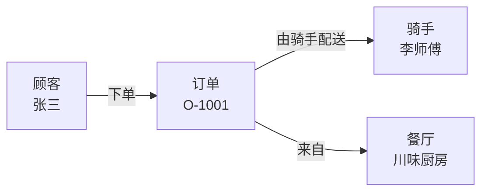

# 第一课：用最直白的方法理解 Ontology

> 来源说明：课程以 Palantir 英文官方文档为技术依据；中文官方页面是机器翻译辅助，关键定义和版本状态以英文原文为准。文中的 YAML/TypeScript 若标为“教学伪代码”，只用于表达设计，不是 Foundry 可直接导入的配置或当前 API。

先记住一句话：

> **Ontology（本体）就是把杂乱的数据，翻译成业务人员和 AI 都能理解、还能操作的“现实世界模型”。**

Palantir 官方称它为组织的“数字孪生”和操作层：它位于数据集、模型之上，把数据连接到订单、客户、设备等现实概念。[官方概览](https://www.palantir.com/docs/foundry/ontology/overview)

### 用外卖系统理解

数据库里可能只有几张表：

```text
customers.csv
orders.csv
riders.csv
```

本体不会让业务人员思考“表和 Join”，而是把它们描述成：



这里包含本体最重要的 6 个概念：

| 本体概念 | 最简单的理解 | 外卖例子 |
|---|---|---|
| Object Type | 一类东西 | 订单、顾客、骑手 |
| Object | 具体的一个东西 | 订单 O-1001 |
| Property | 它有什么信息 | 金额、状态、下单时间 |
| Link | 它和谁有关 | 订单由骑手配送 |
| Action | 用户能对它做什么 | 接单、取消订单、完成配送 |
| Function | 系统如何计算和判断 | 计算超时风险、预计送达时间 |

官方也直接给出了数据库类比：[核心概念](https://www.palantir.com/docs/foundry/ontology/core-concepts)

```text
数据集       ≈ Object Type
一行数据     ≈ Object
一列         ≈ Property
Join         ≈ Link
```

但本体比数据库模型多了关键一层：**动作和业务规则**。

例如：

```text
Action：指派骑手
输入：订单、骑手
规则：只有“待配送”订单可以指派
结果：
  1. 修改订单状态
  2. 建立订单 → 骑手的链接
  3. 通知骑手
  4. 记录是谁做出的决定
```

这就是为什么本体不只是 ER 图或数据字典。它不仅表达“世界是什么样”，还表达：

> **这个世界允许发生什么变化。**

Palantir 的 Action 可以在一个事务中修改对象、属性和链接，并配置通知、Webhook 等副作用。但“单一事务”主要描述 Ontology edits；外部副作用不一定与这些 edits 原子提交，例如通知失败时 edits 仍可能成功，side-effect Webhook 也可能在对象修改成功后执行。[Action 官方说明](https://www.palantir.com/docs/foundry/action-types/overview) [Webhook 执行语义](https://www.palantir.com/docs/foundry/action-types/webhooks)

### Foundry 和 Ontology 的关系

可以这样理解：

```text
Foundry = 整座数字化工厂
Ontology = 工厂里统一的业务世界模型
```

Foundry 负责：

```text
连接数据 → 清洗转换 → 权限治理 → 建模分析
                     ↓
                  Ontology
                     ↓
            应用、业务人员、AI
                     ↓
             执行动作并写回结果
```

因此 Ontology 是 Foundry 中连接数据、逻辑和业务操作的中心。[Palantir 平台概览](https://www.palantir.com/docs/foundry/platform-overview/overview)

### 现在检查你是否理解

看下面这句话：

> “订单 O-1001 金额 88 元，由骑手 R-07 配送，调度员点击了取消订单。”

<details>
<summary>先自己回答，再查看参考答案</summary>

```text
订单             → Object Type
O-1001           → Object
88 元            → Property Value
由 R-07 配送     → Link
取消订单         → Action
```

</details>

如果这个映射你能看懂，你已经掌握了进入后续课程所需的核心直觉；主键、数据来源、权限和 Action 语义还需要在后续课程继续学习。

最后浓缩成一个公式：

```text
Ontology
= 业务名词（Objects）
+ 业务信息（Properties）
+ 业务关系（Links）
+ 业务动作（Actions）
+ 业务逻辑（Functions）
+ 权限与治理
```

## 贯穿核心 12 课的动手项目

从下一课开始，你会持续完善同一个“迷你外卖本体”。不要先看答案，先在纸上或单独文件完成：

1. 写出订单、骑手各自的主键和 Properties。
2. 画出订单与骑手之间的 Link，并标出连接字段。
3. 写出“改派骑手”Action 的输入、前置条件和结果。
4. 每学完一课，用设备维护案例的新知识回头改进这个模型。

建议学习顺序仍按 `01 → 12`，但第二课开头会先补齐 Foundry 的最小全景；第六课再系统展开平台细节。每章的“独立练习”都应在查看参考答案前完成。

### 怎样控制学习负担

```text
入门必修：01–04、06、07 前半、09 主决策表、10 Action 核心
完整案例：05 先读故事主线，再按需展开技术细节
生产进阶：07 后半、08、10 可靠性、11 开发与 AI、12 治理
```

第一次学习不需要背产品名。先能解释“对象—关系—逻辑—动作”闭环，再进入 OSv2、Interface、MCP 和企业治理。
