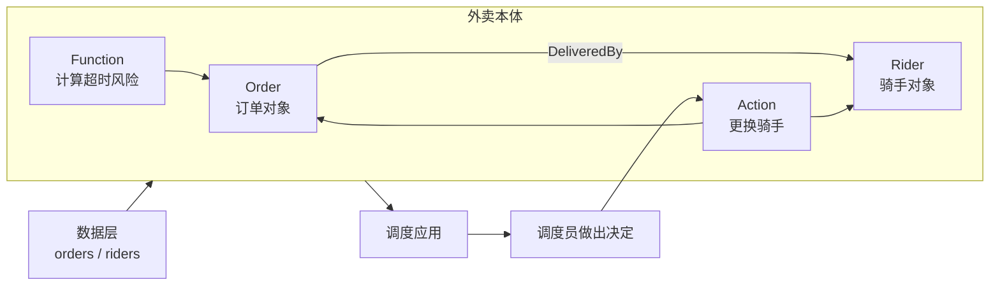

# 第二课：动手推演一个最小本体

这一课只做一件事：

> 把几张外卖业务表，转换成一个人和 AI 都能理解的业务世界。

完成后，你会理解 Object、Property、Link、Function 和 Action 是怎样组合起来的，并独立完成一版设计草图。

> 本章所有 YAML 都是教学伪代码，不是 Foundry 的正式导入格式或 API。

## 0. 先补齐 Foundry 的最小全景

这一课只需要知道五步，不必先学习所有产品：

```text
Data Connection 接入源数据
→ Dataset 保存表和文件
→ Pipeline 清洗、转换并建立稳定字段
→ Ontology 把数据映射成业务对象、关系和动作
→ 应用、人和 AI 查询对象并通过 Action 执行业务决定
```

第六课会系统解释这些组件。现在只要记住：下面的两张表是假设已经经过前三步准备好的教学输入。

## 1. 从业务问题开始

设计本体时，不要先问：

> 数据库里有哪些表？

应该先问：

> 业务人员需要了解什么，并且需要做出什么决定？

假设外卖调度员每天需要回答三个问题：

1. 哪些订单正在配送？
2. 每个订单由哪位骑手配送？
3. 哪些订单可能超时，需要更换骑手？

这三个问题就是我们设计本体的起点。

## 2. 查看原始数据

假设 Foundry 已经接入了两张表。

`orders`：

| order_id | customer_name | amount | status | rider_id | promised_minutes | elapsed_minutes |
|---|---|---:|---|---|---:|---:|
| O-1001 | 张三 | 88 | 配送中 | R-07 | 30 | 25 |
| O-1002 | 李四 | 42 | 待配送 |  | 35 | 10 |

`riders`：

| rider_id | rider_name | status |
|---|---|---|
| R-07 | 王师傅 | 忙碌 |
| R-08 | 刘师傅 | 空闲 |

在数据层看来，它们只是表、行、列和字段。

在本体层，我们要把它们翻译成现实世界的语言。

## 3. 定义 Object Type

首先找出业务中的“名词”：

```text
订单
骑手
```

因此我们需要两个 Object Type：

```yaml
objectTypes:
  Order:
    displayName: 订单
    primaryKey: orderId

  Rider:
    displayName: 骑手
    primaryKey: riderId
```

Object Type 是“一类事物”的定义：

```text
Order 代表所有订单
Rider 代表所有骑手
```

每个 Object Type 都需要一个能够唯一识别 Object 的主键：

```text
Order 使用 orderId
Rider 使用 riderId
```

## 4. 定义 Property

接下来描述这些对象“有什么信息”。

```yaml
objectTypes:
  Order:
    primaryKey: orderId
    properties:
      orderId: string
      customerName: string
      amount: decimal
      status: string
      riderId: string
      promisedMinutes: integer
      elapsedMinutes: integer

  Rider:
    primaryKey: riderId
    properties:
      riderId: string
      riderName: string
      status: string
```

映射到具体数据后，会产生 Object：

```yaml
objects:
  - type: Order
    orderId: O-1001
    customerName: 张三
    amount: 88
    status: 配送中
    riderId: R-07
    promisedMinutes: 30
    elapsedMinutes: 25

  - type: Rider
    riderId: R-07
    riderName: 王师傅
    status: 忙碌
```

注意下面两个概念的区别：

```text
Order      是 Object Type
O-1001     是一个 Order Object

amount     是 Property
88         是 Property Value
```

## 5. 定义 Link Type

现在我们知道有订单和骑手，但还不知道它们之间的关系。

原始 `orders` 表中的 `rider_id` 可以把两类对象连接起来：

```yaml
linkTypes:
  DeliveredBy:
    displayName: 由骑手配送
    from: Order
    to: Rider
    join:
      Order.riderId: Rider.riderId
```

于是：

```text
O-1001 ──由骑手配送──> R-07
```

这里：

```text
DeliveredBy                 是 Link Type
O-1001 → R-07               是一个具体的 Link
```

关系建立后，业务人员不再需要知道怎样执行数据库 Join，只需要问：

> 谁在配送订单 O-1001？

系统沿着 Link 就能找到骑手王师傅。

## 6. 添加 Function

业务人员还需要知道订单是否可能超时。

我们可以定义一个无副作用的计算逻辑：

```text
函数名称：计算超时风险

输入：一个订单

规则：
  如果 elapsedMinutes >= promisedMinutes，返回“已超时”
  如果 elapsedMinutes >= promisedMinutes × 0.8，返回“高风险”
  否则返回“正常”

输出：风险等级
```

对订单 O-1001 计算：

```text
25 >= 30 × 0.8
25 >= 24

结果：高风险
```

Function 的重点是：

> 它读取对象和属性，执行业务逻辑，然后返回结果。

它本身不一定修改对象。

在 Foundry 中，函数可以接受 Object 或对象集作为输入，读取属性值，并供应用程序或 Action 使用。[函数与本体核心概念](https://www.palantir.com/docs/foundry/ontology/core-concepts)

## 7. 添加 Action

发现高风险订单后，调度员需要更换骑手。

这是一项会改变业务世界的操作：

```yaml
actionType:
  name: ReassignRider
  displayName: 更换骑手

  parameters:
    order: Order
    newRider: Rider

  rules:
    - 订单状态必须是“配送中”
    - 新骑手状态必须是“空闲”

  changes:
    - 删除订单与旧骑手之间的 DeliveredBy Link
    - 创建订单与新骑手之间的 DeliveredBy Link
    - 将旧骑手状态改为“空闲”
    - 将新骑手状态改为“忙碌”

  sideEffects:
    - 通知旧骑手
    - 通知新骑手
    - 记录调度员和操作时间
```

执行操作前：

```text
O-1001 ──由骑手配送──> R-07 王师傅（忙碌）
                           R-08 刘师傅（空闲）
```

执行“更换骑手”后：

```text
                           R-07 王师傅（空闲）
O-1001 ──由骑手配送──> R-08 刘师傅（忙碌）
```

Action 和直接修改数据库字段的区别在于：

```text
直接修改字段：把 rider_id 从 R-07 改成 R-08

Action：表达“更换骑手”这个业务意图，
        检查规则，统一修改对象和链接，
        执行通知，并留下决策记录。
```

Palantir 官方将 Action Type 定义为用户可以一次执行的一组对象、属性和链接更改，也可以包含通知等副作用。[Action 官方说明](https://www.palantir.com/docs/foundry/action-types/overview)

## 8. 把整个本体连起来

现在，这个最小本体已经同时包含静态世界和动态世界：



可以把它分成两部分：

```text
语义部分：Object、Property、Link
回答“这个业务世界里有什么，以及它们是什么关系”

动态部分：Function、Action
回答“怎样判断，以及允许怎样改变这个世界”
```

这就是 Palantir 所说的操作层：Ontology 不仅帮助用户读取和理解数据，还能捕获用户做出的决定，并将结果重新写回业务世界。[为什么创建 Ontology？](https://www.palantir.com/docs/foundry/ontology/why-ontology)

## 9. 一分钟自测

请判断下面每一项属于什么概念：

```text
1. “骑手”
2. “王师傅”
3. “骑手状态”
4. “忙碌”
5. “订单由骑手配送”
6. “O-1001 由 R-07 配送”
7. “计算超时风险”
8. “更换骑手”
```

<details>
<summary>完成后查看参考答案</summary>

```text
1. Object Type
2. Object
3. Property
4. Property Value
5. Link Type
6. Link
7. Function
8. Action
```

</details>

## 10. 本课结论

现在可以把“建立本体”理解成五个连续动作：

```text
1. 找出业务名词             → Object Type
2. 描述名词的特征           → Property
3. 连接名词之间的关系       → Link Type
4. 编写计算和判断逻辑       → Function
5. 定义用户可以执行的改变   → Action
```

最重要的不是 YAML，也不是某个 Foundry 界面，而是这种思考方式：

> 不再围绕表格组织系统，而是围绕现实中的业务对象、关系和决策组织系统。

下一课可以继续回答一个关键问题：本体和数据库 ER 模型、知识图谱、领域驱动设计之间到底有什么区别。

## 独立练习：不要立即照抄本章示例

为 `O-1002` 指派骑手 `R-08`，单独写出：所需 Properties、Link、Action 参数、提交条件以及成功后的 edits。然后故意删除一个连接字段，解释 Link 为什么会失败。完成后再回到本章对照；本题没有唯一的表达格式。
