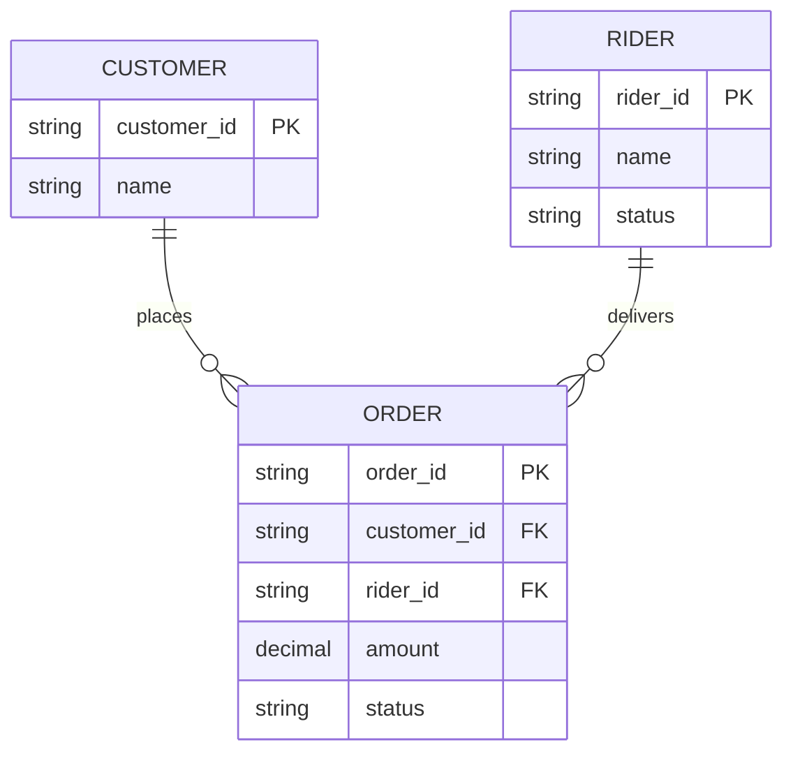
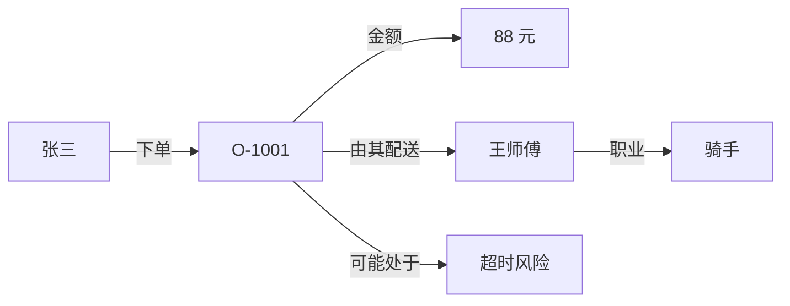
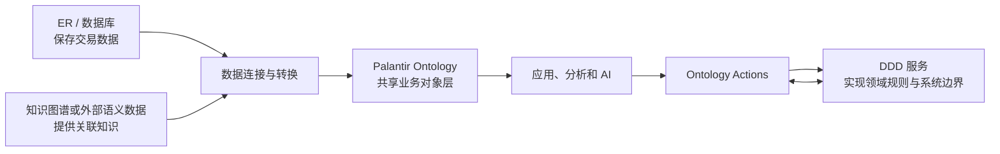

# 第三课：本体与 ER 模型、知识图谱、DDD 到底有什么区别？

> 边界说明：本章比较的是这些概念在常见工程实践中的主要关注点，不声称它们彼此排斥。通用哲学/知识表示中的 ontology，也不等同于 Palantir Foundry Ontology 这一具体产品实现。

这一课回答一个很容易混淆的问题：

> 它们看起来都在描述“对象、属性和关系”，为什么还需要四种不同概念？

最短答案是：

```text
ER 模型       关注数据怎样存
知识图谱      关注知识怎样连
DDD           关注软件怎样围绕业务设计
Ontology      关注组织怎样统一理解并操作现实世界
```

它们并不是互相排斥的竞争产品，而是从不同角度解决不同问题。

## 1. 继续使用同一个外卖案例

假设我们的业务里有：

```text
顾客张三下了订单 O-1001
订单金额为 88 元
订单由骑手王师傅配送
订单可能超时
调度员可以更换骑手
```

下面分别用四种方式观察这段业务。

## 2. ER 模型：为了设计数据库

ER 是 Entity-Relationship 的缩写，即“实体—关系模型”。

Peter Chen 在 1976 年发表的论文中正式提出 ER 模型，目的是为数据库设计提供一种统一的数据视图和图形化方法。[ER 模型原始论文](https://doi.org/10.1145/320434.320440)

外卖业务的 ER 图可能是：



ER 模型最关心的是：

```text
有哪些实体？
实体有哪些字段？
主键是什么？
外键是什么？
一对一、一对多还是多对多？
怎样保证数据库中的数据完整？
```

它非常适合设计表结构。

但是，单独看这个 ER 图，我们通常还不知道：

```text
谁有权更换骑手？
更换骑手需要满足什么业务条件？
更换后应该通知谁？
怎样计算订单超时风险？
这个模型应该怎样被不同应用和 AI 共同使用？
```

这些内容可以在数据库触发器、后端代码、权限系统和消息系统中实现，但通常分散在不同地方，不属于 ER 图本身的核心表达范围。

### ER 模型的一句话总结

> ER 模型是现实世界到数据库结构之间的设计图。

## 3. 知识图谱：为了连接和查询知识

知识图谱通常把信息表示成节点和边：



常见的三元组表达是：

```text
主语       谓语       宾语
O-1001     由其配送   王师傅
王师傅     职业       骑手
张三       下单       O-1001
```

W3C 的 RDF 标准把图定义为一组三元组；OWL 则可以进一步描述类、属性、个体、关系和逻辑约束，并让推理程序检查一致性或推导隐含知识。[RDF 1.1](https://www.w3.org/TR/rdf11-concepts/) · [OWL 2 入门](https://www.w3.org/TR/owl-primer/)

例如，知识图谱可以记录：

```text
所有骑手都是配送人员
王师傅是一名骑手
```

推理系统便可能推出：

```text
王师傅是一名配送人员
```

知识图谱最关心的是：

```text
知识实体之间怎样连接？
不同来源的数据怎样使用统一标识？
怎样沿着关系发现相关知识？
怎样利用规则推导没有直接写出的事实？
```

但一个知识图谱不一定定义业务操作。

它可以知道：

```text
O-1001 由王师傅配送
```

却不一定知道如何安全地执行：

```text
把 O-1001 改派给刘师傅，
验证刘师傅处于空闲状态，
同步订单系统，
通知两名骑手，
留下操作审计记录。
```

### “知识图谱”和“本体”的关系

这两个词不是同义词：

```text
本体     定义概念、含义、关系和规则
知识图谱 保存或连接具体事实
```

可以用一个简单比喻：

```text
本体是语言的语法和词义
知识图谱是用这门语言写出的事实网络
```

例如：

```text
“订单是一类业务对象”                   属于本体定义
“订单可以由骑手配送”                   属于本体定义
“O-1001 由王师傅配送”                  属于具体事实
```

一个知识图谱可以使用本体约束自己的含义；一个本体也可以先只定义类型和规则，暂时没有大量实例数据。

### 知识图谱的一句话总结

> 知识图谱是以图的形式连接和查询事实。

## 4. DDD：为了让软件围绕业务语言生长

DDD 是 Domain-Driven Design，即领域驱动设计。

它是一种软件设计方法，强调开发人员与领域专家共同建立领域模型，并在交流和代码中使用一致的业务语言。Eric Evans 的 DDD 参考资料包含实体、值对象、聚合、领域服务、限界上下文等核心模式。[Eric Evans 的 DDD Reference](https://www.domainlanguage.com/wp-content/uploads/2016/05/DDD_Reference_2015-03.pdf)

在外卖系统中，我们可能写出：

```typescript
class Order {
  constructor(
    readonly id: OrderId,
    private status: OrderStatus,
    private riderId?: RiderId,
  ) {}

  reassignRider(newRider: Rider): void {
    if (this.status !== "DELIVERING") {
      throw new Error("只有配送中的订单才能更换骑手");
    }

    if (!newRider.isAvailable()) {
      throw new Error("新骑手必须处于空闲状态");
    }

    this.riderId = newRider.id;
  }
}
```

DDD 最关心的是：

```text
领域专家使用什么业务语言？
业务规则应该放在哪个模型中？
哪些对象必须作为一个整体保持一致？
一个模型在哪个边界内有效？
复杂系统应该怎样拆分成不同的限界上下文？
```

DDD 中很重要的概念是“限界上下文”。

同一个词在不同上下文中可以有不同含义：

```text
配送上下文中的 Rider：位置、运力、配送状态
财务上下文中的 Rider：结算账户、佣金、税务信息
客服上下文中的 Rider：投诉记录、满意度、联系方式
```

DDD 不强求整个企业只有一个巨大的统一模型。相反，它会明确不同模型的边界，以及它们如何协作。

DDD 的最终产物通常体现在：

```text
代码结构
服务边界
聚合与事务边界
领域事件
团队之间的语言和协作方式
```

它不天然提供一个已经运行的数据平台、全企业对象索引、图查询、统一权限或可供分析应用直接使用的共享对象层。

### DDD 的一句话总结

> DDD 是让软件设计忠实反映业务知识的方法。

## 5. Palantir Ontology：为了形成可执行的业务世界

Palantir Ontology 会把数据集和模型映射为：

```text
Objects
Properties
Links
Functions
Actions
Security
```

然后让应用、业务人员和 AI 在这个共同的业务世界上读取信息、分析问题并执行经过治理的操作。

Palantir 官方将 Ontology 描述为组织的操作层和数字孪生，其中既有语义元素，也有函数、操作和动态安全等动力元素。[Palantir Ontology 官方概览](https://www.palantir.com/docs/foundry/ontology/overview)

同一个“更换骑手”在 Ontology 中可能包含：

```text
输入：Order、Rider

验证：
  订单必须处于配送中
  新骑手必须处于空闲状态
  当前用户必须拥有调度权限

变更：
  修改订单与骑手的 Link
  修改新旧骑手的状态

副作用：
  写回订单系统
  通知相关人员
  记录操作者与时间
```

因此，Palantir Ontology 不只是回答：

> “O-1001 由谁配送？”

还可以治理并执行：

> “把 O-1001 安全地改派给谁？”

### Palantir Ontology 的一句话总结

> Palantir Ontology 是连接数据、逻辑、权限和业务操作的共享运行层。

## 6. 四者放在一起比较

| 维度 | ER 模型 | 知识图谱 | DDD | Palantir Ontology |
|---|---|---|---|---|
| 首要目标 | 设计和组织数据库 | 连接、查询和推理知识 | 设计复杂业务软件 | 建立可执行的企业业务模型 |
| 核心元素 | 实体、属性、关系、键 | 节点、边、三元组、语义 | 实体、值对象、聚合、领域服务、事件 | Object、Property、Link、Function、Action、Security |
| 主要使用者 | 数据库设计者、后端工程师 | 数据与知识工程师、研究人员 | 软件团队、领域专家 | 数据团队、开发者、业务用户、AI |
| 主要产物 | 表结构和约束设计 | 事实网络及语义定义 | 代码模型和服务边界 | 可查询、可操作、受治理的运行时对象层 |
| 是否重视存储结构 | 非常重视 | 取决于实现 | 通常不是首要问题 | 与底层数据绑定，但向用户隐藏存储细节 |
| 是否支持关系遍历 | 通过 Join | 核心能力 | 通过代码或服务协作 | 通过 Link 和对象查询 |
| 是否强调逻辑推理 | 通常不是重点 | 经常是重点 | 强调业务规则，而非通用逻辑推理 | 强调函数、模型和决策逻辑 |
| 是否直接定义业务动作 | 通常不定义 | 通常不定义 | 在领域模型与应用服务中定义 | Action 是一等概念 |
| 是否是软件设计方法 | 否 | 否 | 是 | 否，它是平台中的运行系统 |
| 典型问题 | 数据怎样保存？ | 已知事实能推出什么？ | 业务规则怎样写进软件？ | 人和 AI 怎样理解并改变业务？ |

## 7. 它们如何共同工作？

现实系统通常不是四选一，而是组合使用：



例如：

```text
PostgreSQL 数据库
  使用 ER 模型保存订单和骑手交易数据

知识图谱
  连接道路、区域、天气和商家之间的知识

DDD 后端服务
  实现订单生命周期、支付和结算规则

Palantir Ontology
  将这些数据与逻辑统一映射为业务对象，
  供调度员、应用和 AI 查询与操作
```

## 8. 最容易出现的四个误解

### 误解一：有实体和关系就是本体

不是。

ER 图也有实体和关系，但主要服务于数据库设计。本体还需要明确业务概念的含义，并让不同数据和使用者以共同语言理解这些概念。

### 误解二：图数据库就是知识图谱

不是。

图数据库是一种存储和查询技术。只有把数据组织成具有业务含义的知识实体和关系，并建立相应语义时，才更接近知识图谱。

### 误解三：知识图谱就是 Ontology

不是。

知识图谱偏向“具体事实的网络”，本体偏向“这些事实使用的概念与含义”。实际项目经常把两者结合起来。

### 误解四：有了 Ontology 就不需要 DDD

不是。

Ontology 可以成为跨数据、应用和团队共享的业务层；DDD 仍然可以指导每个软件系统怎样划分边界、组织代码和维护内部业务规则。

特别要注意：

> “整个企业共享语言”与“不同限界上下文拥有不同模型”之间存在真实张力。

好的设计不是强迫所有系统使用完全相同的内部模型，而是：

```text
明确每个上下文自己的模型
明确哪些概念需要在企业层共享
明确不同模型之间怎样映射
```

## 9. 怎样选择？

如果你的问题是：

```text
“数据库应该有哪些表和外键？”
选择 ER 模型。
```

如果你的问题是：

```text
“怎样连接大量异构知识并进行关系查询或推理？”
考虑知识图谱，以及 RDF、OWL 等语义技术。
```

如果你的问题是：

```text
“怎样让复杂软件准确表达业务规则并保持可维护？”
使用 DDD 的思想和模式。
```

如果你的问题是：

```text
“怎样把企业的数据、模型、权限和操作统一起来，
让业务人员、应用和 AI 在同一个世界中协作？”
这正是 Palantir Ontology 试图解决的问题。
```

## 10. 一分钟自测

判断下面的问题最适合先使用哪一种方法：

```text
1. 订单表和骑手表应该怎样设计主键、外键？
2. 怎样从“王师傅是骑手”推出“王师傅是配送人员”？
3. 订单聚合应该负责维护哪些业务不变量？
4. 怎样让调度应用和 AI 共用“更换骑手”操作？
```

<details>
<summary>完成后查看参考答案</summary>

```text
1. ER 模型
2. 知识图谱与本体推理
3. DDD
4. Palantir Ontology
```

</details>

## 11. 本课结论

用四句话记住它们：

```text
ER 模型把现实翻译成数据库结构。
知识图谱把事实组织成关系网络。
DDD 把业务知识翻译成可维护的软件。
Palantir Ontology 把企业世界组织成可查询、可治理、可执行的运行模型。
```

它们的关系不是替代，而是分工：

```text
ER 提供可靠的数据基础
知识图谱提供丰富的知识连接
DDD 提供清晰的软件边界和业务行为
Ontology 把数据、知识、逻辑和操作组合成共同的业务世界
```

下一课可以继续讨论：怎样从一个真实业务问题出发，一步一步识别 Object Type、Property、Link、Function 和 Action，而不是把数据库表机械地复制成本体。

## 独立练习：同一需求画四遍

选择“客户退货”流程，分别写出一版 ER 实体关系、一组知识图谱三元组、一个 DDD 聚合及命令，以及一个 Palantir Ontology 的 Object/Link/Action 草图。最后说明四者哪些部分重叠、哪些不能互相替代。
