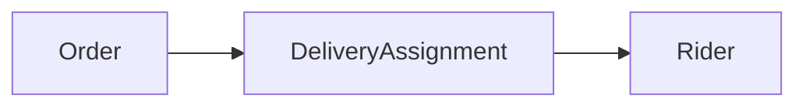
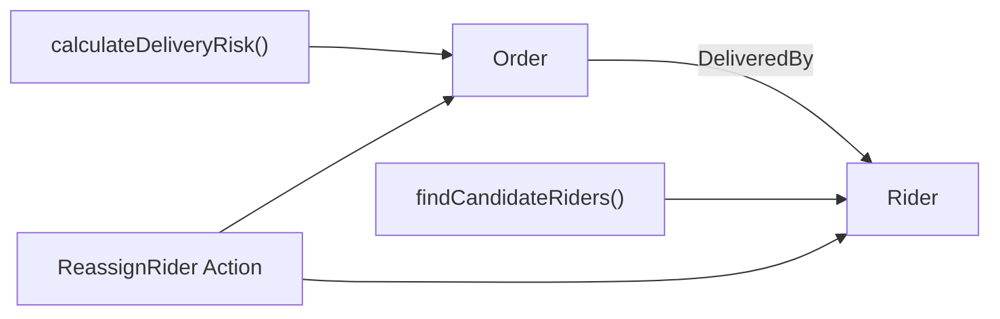
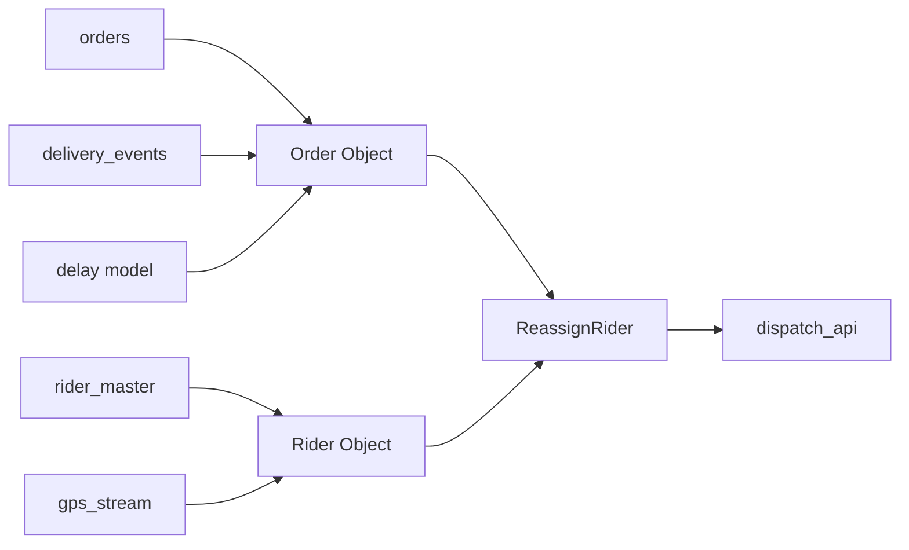
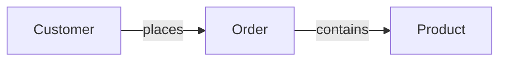

# 第四课：不要从数据库表开始设计本体

> 本章 YAML 均为教学伪代码，只表达建模思路，不是 Foundry 的正式导入格式或当前 API。

上一课讲了本体与 ER 模型、知识图谱和 DDD 的区别。

这一课开始学习真正的本体设计方法：

> 从一个需要改进的业务决策出发，识别 Object、Property、Link、Function 和 Action。

Palantir 官方的首要设计原则是：

> 对现实世界建模，而不是对源系统建模。

Object Type 应该代表订单、患者、设备、工单等有业务意义的概念，而不是数据库表、API 响应或电子表格标签页。[Palantir Ontology 设计最佳实践](https://www.palantir.com/docs/foundry/ontology/ontology-best-practices)

## 1. 错误方法：把表机械复制成本体

假设数据仓库里有一张表：

```text
delivery_dispatch_result_v3
```

字段如下：

```text
ord_no
cust_nm
cust_phone
rider_no
rider_nm
rider_mobile
shop_no
shop_nm
dispatch_ts
promised_min
elapsed_min
risk_score
last_upd_ts
src_sys_cd
```

最省事的做法似乎是创建一个 Object Type：

```yaml
objectType: DeliveryDispatchResultV3
properties:
  ordNo: string
  custNm: string
  custPhone: string
  riderNo: string
  riderNm: string
  riderMobile: string
  shopNo: string
  shopNm: string
  dispatchTs: timestamp
  promisedMin: integer
  elapsedMin: integer
  riskScore: decimal
  lastUpdTs: timestamp
  srcSysCd: string
```

这并没有真正建立本体，只是给数据表换了一件衣服。

它的问题包括：

```text
用户看到的是系统语言，而不是业务语言
订单、顾客、骑手和商家被压在同一个对象里
骑手无法被独立搜索和操作
骑手姓名变化后，很多订单对象可能保存旧值
源表改名或拆表会直接破坏上层应用
其他团队很难复用这些概念
AI 也难以判断每个字段代表什么现实事物
```

官方将这种做法称为类似“Kitchen Sink”的反模式：将源列一对一复制成属性，会把源系统的偶然结构带入 Ontology。[Palantir Ontology 设计最佳实践](https://www.palantir.com/docs/foundry/ontology/ontology-best-practices)

正确顺序应该是：

```text
理解业务决策
    ↓
识别现实世界概念
    ↓
设计 Object、Property、Link、Function、Action
    ↓
最后才把源数据映射进来
```

## 2. 第一步：选择一个具体业务决策

不要以“建立整个外卖公司的本体”为目标。

这个范围太大，容易做出一个理论上完美、实际上没人使用的模型。

我们先选择一个具体决策：

> 当订单出现超时风险时，调度员需要判断是否更换骑手。

把它写成一张决策卡：

```yaml
decision:
  name: 处理高风险配送订单
  actor: 调度员
  trigger: 订单超时风险升高
  question: 是否需要更换骑手？
  inputs:
    - 订单当前状态
    - 已用配送时间
    - 承诺送达时间
    - 当前骑手状态和位置
    - 附近可用骑手
  possibleActions:
    - 保持当前骑手
    - 更换骑手
    - 联系骑手确认情况
  desiredOutcome: 降低超时率，同时避免无意义改派
```

这张卡比数据库模式更适合作为起点，因为它告诉我们：

```text
谁在做决定？
什么时候做？
需要看到什么？
可以采取什么行动？
怎样判断结果好不好？
```

## 3. 第二步：从业务语言中圈出名词和动词

观察这句话：

> 调度员查看高风险订单、当前骑手和附近可用骑手，然后决定是否更换骑手。

先圈出名词：

```text
调度员
订单
骑手
位置
风险
```

再圈出动词：

```text
查看
计算风险
配送
更换骑手
联系骑手
```

名词可能成为：

```text
Object Type
Property
Property Value
Link Type
```

动词可能成为：

```text
Link Type
Function
Action
普通界面行为
```

但不能看到名词就创建 Object Type，也不能看到动词就创建 Action。下一步还要判断它们是否值得独立建模。

## 4. 第三步：判断什么应该成为 Object Type

可以用四个问题判断一个候选概念：

```text
1. 它是否具有稳定、可辨认的身份？
2. 它是否拥有自己的生命周期？
3. 用户是否需要独立搜索、查看或操作它？
4. 它是否会被多个关系、应用或工作流复用？
```

回答“是”的数量越多，它越可能应该成为 Object Type。

### 候选一：订单

```text
有唯一订单号                 是
经历待接单、配送中、完成等状态 是
需要独立查看和操作             是
被客服、配送、财务共同使用       是
```

结论：创建 `Order` Object Type。

### 候选二：骑手

```text
有唯一骑手编号               是
有入职、在线、忙碌、离线等状态 是
需要独立搜索和指派             是
被多个订单和工作流使用         是
```

结论：创建 `Rider` Object Type。

### 候选三：位置

如果这里只需要记录骑手当前经纬度：

```text
没有独立业务身份
不会被单独操作
只是骑手当前的一个特征
```

结论：当前阶段把位置设计为 `Rider.currentLocation` Property。

如果未来需要保存每次 GPS 观测、轨迹、数据质量和采集设备：

```text
每次观测有时间和来源
需要单独查询历史记录
拥有独立的数据生命周期
```

那么可以再创建 `LocationObservation` Object Type。

这说明本体设计没有永远正确的粒度；粒度取决于需要支持的决策和工作流。

### 候选四：风险

“高风险”只是一个计算结果时，可以设计为派生 Property：

```text
Order.deliveryRisk = HIGH
```

如果每次风险评估都需要保存：

```text
模型版本
评估时间
输入特征
预测概率
解释信息
人工复核结果
```

则应考虑创建 `DeliveryRiskAssessment` Object Type，因为一次评估已经成为有身份、需要审计的业务事件。

## 5. 第四步：只保留有决策价值的 Property

有了 `Order` 和 `Rider`，接下来选择属性。

不要问：

> 源表有哪些列？

应该问：

> 为了理解对象、做出决定和执行工作流，用户真正需要什么？

### Order 的最小属性

```yaml
Order:
  orderId:
    type: string
    purpose: 唯一识别订单

  status:
    type: OrderStatus
    purpose: 判断订单当前所处阶段

  promisedDeliveryAt:
    type: timestamp
    purpose: 判断是否接近超时

  estimatedDeliveryAt:
    type: timestamp
    purpose: 展示预计送达时间

  deliveryRisk:
    type: RiskLevel
    purpose: 帮助调度员筛选高风险订单
```

### Rider 的最小属性

```yaml
Rider:
  riderId:
    type: string
    purpose: 唯一识别骑手

  displayName:
    type: string
    purpose: 供用户识别骑手

  availabilityStatus:
    type: RiderStatus
    purpose: 判断骑手能否被指派

  currentLocation:
    type: geospatial
    purpose: 判断骑手与订单的距离

  activeOrderCount:
    type: integer
    purpose: 判断当前工作负载
```

每个属性最好能够回答：

```text
谁使用它？
用于什么决定？
它来自哪里？
多久更新一次？
谁可以修改？
它是否包含敏感信息？
```

还可以按来源把属性分为三类：

| 属性类别 | 例子 | 产生方式 |
|---|---|---|
| 原始属性 | `status` | 从业务系统同步 |
| 派生属性 | `deliveryRisk` | 由函数或模型计算 |
| 可编辑属性 | `dispatchNote` | 由用户通过 Action 写入 |

官方建议每个属性都应具有明确的业务或技术价值，而不是把所有源字段无差别暴露出来。[Palantir Ontology 设计最佳实践](https://www.palantir.com/docs/foundry/ontology/ontology-best-practices)

## 6. 第五步：识别真实关系，而不是复制外键

订单表里可能有：

```text
rider_id = R-07
```

`rider_id` 是源系统实现关系的方法，但业务关系是：

```text
订单由骑手配送
```

因此定义：

```yaml
linkType:
  name: DeliveredBy
  from: Order
  to: Rider
  meaning: 当前负责配送该订单的骑手
```

命名 Link 时，应让业务人员不看数据库也能理解：

```text
✓ Order is delivered by Rider
✓ Rider is delivering Order

✗ Order joins Rider on rider_id
✗ Order has Rider FK
```

### Link 还是 Object Type？

如果只关心当前指派关系：

```text
O-1001 ──DeliveredBy──> R-07
```

一个 Link 通常足够。

如果需要记录每次指派的完整生命周期：

```text
指派时间
解除时间
指派原因
指派人
骑手接受时间
拒绝原因
```

那么“配送指派”本身已经是一件重要业务事件，可以建模成：



判断原则是：

> 当一段关系拥有自己的属性、身份或生命周期时，考虑把它提升为 Object Type。

## 7. 第六步：把判断逻辑设计成 Function

调度员需要判断哪些订单有风险，以及哪些骑手适合接单。

候选 Function：

```yaml
functions:
  calculateDeliveryRisk:
    input: Order
    output: RiskLevel
    purpose: 根据承诺时间、预计送达时间和实时情况计算风险

  findCandidateRiders:
    input: Order
    output: Rider[]
    purpose: 查找附近、空闲且满足运力条件的骑手

  estimateReassignmentBenefit:
    input:
      - Order
      - Rider
    output: Duration
    purpose: 估计改派后可以节省多少时间
```

Function 通常适合表达：

```text
计算
筛选
聚合
评分
推荐
预测
验证
```

它回答的是：

> 我们怎样根据当前业务世界得到判断或建议？

它和 Action 的关键区别是：

```text
Function 主要读取和计算
Action   表达并执行一次业务决定
```

## 8. 第七步：把业务意图设计成 Action

调度员不是想“修改 rider_id 字段”。

调度员真正想做的是：

> 更换配送骑手。

因此 Action 应使用业务动词命名：

```yaml
actionType:
  name: ReassignRider
  displayName: 更换骑手

  parameters:
    order: Order
    newRider: Rider
    reason: ReassignmentReason
    note: string

  preconditions:
    - 订单必须处于配送中
    - 新骑手必须处于空闲状态
    - 新骑手不能是当前骑手
    - 操作者必须拥有调度权限

  edits:
    - 更新 Order → DeliveredBy → Rider Link
    - 更新新旧 Rider 的状态和工作负载
    - 保存改派原因

  sideEffects:
    - 向新旧骑手发送通知
    - 将结果写回订单调度系统
    - 记录操作者、时间和参数
```

Action 的名字应该表达用户的目标：

```text
✓ 更换骑手
✓ 取消订单
✓ 批准退款
✓ 安排设备检修

✗ 更新字段
✗ 修改记录
✗ 设置 rider_id
```

Palantir Action 会把参数转换为对象、属性或 Link 的变更，也可以触发通知等效果。[Action Rules 官方说明](https://www.palantir.com/docs/foundry/action-types/rules)

### Action 还是 Pipeline？

可以用这个简单标准区分：

```text
人或 AI 做出一次业务决定       → Action
系统持续、自动地加工大量数据   → Pipeline
```

例如：

```text
每分钟重新计算所有订单风险     → Pipeline 或自动计算流程
调度员确认将 O-1001 改派给 R-08 → Action
```

Palantir 的设计建议也明确区分：人或 Agent 的决策使用 Action，自动数据转换使用 Pipeline。[Palantir Ontology 设计最佳实践](https://www.palantir.com/docs/foundry/ontology/ontology-best-practices)

## 9. 第八步：从一开始就设计权限和治理

如果一个 Action 能改变现实业务，就不能最后才考虑权限。

“更换骑手”至少需要回答：

```text
谁能看到订单？
谁能看到骑手的位置和电话？
谁可以执行更换骑手？
是否只能操作自己负责的区域？
高金额或敏感订单是否需要额外审批？
操作是否能够撤销？
谁可以查看操作日志？
```

最小安全设计：

```yaml
security:
  dispatcher:
    canRead:
      - Order
      - Rider.displayName
      - Rider.currentLocation
    canApply:
      - ReassignRider
    scope: 自己负责的配送区域

  customerService:
    canRead:
      - Order
      - Rider.displayName
    cannotRead:
      - Rider.currentLocation
      - Rider.privatePhone
    cannotApply:
      - ReassignRider
```

本体的价值不仅是统一语义，还包括对改变的权限和治理。Palantir 将数据、逻辑、Action 和 Security 视为建模决策的四个相互连接部分。[Palantir Ontology 系统](https://www.palantir.com/docs/foundry/architecture-center/ontology-system)

## 10. 第九步：最后才映射数据源

到现在为止，我们还没有依赖某一张具体表的结构。

已经得到一个以业务为中心的模型：



现在才调查源数据：

```text
订单主数据来自 order_service.orders
订单实时状态来自 delivery_events
骑手身份来自 rider_master
骑手位置来自 gps_stream
风险评分来自 delay_prediction_model
用户改派结果写回 dispatch_api
```

映射可能是多对一，也可能是一对多：



这里体现了关键区别：

```text
源系统围绕采集、交易和技术边界组织数据
Ontology 围绕现实对象和业务决策组织信息
```

一个 Object Type 可以由多个数据源共同支持；一张源表也可能包含多个应该拆开的现实实体。

## 11. 第十步：用一个完整工作流验证设计

不要只检查本体图是否漂亮，要让它跑过一个真实工作流。

### 场景

```text
订单 O-1001 的预计送达时间超过了承诺时间。
```

### 用户工作流

```text
1. 调度员打开“高风险订单”列表
2. 选择 O-1001
3. 查看订单、当前骑手和风险原因
4. 系统运行 findCandidateRiders
5. 系统展示候选骑手及预计改善时间
6. 调度员选择 R-08
7. 执行 ReassignRider
8. 系统检查权限和业务前置条件
9. 更新对象、属性和 Link
10. 写回调度系统并通知骑手
11. 记录这次决定及最终配送结果
```

如果某一步无法自然地由 Object、Property、Link、Function 或 Action 支持，模型可能缺少内容。

如果完成工作流需要用户理解数据库字段、手工 Join 或在多个系统之间复制 ID，模型可能还没有真正抽象业务世界。

## 12. 一张可以重复使用的设计画布

以后面对任何业务场景，都可以先填写下面这张画布：

```yaml
useCase:
  name:
  actor:
  trigger:
  decision:
  desiredOutcome:

objects:
  - name:
    identity:
    lifecycle:
    whyIndependent:

properties:
  - object:
    name:
    purpose:
    source:
    updateFrequency:
    sensitivity:

links:
  - from:
    relationship:
    to:
    businessMeaning:

functions:
  - name:
    inputs:
    output:
    businessQuestion:

actions:
  - name:
    actor:
    parameters:
    preconditions:
    edits:
    sideEffects:

security:
  whoCanRead:
  whoCanAct:
  scope:
  auditRequirements:

successMetric:
  name:
  currentValue:
  targetValue:
```

## 13. 常见反模式检查

设计完成后，逐项检查：

| 反模式 | 识别信号 | 改进方向 |
|---|---|---|
| 表格镜像 | Object Type 名称与数据表完全相同 | 回到现实实体和用户语言 |
| 属性垃圾场 | 几乎每个源字段都成为 Property | 只保留有决策或技术价值的属性 |
| 上帝对象 | 一个对象包含整个业务的所有信息 | 拆分具有独立身份和生命周期的实体 |
| 外键语言 | Link 名叫 `has_x_id` | 用真实业务关系命名 |
| CRUD Action | Action 名叫“更新记录” | 用用户业务意图命名 |
| 只读本体 | 有对象和图，但没有决策闭环 | 补充 Function、Action 和结果反馈 |
| 忽视权限 | 所有用户都看见和操作相同内容 | 在对象、属性和 Action 层设计权限 |
| 一次建全 | 首版试图覆盖整个企业 | 从高价值垂直工作流增量扩展 |

## 14. 一分钟自测

原始表中有下面几个字段：

```text
order_id
customer_name
customer_email
product_sku
quantity
```

应该直接创建一个 `OrderData` Object Type，并把五列全部变成 Property 吗？

<details>
<summary>完成后查看参考答案</summary>

不应该机械复制。

这行数据至少可能包含三个现实实体：

```text
Order
Customer
Product
```

更合理的初步模型是：



</details>

但最终是否拆分，仍要回到具体业务问题：

```text
用户是否需要独立搜索 Customer？
Product 是否有稳定身份和自己的生命周期？
一个订单是否可能包含多个 Product？
是否需要在不同工作流中复用它们？
```

## 15. 本课结论

正确的 Ontology 设计顺序是：

```text
1. 选择需要改进的业务决策
2. 明确使用者、触发条件和结果
3. 从业务语言中提取名词与动词
4. 识别具有身份和生命周期的 Object Type
5. 只选择有决策价值的 Property
6. 用 Link 表达真实业务关系
7. 用 Function 表达计算与判断
8. 用 Action 表达可以执行的业务意图
9. 同时设计权限、审计和写回
10. 最后映射数据源，并用真实工作流验证
```

最值得记住的一句话是：

> 数据告诉你目前记录了什么；业务决策告诉你本体应该表达什么。

下一课可以继续把这套方法应用到一个更接近真实企业的场景：设备预测性维护，从传感器数据一直设计到“创建并批准维修工单”的完整决策闭环。

## 独立练习：从决定倒推模型

不要看前文画布，选择“批准客户退款”这一决定，独立写出：决策者、所需证据、核心 Objects、Links、一个只读 Function、一个 Action、三条提交条件及失败后的补偿方式。再解释为什么没有把每张源表都建成 Object Type。
