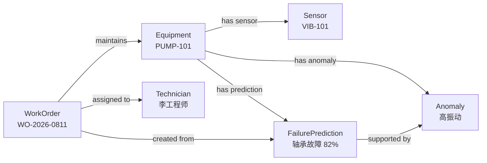
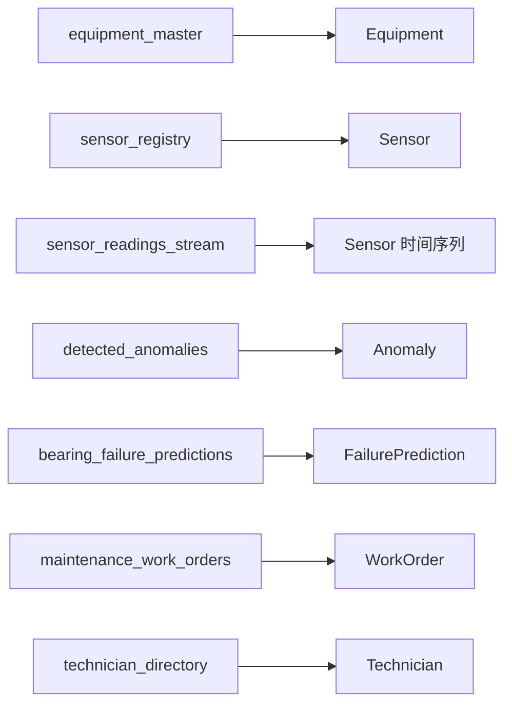
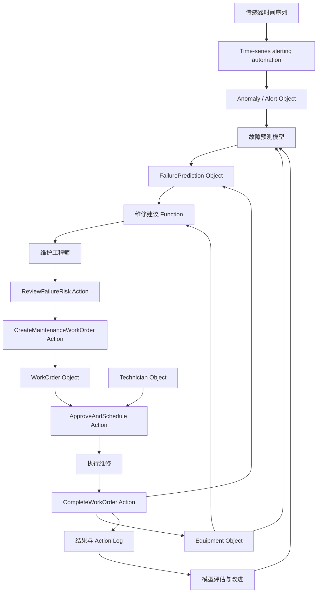

# 第五课：设备预测性维护的完整决策闭环

> 阅读路线：初学者先读 1–8 节建立业务故事，再读 19–24 节看完整闭环；9–18 节是时间序列、模型、Action、权限和反馈的技术展开，可在第 9、10、12 课后回看。本章 YAML/JSON 均为教学伪代码。

前四课一直使用外卖订单帮助我们理解 Ontology。

这一课换成一个更接近真实企业生产的场景：

> 在设备真正损坏之前发现风险，并安排合适的维修。

我们不会只画一张设备关系图，而是完整走过：

```text
传感器产生数据
    ↓
系统发现异常
    ↓
模型预测故障
    ↓
工程师判断是否需要维修
    ↓
主管批准维修工单
    ↓
技术人员完成维修
    ↓
结果写回 Ontology
    ↓
继续评估和改进模型
```

完成这一课，你会理解 Palantir 所说的“决策闭环”究竟是什么。

## 1. 什么是预测性维护？

工厂维护设备常见三种方式。

### 第一种：坏了再修

```text
设备损坏
    ↓
生产停止
    ↓
紧急寻找人员和备件
    ↓
维修
```

这种方式叫故障后维修。

问题是停机通常来得突然，损失可能很大。

### 第二种：固定时间维修

```text
每运行 30 天检查一次
每运行 1,000 小时更换一次部件
```

这种方式叫预防性维护。

它比坏了再修可靠，但可能出现：

```text
设备明明正常，却提前更换部件
设备在两次检查之间突然损坏
所有同型号设备使用相同周期，没有考虑真实状态
```

### 第三种：根据设备状态预测维修

```text
持续观察温度、振动、电流等数据
    ↓
发现行为逐渐偏离正常状态
    ↓
预测未来一段时间的故障风险
    ↓
在最合适的时间安排维修
```

这就是预测性维护。

但真正困难的不是训练一个预测模型，而是把预测变成安全、及时、可执行的维修决定。

## 2. 我们的具体场景

某工厂有一台用于输送冷却水的工业泵：

```text
设备编号：PUMP-101
设备名称：一号冷却水泵
所在工厂：上海一厂
当前状态：运行中
关键部件：轴承
```

设备安装了三个传感器：

```text
TEMP-101       温度传感器
VIB-101        振动传感器
CURRENT-101    电流传感器
```

最近的观测是：

```text
轴承温度逐渐升高
振动幅度明显增加
电机电流出现不稳定波动
```

模型给出的预测是：

```text
未来 7 天发生轴承故障的概率：82%
建议：48 小时内检查轴承
```

维护工程师现在需要决定：

> 这是一次真正需要处理的故障风险，还是传感器噪声或模型误报？

如果需要处理，还要继续决定：

```text
是否停止设备？
什么时候维修？
由谁维修？
需要哪些备件？
是否有备用泵可以接替生产？
维修工单是否需要审批？
```

这已经不是一张预测结果表能够独立解决的问题。

## 3. 为什么只有仪表盘还不够？

传统方案可能建立一个仪表盘：

```text
设备             风险概率    建议
PUMP-101         82%        48 小时内检查
PUMP-205         23%        继续观察
PUMP-309         91%        立即停机
```

仪表盘可以告诉用户“发生了什么”，但往往没有回答：

```text
PUMP-101 在哪里？
它对生产有多重要？
它当前正在执行什么任务？
有没有备用设备？
过去发生过类似故障吗？
上次维修更换了什么部件？
当前有没有未完成的维修工单？
谁有资格维修这种设备？
库存里有没有轴承？
谁有权批准停机？
工程师最后是否接受了模型建议？
维修后证明模型预测正确了吗？
```

预测性维护真正需要的是：

> 把预测结果放回设备、人员、工单、备件和生产计划构成的现实业务世界中。

这正是 Ontology 的作用。

## 4. 从决策卡开始

按照第四课的方法，先不看数据库表，先定义业务决策。

```yaml
decision:
  name: 处理设备故障风险
  actor: 维护工程师
  trigger: 设备风险达到高等级
  question: 是否应该创建维修工单？

  inputs:
    - 设备当前健康状态
    - 原始传感器趋势
    - 异常持续时间
    - 模型故障概率和解释
    - 设备生产关键性
    - 当前生产计划
    - 历史维修记录
    - 现有未完成工单
    - 技术人员与备件可用性

  possibleActions:
    - 标记为误报
    - 继续观察
    - 创建检查工单
    - 创建维修工单
    - 请求紧急停机

  desiredOutcome:
    - 减少非计划停机
    - 避免不必要维修
    - 缩短风险发现到处理的时间
```

现在我们知道本体必须支持的不是“展示风险分数”，而是“处理设备故障风险”这一完整决定。

## 5. 识别 Object Type

从业务语言中提取主要名词：

```text
工厂
设备
传感器
异常
故障预测
维修工单
技术人员
备件
```

我们先建立能够完成最小闭环的六个 Object Type：

```text
Equipment          设备
Sensor             传感器
Anomaly            异常
FailurePrediction  故障预测
WorkOrder          维修工单
Technician         技术人员
```

工厂和备件也很重要，但第一版可以暂时简化为属性；当需要跨工厂调度或管理备件库存时，再提升为独立 Object Type。

### Equipment

设备拥有稳定编号、生命周期和独立工作流，因此是 Object Type。

```yaml
Equipment:
  primaryKey: equipmentId
  properties:
    equipmentId: string
    displayName: string
    equipmentType: string
    operationalStatus: EquipmentStatus
    criticality: CriticalityLevel
    commissioningDate: date
    siteName: string
```

### Sensor

传感器也有自己的身份和生命周期：

```text
可能安装、拆除或更换
可能需要校准
可能发生离线或数据漂移
同一设备可能安装多个传感器
```

因此它不是 Equipment 的几个普通字段。

```yaml
Sensor:
  primaryKey: sensorId
  properties:
    sensorId: string
    displayName: string
    measurementType: MeasurementType
    unit: string
    status: SensorStatus
    lastCalibrationAt: timestamp
    latestValue: decimal
    latestReadingAt: timestamp
```

### Anomaly

异常是一个有开始时间、结束时间、严重程度和处理状态的事件。

```yaml
Anomaly:
  primaryKey: anomalyId
  properties:
    anomalyId: string
    anomalyType: string
    severity: Severity
    detectedAt: timestamp
    endedAt: timestamp
    status: AnomalyStatus
    detectionMethod: string
    description: string
```

为什么不把它简单做成 `Equipment.hasAnomaly = true`？

因为我们需要回答：

```text
异常是什么时候开始的？
持续了多久？
严重程度怎样变化？
由哪条规则或哪个模型发现？
谁确认或关闭了它？
一台设备过去发生过多少次类似异常？
```

一个布尔属性无法保存这些信息。

### FailurePrediction

故障预测也值得成为 Object Type，因为每次预测都有自己的上下文：

```yaml
FailurePrediction:
  primaryKey: predictionId
  properties:
    predictionId: string
    generatedAt: timestamp
    failureMode: string
    probability: decimal
    predictedWindowStart: timestamp
    predictedWindowEnd: timestamp
    recommendedAction: string
    modelName: string
    modelVersion: string
    explanation: string
    reviewStatus: ReviewStatus
```

如果只关心设备最新风险，可以把 `latestRiskLevel` 放在 Equipment 上作为便于搜索的派生属性。

但是仍然保留 `FailurePrediction`，因为它能记录：

```text
模型在什么时间做了什么预测
当时使用了哪个模型版本
工程师是否接受该预测
最后是否真的发生了故障
```

### WorkOrder

维修工单有自己的编号、状态和生命周期：

```yaml
WorkOrder:
  primaryKey: workOrderId
  properties:
    workOrderId: string
    title: string
    workType: WorkType
    priority: Priority
    status: WorkOrderStatus
    createdAt: timestamp
    plannedStartAt: timestamp
    completedAt: timestamp
    approvalStatus: ApprovalStatus
    completionNotes: string
    actualFailureFound: boolean
```

### Technician

技术人员需要被独立搜索、指派并检查资格：

```yaml
Technician:
  primaryKey: technicianId
  properties:
    technicianId: string
    displayName: string
    availabilityStatus: AvailabilityStatus
    skillTags: string[]
    certificationLevel: string
    shift: string
```

## 6. 传感器读数应该成为 Object 吗？

这是预测性维护设计中一个重要问题。

假设每台设备每秒产生 20 个读数：

```text
1 台设备每天：1,728,000 个读数
1,000 台设备每天：17.28 亿个读数
```

如果把每个读数都做成普通 Object：

```text
SensorReading-00000001
SensorReading-00000002
SensorReading-00000003
...
```

对象数量会迅速膨胀，而且大部分业务用户并不需要独立操作某一个毫秒级读数。

更自然的设计通常是：

```text
Sensor 是 Object
传感器数值是与 Sensor 或 Equipment 关联的时间序列
Anomaly 是从时间序列中识别出的有业务意义事件
```

在 Foundry 中，时间序列需要先存在于数据集中，然后可以配置为供 Ontology 与分析工具使用的时间序列属性或相关结构。[Foundry 时间序列设置](https://www.palantir.com/docs/foundry/time-series/time-series-setup)

简单理解：

```text
每个原始读数        更适合保存在时间序列数据中
持续十分钟的高振动   更适合成为 Anomaly Object
工程师确认的轴承故障 更适合成为维修结果或事件
```

但如果每个观测都必须单独签名、审计或接受人工复核，那么 `SensorReading` 也可以成为 Object Type。是否建成 Object，取决于它是否拥有独立业务身份和工作流，而不只是数据量。

## 7. 设计 Link Type

现在把 Object 连接成业务世界。



对应的 Link Type：

```yaml
linkTypes:
  EquipmentHasSensor:
    from: Equipment
    to: Sensor
    meaning: 设备安装了该传感器

  EquipmentHasAnomaly:
    from: Equipment
    to: Anomaly
    meaning: 设备发生了该异常

  EquipmentHasPrediction:
    from: Equipment
    to: FailurePrediction
    meaning: 该预测针对这台设备

  PredictionSupportedByAnomaly:
    from: FailurePrediction
    to: Anomaly
    meaning: 该异常是预测的证据之一

  WorkOrderMaintainsEquipment:
    from: WorkOrder
    to: Equipment
    meaning: 工单用于检查或维修该设备

  WorkOrderAssignedToTechnician:
    from: WorkOrder
    to: Technician
    meaning: 技术人员负责执行该工单

  WorkOrderCreatedFromPrediction:
    from: WorkOrder
    to: FailurePrediction
    meaning: 工单由该预测触发或支持
```

这些 Link 不只是为了画图。

它们让用户能够沿着真实关系提问：

```text
哪台设备发生了高严重度异常？
哪些预测没有对应的维修工单？
哪些技术人员负责高关键性设备？
哪个模型版本产生了最多误报？
哪些工单源自同一种故障模式？
```

## 8. 把底层数据映射进 Ontology

现在才开始检查数据来源。

假设企业现有系统包括：

```text
资产管理系统 EAM
  equipment_master

IoT 平台
  sensor_registry
  sensor_readings_stream

异常检测流水线
  detected_anomalies

机器学习平台
  bearing_failure_predictions

维修管理系统 CMMS
  maintenance_work_orders

人力资源系统
  technician_directory
```

映射关系：



注意这里没有创建：

```text
EquipmentMasterRow
SensorRegistryRow
BearingPredictionTableRecord
```

因为 Ontology 表达的是现实对象，而不是源系统中的记录形式。

## 9. 从时间序列中识别异常

原始传感器数据可能是：

| timestamp | sensor_id | value | unit |
|---|---|---:|---|
| 10:00 | VIB-101 | 2.1 | mm/s |
| 10:05 | VIB-101 | 2.4 | mm/s |
| 10:10 | VIB-101 | 3.2 | mm/s |
| 10:15 | VIB-101 | 4.8 | mm/s |
| 10:20 | VIB-101 | 6.3 | mm/s |

一条简单业务规则可能是：

```text
如果振动值连续 10 分钟超过 5 mm/s，
创建一个“持续高振动”异常。
```

这里要区分三件事：

```text
时间序列           原始连续观测
检测规则           判断哪些时间段值得关注
Anomaly Object     被识别并进入业务工作流的异常事件
```

当前推荐使用 **time-series alerting automations**：在 Quiver 中定义时间序列搜索逻辑，再由 Automate 按对象范围持续评估，并把新识别的区间输出为 Alert Objects。旧的 Foundry time-series Rules 已进入 **Sunset**，只应作为遗留系统迁移背景理解，不应用于新需求。[Time series alerting 官方概览](https://www.palantir.com/docs/foundry/time-series/alerting-overview) [旧 Time series Rules 生命周期](https://www.palantir.com/docs/foundry/foundry-rules/timeseries-concepts)

不是每个异常都需要机器学习。有些设备规则非常明确：

```text
温度 > 100°C         简单阈值规则可能足够
压力在 5 分钟内骤降   变化率规则可能足够
多个信号共同缓慢漂移   机器学习可能更合适
```

## 10. 把故障预测模型连接到 Ontology

假设数据科学团队训练了轴承故障模型：

```text
输入：
  最近 24 小时振动特征
  最近 24 小时温度趋势
  电机电流波动
  设备运行小时数
  历史维修记录

输出：
  故障类型
  未来 7 天故障概率
  预测时间窗口
  主要风险因素
```

模型原始输出可能是：

```json
{
  "asset_key": "PUMP-101",
  "class": "BEARING_FAILURE",
  "p": 0.82,
  "window_start": "2026-08-12T00:00:00Z",
  "window_end": "2026-08-18T23:59:59Z",
  "top_features": ["vibration_rms", "bearing_temperature"]
}
```

业务用户不应该被迫理解 `asset_key`、`class`、`p` 或特征数组。

映射到 Ontology 后，用户看到的是：

```text
设备：一号冷却水泵
预测故障：轴承故障
未来 7 天风险：82%
主要原因：振动升高、轴承温度升高
建议：48 小时内检查
```

Palantir 官方强调，将模型结果映射为真实世界概念后，最终用户不需要理解机器学习本身，只需要使用预测、估计或分类等业务概念。[Ontology 中的模型](https://www.palantir.com/docs/foundry/ontology/models)

模型在 Foundry 中可以作为受管理、可部署的资源，具有版本、权限、依赖和评估信息，并能够绑定到 Ontology 供应用与函数使用。[Foundry 模型概念](https://www.palantir.com/docs/foundry/model-integration/models)

## 11. 用 Function 把预测变成可用建议

模型给出故障概率，但工程师需要的是一个可执行建议。

因此可以在模型外增加业务 Function：

```yaml
function:
  name: recommendMaintenanceResponse

  inputs:
    equipment: Equipment
    prediction: FailurePrediction

  logic:
    - 读取设备关键性
    - 读取当前生产计划
    - 检查是否已有未完成工单
    - 检查异常是否持续存在
    - 检查备用设备是否可用
    - 综合模型概率与业务规则

  output:
    recommendation:
      urgency: string
      recommendedWorkType: string
      suggestedStartTime: timestamp
      explanation: string
```

对于 PUMP-101，结果可能是：

```text
紧急程度：高
建议工作：48 小时内检查并准备更换轴承
建议时间：明天 02:00 的低负荷窗口
解释：
  故障概率为 82%
  高振动持续 35 分钟
  设备属于生产关键设备
  PUMP-102 可在维修期间承担负载
```

这里形成了三层逻辑：

```text
检测规则
  从原始时间序列识别异常

机器学习模型
  预测可能发生什么故障

业务 Function
  结合生产环境给出处理建议
```

这三层不应该混成一个无法解释的分数。

## 12. 第一个 Action：确认风险

维护工程师查看异常和预测后，需要表达自己的判断。

定义 `ReviewFailureRisk` Action：

```yaml
actionType:
  name: ReviewFailureRisk
  displayName: 复核故障风险

  parameters:
    prediction: FailurePrediction
    decision:
      allowedValues:
        - 接受预测
        - 继续观察
        - 标记误报
    comment: string

  preconditions:
    - 预测状态必须是“待复核”
    - 操作者必须拥有维护工程师权限

  edits:
    - 更新 FailurePrediction.reviewStatus
    - 保存工程师意见

  sideEffects:
    - 如果标记误报，通知模型负责人
    - 如果接受预测，开放“创建工单”操作
```

Action 捕获的不只是一个状态变化，还捕获：

```text
谁做了决定
什么时候做的
看到了哪次预测
决定是什么
为什么这样决定
```

## 13. 第二个 Action：创建维修工单

工程师接受预测后，可以执行：

```yaml
actionType:
  name: CreateMaintenanceWorkOrder
  displayName: 创建维修工单

  parameters:
    equipment: Equipment
    prediction: FailurePrediction
    workType: WorkType
    priority: Priority
    plannedStartAt: timestamp
    description: string

  preconditions:
    - Equipment.operationalStatus 不是“已报废”
    - Prediction.reviewStatus 是“已接受”
    - 不存在相同故障的未完成工单
    - 操作者具有创建工单权限

  edits:
    - 创建 WorkOrder Object
    - 创建 WorkOrder → Equipment Link
    - 创建 WorkOrder → FailurePrediction Link
    - 将 Prediction 状态更新为“已创建工单”

  sideEffects:
    - 将工单写入外部 CMMS
    - 通知维修主管
```

用户的业务意图是“创建维修工单”，而不是：

```text
向 maintenance_work_orders 表插入一行
给 prediction 表修改 status 字段
再手工调用一次 CMMS API
```

这正是 Action 抽象底层变更的意义。

Palantir Action 可以在一次操作中协调对象、属性和 Link edits，并配置通知等副作用。但外部副作用不属于与 Ontology edits 相同的原子边界；例如 side-effect webhook 可能在 edits 成功后执行并失败。[Action 官方说明](https://www.palantir.com/docs/foundry/action-types/overview) [Webhook 执行语义](https://www.palantir.com/docs/foundry/action-types/webhooks)

## 14. 第三个 Action：批准和安排维修

对于关键设备，创建工单后还需要主管批准。

```yaml
actionType:
  name: ApproveAndScheduleWorkOrder
  displayName: 批准并安排维修

  parameters:
    workOrder: WorkOrder
    decision:
      allowedValues:
        - 批准
        - 退回修改
        - 拒绝
    technician: Technician
    plannedStartAt: timestamp
    comment: string

  preconditions:
    - WorkOrder.status 是“待批准”
    - 被指派人员拥有所需技能和认证
    - 被指派人员在计划时间可用
    - 操作者具有维修主管权限

  edits:
    - 更新 WorkOrder.approvalStatus
    - 更新 WorkOrder.plannedStartAt
    - 创建 WorkOrder → Technician Link

  sideEffects:
    - 通知技术人员
    - 在排班系统中保留时间
    - 如果需要停机，发起停机审批流程
```

## 15. 第四个 Action：完成维修

技术人员完成工作后，不能只把工单状态改为“完成”。

需要记录模型和业务改进所需的反馈：

```yaml
actionType:
  name: CompleteWorkOrder
  displayName: 完成维修工单

  parameters:
    workOrder: WorkOrder
    actualFailureFound: boolean
    confirmedFailureMode: string
    workPerformed: string
    partsReplaced: string[]
    completionNotes: string
    completedAt: timestamp

  preconditions:
    - WorkOrder.status 是“执行中”
    - 操作者是被指派人员或授权主管

  edits:
    - 更新 WorkOrder.status 为“已完成”
    - 保存实际发现和维修内容
    - 更新 Equipment.operationalStatus
    - 更新相关 FailurePrediction 的最终结果
    - 关闭已解决的 Anomaly

  sideEffects:
    - 将结果写回 CMMS
    - 通知设备负责人
    - 将结果送入模型监控和评估数据集
```

`actualFailureFound` 特别重要。

因为它回答：

> 模型说会发生轴承故障，维修人员最终真的发现轴承故障了吗？

没有这个反馈，就无法知道模型是否真正帮助了业务。

## 16. 权限：不是每个人都能做所有决定

这个工作流涉及不同角色：

```text
操作员
维护工程师
维修主管
技术人员
数据科学家
工厂经理
```

可以建立最小权限矩阵：

| 角色 | 可以读取 | 可以执行 |
|---|---|---|
| 操作员 | 设备状态、当前异常 | 报告现场情况 |
| 维护工程师 | 传感器趋势、预测、历史工单 | 复核风险、创建工单 |
| 维修主管 | 工单、人员、生产影响 | 批准并安排工单 |
| 技术人员 | 分配给自己的工单和设备信息 | 开始、更新、完成工单 |
| 数据科学家 | 脱敏后的预测与维修结果 | 管理和评估模型，不批准维修 |
| 工厂经理 | 汇总风险、停机与成本 | 批准重大停机 |

还需要属性级保护：

```text
技术人员私人电话不是所有用户都可见
详细生产计划可能只对特定工厂开放
模型调试特征不一定适合直接展示给业务用户
维修成本可能只对管理和财务角色开放
```

Ontology 的 Security 不是一个额外登录页面，而是与 Object、Property、Function 和 Action 一起决定谁能看到什么、计算什么和改变什么。

## 17. 决策如何变成可以学习的数据？

每次 Action 都是在捕获一次业务决定：

```text
工程师接受或拒绝模型预测
主管批准或拒绝维修工单
技术人员报告实际故障
工厂经理批准或拒绝停机
```

如果配置 Action Log，可以记录默认元数据，并按需配置额外上下文。不要假设下面所有内容都会自动完整记录：

```text
Action 类型和版本
提交时间
提交用户
被修改的对象
Action 参数（可选配置）
提交时相关业务上下文（可选配置）
```

Palantir 的 Action Log 会把 Action 提交建模为可分析的对象，并能够回答“谁在什么时候改变了什么”。[Action Log 官方说明](https://www.palantir.com/docs/foundry/action-types/action-log)

这使企业能够分析：

```text
哪些预测被工程师接受？
哪些预测被标记为误报？
高风险预测到创建工单平均需要多久？
哪些主管经常拒绝工单，原因是什么？
模型建议与实际维修结果是否一致？
提前维修减少了多少非计划停机？
```

## 18. 闭环如何改进模型？

最初，模型只有输入数据和预测：

```text
传感器数据 → 模型 → 故障概率
```

Ontology 工作流加入后，可以获得真实结果：

```text
传感器数据
    ↓
异常
    ↓
故障预测
    ↓
工程师复核
    ↓
维修工单
    ↓
实际维修发现
    ↓
模型评估与重新训练
```

例如产生训练和评估数据：

| prediction | engineer_decision | work_order | actual_failure | result |
|---:|---|---|---|---|
| 82% | 接受 | 已完成 | 发现轴承磨损 | 正确预测 |
| 77% | 接受 | 已完成 | 未发现异常 | 误报 |
| 34% | 继续观察 | 无 | 5 天后轴承损坏 | 漏报 |

这样才能计算：

```text
准确率
召回率
误报率
漏报率
不同设备类型上的模型表现
不同模型版本的实际业务效果
```

更重要的是，还能计算业务结果：

```text
减少了多少非计划停机时间？
避免了多少生产损失？
增加了多少不必要维修？
平均提前多少小时发现风险？
从风险发现到执行维修花了多久？
```

模型不是因为“准确率很高”就一定有价值。

真正的目标是：

> 模型是否帮助组织做出了更好的维修决定？

Palantir 将模型绑定到 Ontology 的重要原因之一，就是让模型进入用户工作流，并让操作与反馈重新成为可用于监控和改进的数据。[Ontology 中的模型](https://www.palantir.com/docs/foundry/ontology/models)

## 19. 完整场景演练

现在完整走一遍 PUMP-101 的故事。

### 10:00：传感器数据进入 Foundry

```text
VIB-101 振动值持续上升
TEMP-101 轴承温度超过正常范围
```

这些数据首先是时间序列，不是业务决定。

### 10:10：时间序列告警自动化识别异常

```text
创建 Anomaly：A-9001
类型：持续高振动
严重程度：高
关联设备：PUMP-101
```

### 10:12：模型生成预测

```text
创建 FailurePrediction：FP-3001
故障模式：轴承故障
未来 7 天概率：82%
模型版本：bearing-model-v12
证据：A-9001、温度上升趋势
```

### 10:15：Function 生成业务建议

```text
建议：48 小时内检查
推荐窗口：明天 02:00
原因：风险高、异常持续、存在备用泵
```

### 10:30：工程师复核

工程师查看：

```text
设备信息
传感器趋势
历史异常
模型解释
历史维修工单
备用泵状态
```

然后执行：

```text
ReviewFailureRisk
决定：接受预测
说明：振动和温度趋势与历史轴承故障一致
```

### 10:35：工程师创建工单

```text
CreateMaintenanceWorkOrder
工单：WO-2026-0811
类型：轴承检查与更换准备
优先级：高
计划时间：明天 02:00
```

工单同时写入企业 CMMS。

### 11:00：维修主管批准

```text
ApproveAndScheduleWorkOrder
决定：批准
技术人员：李工程师
```

### 次日 03:20：维修完成

```text
CompleteWorkOrder
实际发现：轴承严重磨损
执行工作：更换轴承并重新校准
设备状态：可运行
```

### 后续：形成反馈

```text
FP-3001 被标记为正确预测
模型 v12 获得一条经过人工和维修验证的结果
设备恢复运行
相关异常关闭
工单和决策记录保留供审计与分析
```

这就是完整的决策闭环。

## 20. 用一张图看懂整个 Ontology



图中包含四个层次：

```text
数据：传感器、设备、工单和人员
逻辑：规则、模型和 Function
操作：复核、创建、审批和完成 Action
安全：每一步的读取和操作权限
```

Palantir 将 Ontology 描述为数据、逻辑、Action 和 Security 的联合，而不只是一个薄薄的语义层。[Ontology 系统官方说明](https://www.palantir.com/docs/foundry/architecture-center/ontology-system)

## 21. 和普通预测项目的区别

### 普通预测项目

```text
收集数据
训练模型
输出风险分数
制作仪表盘
项目结束
```

常见结果：

```text
用户偶尔看仪表盘
不知道应该采取什么操作
操作发生在其他系统
模型团队不知道用户是否采纳建议
实际结果没有回到训练数据
```

### Ontology 驱动的预测项目

```text
数据映射到真实设备
预测映射到故障风险
建议结合业务上下文
用户通过 Action 做出决定
Action 写回业务系统
维修结果与预测保持关联
结果继续用于模型评估和改进
```

区别不在于模型算法更复杂，而在于预测是否进入了真实运营。

## 22. 最小 Ontology 蓝图

下面是本课设计的简化汇总。它用于帮助理解，不是 Foundry 的正式导入格式。

```yaml
objectTypes:
  Equipment:
    primaryKey: equipmentId
    importantProperties:
      - operationalStatus
      - criticality
      - latestRiskLevel

  Sensor:
    primaryKey: sensorId
    importantProperties:
      - measurementType
      - status
      - latestValue

  Anomaly:
    primaryKey: anomalyId
    importantProperties:
      - anomalyType
      - severity
      - detectedAt
      - status

  FailurePrediction:
    primaryKey: predictionId
    importantProperties:
      - failureMode
      - probability
      - modelVersion
      - reviewStatus

  WorkOrder:
    primaryKey: workOrderId
    importantProperties:
      - workType
      - priority
      - status
      - approvalStatus
      - actualFailureFound

  Technician:
    primaryKey: technicianId
    importantProperties:
      - availabilityStatus
      - skillTags
      - certificationLevel

linkTypes:
  - EquipmentHasSensor
  - EquipmentHasAnomaly
  - EquipmentHasPrediction
  - PredictionSupportedByAnomaly
  - WorkOrderMaintainsEquipment
  - WorkOrderAssignedToTechnician
  - WorkOrderCreatedFromPrediction

alertingAutomations:
  - detectAnomaly

models:
  - predictFailure

functions:
  - recommendMaintenanceResponse
  - findQualifiedTechnicians

actions:
  - ReviewFailureRisk
  - CreateMaintenanceWorkOrder
  - ApproveAndScheduleWorkOrder
  - CompleteWorkOrder

feedback:
  - engineerDecision
  - actualFailureFound
  - confirmedFailureMode
  - repairOutcome
  - avoidedDowntime
```

## 23. 一分钟自测

判断下面内容最适合建模成什么：

```text
1. 一号冷却水泵
2. 轴承温度
3. 每秒产生的温度值
4. 持续 20 分钟的高温异常
5. 未来 7 天轴承故障概率为 82%
6. 根据预测、生产计划和备用设备给出维修建议
7. 工程师确认预测可信
8. 主管批准工单
9. 技术人员报告确实发现轴承磨损
```

<details>
<summary>完成后查看参考答案</summary>

```text
1. Equipment Object
2. Sensor 或时间序列的业务含义
3. 时间序列数据点
4. Anomaly Object
5. FailurePrediction Object 或其 Property Value
6. Function
7. ReviewFailureRisk Action
8. ApproveAndScheduleWorkOrder Action
9. CompleteWorkOrder Action 捕获的结果
```

</details>

## 24. 本课结论

预测性维护不是：

```text
传感器数据 + 一个机器学习模型 + 一个仪表盘
```

完整的预测性维护应该是：

```text
真实设备和传感器
    +
时间序列和异常
    +
故障预测模型
    +
结合业务上下文的 Function
    +
工程师和主管执行的 Action
    +
维修工单与外部系统写回
    +
权限、审计和实际维修结果
    +
模型评估与持续改进
```

最值得记住的一句话是：

> 模型只是在预测未来；Ontology 把预测放进现实世界，让组织能够理解它、采取行动并从结果中学习。

下一课进入 Foundry 本身：从外部业务系统开始，讲清 Data Connection、Dataset、Pipeline、数据血缘、Ontology Manager 和应用之间到底是什么关系。

## 独立练习：找出错误闭环

复制本章闭环图后故意制造三类错误：让 Prediction 没有模型版本、让 Action 绕过权限、让外部写回失败却没有状态记录。逐一说明它们会怎样破坏审计、恢复或模型评估，并给出修正方案。
