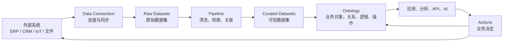
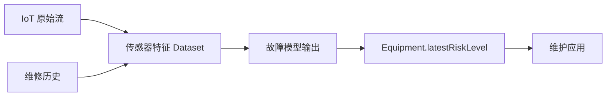
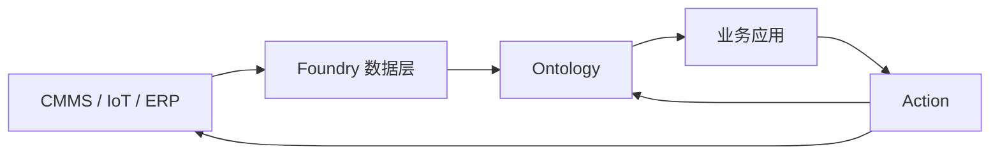

# 第六课：Foundry 到底是什么？

> 本章图和配置片段用于建立平台心智模型；具体界面、可用能力与配置方式以当前 Foundry 环境和英文官方文档为准。

前五课主要站在 Ontology 内部看问题。

这一课把视角拉远，回答：

> Ontology 在 Foundry 中处于什么位置？数据怎样从企业系统一路变成业务应用？

先记住一张总图：



Foundry 不是一个数据库，也不只是 ETL 工具。

最直白地说：

> Foundry 是把企业数据连接、加工、治理、建模并投入日常运营的平台；Ontology 是它面向现实业务的操作层。

Palantir 官方把 Foundry 中的数据分为数据层和对象层：数据层保存 Dataset，对象层就是 Ontology。[Foundry 入门概念](https://www.palantir.com/docs/foundry/getting-started/introductory-concepts)

## 1. 用工厂物流理解 Foundry

可以把 Foundry 想成一座物流中心：

```text
Data Connection   = 收货入口
Dataset           = 仓库中的标准货箱
Pipeline          = 分拣、清洗和组装流水线
Data Lineage      = 每件货物的来源与加工记录
Ontology          = 按业务含义组织好的商品世界
Applications      = 业务人员使用的工作台
Actions           = 发货、调度、批准等操作
Security          = 每个区域和动作的门禁
```

这个比喻的关键是：

```text
数据进入 Foundry 后并没有立刻成为 Ontology。
它先以 Dataset 存在，再经过可追踪的加工，最后映射为业务对象。
```

## 2. 第一站：Data Connection

企业数据可能来自：

```text
关系数据库
ERP、CRM、MES、CMMS
S3、HDFS、SFTP
API
IoT 流
CSV、Excel、JSON、XML
图片、视频、PDF
另一个 Foundry 环境
```

Data Connection 的工作是把这些数据可靠地同步进 Foundry。

它主要负责：

```text
如何连接源系统
怎样认证
全量还是增量同步
批处理还是流式同步
多久同步一次
同步失败怎样重试
如何监控数据是否按时到达
```

它不应该承担大量复杂业务清洗。

官方建议尽量按原始形态接入数据，让数据的所有变化在 Foundry 内部受版本和血缘管理。[Data Connection 官方概览](https://www.palantir.com/docs/foundry/data-connection/overview)

例如：

```text
外部 CMMS 数据库
  maintenance_work_orders 表
          ↓ Data Connection
Foundry
  raw_cmms_work_orders Dataset
```

这里的 `raw_cmms_work_orders` 仍然代表源系统记录，不是 `WorkOrder` Object。

## 3. 第二站：Dataset

Dataset 是 Foundry 数据层最基本的数据表示。

它可以包含：

```text
结构化数据      表格、行、列
半结构化数据    JSON、XML
非结构化数据    PDF、图片、视频、邮件
```

Dataset 不只是一个静态 CSV 文件。

它还带有：

```text
Schema
权限
版本
更新事务
分支
数据质量与构建信息
血缘
```

官方文档把 Dataset 描述为数据从进入 Foundry 到映射进 Ontology 期间最基本的表示形式。[Dataset 核心概念](https://www.palantir.com/docs/foundry/data-integration/datasets)

### Raw Dataset 和 Curated Dataset

可以简单分成两类：

```text
Raw Dataset
  尽量忠实保存源系统数据
  方便追踪和重新加工

Curated Dataset
  已清洗、标准化、去重和关联
  适合分析、模型或 Ontology 使用
```

例如：

```text
raw_equipment
raw_sensor_registry
raw_work_orders
        ↓
curated_equipment
curated_sensor
curated_work_order
```

## 4. 第三站：Pipeline

Pipeline 是数据加工过程。

典型工作包括：

```text
重命名列
转换数据类型
去除无效记录
处理空值
去重
Join 多个数据集
计算派生字段
统一单位和编码
执行数据质量检查
生成适合 Ontology 的输出
```

可以用两种主要方式建立 Pipeline：

```text
Pipeline Builder   点选式、低代码方式
Code Repositories  使用代码实现复杂转换
```

Pipeline Builder 能输出 Dataset，也能直接输出 Object Type、Link Type 和时间序列等 Ontology 组件。[Pipeline Builder 输出](https://www.palantir.com/docs/foundry/pipeline-builder/outputs-overview)

### 一个简单 Pipeline

原始设备数据：

| asset_no | asset_nm | site_cd | active_flg |
|---|---|---|---:|
| PUMP-101 | 一号冷却泵 | SH-01 | 1 |

经过转换：

```text
asset_no    → equipment_id
asset_nm    → display_name
site_cd     → site_id
active_flg  → operational_status
```

输出：

| equipment_id | display_name | site_id | operational_status |
|---|---|---|---|
| PUMP-101 | 一号冷却泵 | SH-01 | RUNNING |

这张输出表已经更接近业务语言，可以支持 `Equipment` Object Type。

### Pipeline 和 Function 不一样

```text
Pipeline
  适合批量或流式处理大量数据
  产生新的 Dataset 或 Ontology 输出
  通常按计划或数据到达触发

Function
  适合应用中的快速业务计算
  接收参数并返回结果
  可以读取 Object、遍历 Link 或支持 Action
```

## 5. Data Lineage：数据的来龙去脉

假设用户看到：

```text
PUMP-101.latestRiskLevel = HIGH
```

他可能会问：

```text
这个值来自哪个系统？
用了哪些原始字段？
经过了哪些转换？
由哪个模型产生？
最后一次更新时间是什么？
上游数据失败会影响哪些应用？
```

Data Lineage 用来回答这些问题。



Foundry 会记录输入、输出和生成数据的转换逻辑；Data Lineage 可以查看 Dataset 的上下游、Schema、构建时间和生成代码。[Data Lineage 官方概览](https://www.palantir.com/docs/foundry/data-lineage/overview)

最简单的理解：

> Ontology 告诉用户一个业务事实是什么意思；Lineage 告诉用户这个事实从哪里来。

## 6. 第四站：Ontology

数据准备好后，把它映射为业务概念：

```text
curated_equipment 的每一行
    ↓
一个 Equipment Object

equipment_id
    ↓
Object 主键

display_name、status
    ↓
Properties

site_id 与 Site.siteId 匹配
    ↓
EquipmentLocatedAtSite Link
```

Ontology 的工作不只是把列改名。

它还加入：

```text
业务名称和描述
对象身份
真实关系
Functions
Actions
模型
安全与治理
```

Palantir 将 Ontology 定义为位于 Dataset、Virtual Table 和模型之上的组织操作层。[Ontology 官方概览](https://www.palantir.com/docs/foundry/ontology/overview)

### Ontology Manager

Ontology Manager 是设计和管理 Ontology 的主要界面。

它用于：

```text
创建和编辑 Object Type
映射 Property
配置主键和标题键
创建 Link Type
管理 Action Type
查看 Function
管理 Interface、Shared Property 和类型组
查看数据源、索引和安全配置
保存、审查和治理变更
```

注意：Ontology Manager 是管理工具；Ontology 本身是被整个 Foundry 平台使用的运行系统。

## 7. 第五站：应用和分析

同一个 Ontology 可以被多种工具使用：

```text
Object Explorer   搜索和浏览业务对象
Object View       查看一个对象的完整业务页面
Insight / Quiver  分析对象集和关系
Workshop          构建业务操作应用
Vertex            图分析、系统建模和模拟
Map               地理空间工作流
OSDK / API        构建外部或定制应用
AIP / Agents      让 AI 在受控工具范围内读取和执行
```

这意味着不需要为每个应用重新解释一次数据：

```text
Equipment 的名称、状态、风险和 Links
在所有 Ontology-aware 应用中具有相同含义。

CreateMaintenanceWorkOrder Action
在多个应用中执行同一套验证和写入逻辑。
```

## 8. 数据怎样写回现实系统？

Foundry 不只是单向读取。

例如工程师在 Workshop 中执行：

```text
CreateMaintenanceWorkOrder
```

可能产生：

```text
在 Ontology 中创建 WorkOrder
建立 WorkOrder → Equipment Link
通知维修主管
通过 Webhook 或 API 写入 CMMS
记录 Action Log
```

因此形成：



这就是闭环运营，而不是只读分析。

## 9. Project、Resource 和权限边界

在 Foundry 中，创建的 Dataset、Pipeline、代码库和应用等都属于 Resource。

Project 用来组织：

```text
人员
资源
文件夹
访问权限
共同业务目标
```

简单理解：

```text
Project 是协作和安全空间
Resource 是空间里的具体资产
Ontology 把多个资源连接成业务运行层
```

项目不是 Ontology 的业务 Object Type。

例如 Foundry Project `Predictive Maintenance` 是协作空间，而 `WorkOrder` 是现实业务对象类型。

## 10. Foundry、Ontology、AIP 和 Apollo

最简单的区分：

```text
Foundry
  连接、加工、管理并运营企业数据

Ontology
  把数据、逻辑和操作组织为企业业务世界

AIP
  把大模型、AI 工作流和 Agent 安全地连接到 Ontology 与运营

Apollo
  负责软件在不同基础设施环境中的持续部署和运行管理
```

学习 Ontology 时，主要关注 Foundry 和 AIP；Apollo 暂时知道它负责软件交付即可。

## 11. 从 PUMP-101 看完整路径

```text
1. IoT 平台产生温度与振动数据
2. Data Connection 将数据同步或流入 Foundry
3. 原始数据进入 Raw Dataset
4. Pipeline 清洗时间、单位和传感器标识
5. 规则和模型计算异常与故障风险
6. 输出映射为 Sensor、Anomaly、FailurePrediction
7. Ontology 将它们连接到 Equipment PUMP-101
8. Workshop 应用展示风险和维修建议
9. 工程师通过 Action 创建工单
10. 工单写回 CMMS
11. 维修结果进入 Dataset 和 Ontology
12. 模型使用结果继续评估和改进
```

每一层的责任不同：

| 层 | 负责的问题 |
|---|---|
| Data Connection | 数据怎样可靠进入平台？ |
| Dataset | 数据以什么版本和 Schema 保存？ |
| Pipeline | 数据怎样被清洗和加工？ |
| Lineage | 数据从哪里来、影响哪里？ |
| Ontology | 数据在业务世界中代表什么？ |
| Function / Model | 怎样计算、预测和推荐？ |
| Application | 用户怎样理解和使用？ |
| Action | 用户或 AI 怎样安全改变业务？ |
| Security | 谁能看、算和操作？ |

## 12. 常见误解

### 误解一：Foundry 就是一个数据仓库

Foundry 可以管理数据，但还集成了数据连接、版本、血缘、模型、Ontology、应用和操作工作流。

### 误解二：Pipeline 就是 Ontology

Pipeline 负责加工数据；Ontology 负责表达现实业务概念并支持运营。

### 误解三：把 Dataset 映射成 Object 就完成了

真正可用的 Ontology 还需要清晰语义、Links、Functions、Actions、安全和应用工作流。

### 误解四：Foundry 只读取其他系统

Foundry 可以通过 Actions、Webhook、导出和 API 将经过治理的决定写回外部系统。

### 误解五：Ontology 替代所有源系统

Ontology 可以成为统一操作层，但 ERP、CRM、CMMS 等系统仍可继续承担各自的交易和记录职责。

## 13. 一分钟自测

把下面内容放到正确位置：

```text
1. 从 SAP 每小时同步订单
2. 保存刚进入 Foundry 的订单表
3. 清洗金额并关联客户主数据
4. 查看订单字段的来源与下游影响
5. 把订单行映射为 Order Object
6. 构建订单处理页面
7. 用户批准订单并写回 SAP
```

<details>
<summary>完成后查看参考答案</summary>

```text
1. Data Connection
2. Raw Dataset
3. Pipeline
4. Data Lineage
5. Ontology
6. Workshop 或自定义应用
7. Action 与外部系统写回
```

</details>

## 14. 本课结论

Foundry 的主线可以浓缩为：

```text
连接数据
    ↓
以 Dataset 保存
    ↓
通过 Pipeline 加工
    ↓
使用 Lineage 保留来龙去脉
    ↓
映射到 Ontology 的业务世界
    ↓
供应用、分析、API 和 AI 使用
    ↓
通过 Action 把决定写回
```

最值得记住的一句话是：

> Dataset 让数据可靠存在，Pipeline 让数据变得可用，Ontology 让数据具有业务含义并能够进入运营。

下一课深入最容易产生疑问的一步：一行 Dataset 究竟怎样成为 Object，主键、索引、多数据源、Links 和用户编辑又是怎样工作的。

## 独立练习：追踪一条数据

为 `PUMP-101.latestRiskLevel` 写出一条完整血缘：源系统字段、Raw Dataset、转换规则、Curated Dataset、模型版本、Ontology Property 和消费它的应用。再指出其中任何一步失败时，用户应该在哪里看到状态。
