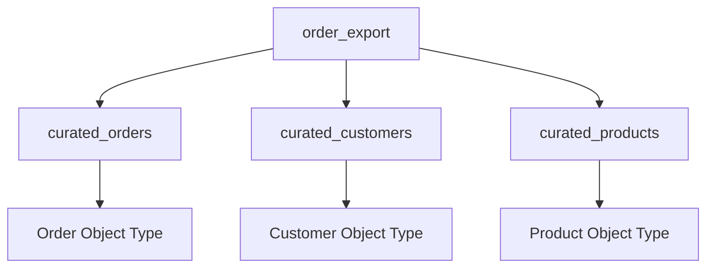
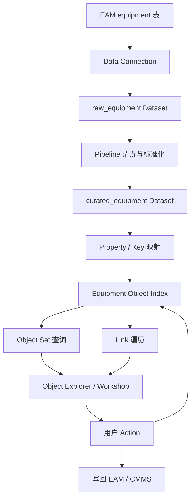

# 第七课：数据怎样变成 Object 和 Link？

> 阅读路线：主键、映射、索引和 Link 是入门必修；多数据源、OSv2 edits、Materialization 与 Virtual Table 属于生产进阶。本章 YAML 是教学伪代码。

上一课建立了 Foundry 全景：

```text
外部系统 → Dataset → Pipeline → Ontology → 应用与 Action
```

这一课放大其中最关键的一步：

> Dataset 中的一行，究竟怎样成为 Ontology 中的 Object？

先记住：

```text
Object Type   是定义
Object        是实例
Object Set    是一组实例
Datasource    提供实例数据
Index         让实例能被快速查询
Primary Key   保证同一个现实对象能被持续识别
```

## 1. 从一张设备表开始

Pipeline 输出了一张可信数据集：

`curated_equipment`

| equipment_id | display_name | status | site_id | criticality |
|---|---|---|---|---|
| PUMP-101 | 一号冷却水泵 | RUNNING | SH-01 | HIGH |
| PUMP-102 | 二号冷却水泵 | STANDBY | SH-01 | HIGH |
| FAN-201 | 一号排风机 | RUNNING | SH-02 | MEDIUM |

我们希望用户看到：

```text
Equipment Object Type
  ├── PUMP-101
  ├── PUMP-102
  └── FAN-201
```

## 2. 先定义 Object Type

在 Ontology Manager 中定义：

```yaml
objectType:
  displayName: 设备
  pluralDisplayName: 设备
  apiName: Equipment
  description: 工厂中可独立识别、运行和维护的生产设备

  primaryKey: equipmentId
  titleKey: displayName

  properties:
    equipmentId: string
    displayName: string
    status: EquipmentStatus
    siteId: string
    criticality: CriticalityLevel
```

这里有三个容易混淆的名字：

```text
Display Name
  给人看的名称，例如“设备”

API Name
  给代码和 OSDK 使用的稳定名称，例如 Equipment

Object Type ID / RID
  平台内部识别资源的标识
```

官方的对象创建流程包括元数据、支持数据源、属性映射、主键和标题键等配置。[创建 Object Type](https://www.palantir.com/docs/foundry/object-link-types/create-object-type)

## 3. 支持数据源是什么？

Object Type 只是 Schema，并不会凭空产生 PUMP-101。

需要指定一个支持数据源：

```text
Equipment Object Type
        ↑
curated_equipment Dataset
```

支持数据源负责提供：

```text
哪些 Object 存在
每个 Object 的主键是什么
Property Value 是什么
数据何时更新
数据访问受什么安全规则约束
```

然后进行属性映射：

| Dataset 列 | Ontology Property |
|---|---|
| `equipment_id` | `Equipment.equipmentId` |
| `display_name` | `Equipment.displayName` |
| `status` | `Equipment.status` |
| `site_id` | `Equipment.siteId` |
| `criticality` | `Equipment.criticality` |

“支持”不等于把 Dataset 改名。

```text
Dataset 仍然属于数据层
Object Type 属于业务语义层
映射把两者连接起来
```

## 4. Primary Key 为什么是核心？

Primary Key 回答：

> 哪些数据代表同一个现实对象？

在例子中：

```text
equipment_id = PUMP-101
```

只要主键仍然是 `PUMP-101`，今天和明天的数据都会被理解为同一台设备。

### 第一天

```yaml
equipmentId: PUMP-101
status: RUNNING
```

### 第二天

```yaml
equipmentId: PUMP-101
status: MAINTENANCE
```

这不是两个 Object，而是同一个 Object 状态发生变化。

### 好主键的特征

```text
唯一
稳定
不会因为显示名称变化而变化
不会重复使用给另一个现实对象
可以从数据源可靠获得或生成
```

### 不好的主键

```text
设备名称
  可能重名，也可能改名

数组下标
  数据重新排序后会变化

当前时间
  每次处理会得到新对象

浮点数
  精度和稳定性不适合作身份
```

Object Storage v2 会在索引时检查主键唯一性；同一事务中的重复主键会使索引失败。[对象索引数据限制](https://www.palantir.com/docs/foundry/object-indexing/data-restrictions)

## 5. Title Key 和 Primary Key 不一样

```text
Primary Key
  用于系统唯一识别对象

Title Key
  用于界面向用户显示对象
```

例如：

```text
Primary Key: PUMP-101
Title Key: 一号冷却水泵
```

用户可以看到友好的标题，系统仍使用稳定 ID。

不要为了界面好看而把名称当主键。

## 6. 索引发生了什么？

完成映射后，Foundry 会把支持数据源中的对象数据建立到 Ontology 后端索引中。

简化过程：


索引的意义是让应用能够快速执行：

```text
搜索 PUMP-101
筛选所有 HIGH criticality 设备
聚合每个站点的设备数量
沿 Link 查找设备的工单
加载一个 Object View
```

Foundry Ontology 后端包含负责索引、存储、查询和协调编辑的服务；Object Storage v2 支持增量索引和流式数据源等能力。[Ontology 后端概览](https://www.palantir.com/docs/foundry/object-backend/overview)

### 教学提醒：Index 不是业务源系统

不要把 Ontology Index 理解成新的 ERP。

```text
ERP / CMMS / IoT
  可能仍然是某类交易数据的系统记录来源

Ontology Index
  提供面向对象、关系和运营应用的快速统一视图
```

## 7. Object、Object Type 和 Object Set

这三个概念必须完全分清。

```text
Equipment
  Object Type：设备这一类事物的定义

PUMP-101
  Object：某一台具体设备

所有高风险设备
  Object Set：满足条件的一组设备
```

Object Set 可以是：

```text
所有设备
上海一厂的设备
风险等级为 HIGH 的设备
存在未完成工单的设备
用户手工保存的一组重点设备
```

动态 Object Set 可以按定义重新计算：

```text
Equipment where latestRiskLevel == HIGH
```

当设备风险变化时，集合成员也会变化。

静态 Object Set 保存具体主键列表，底层数据变化时成员不会自动改变。[Ontology 后端中的 Object Set](https://www.palantir.com/docs/foundry/object-backend/overview)

## 8. 一张表可能包含多个 Object Type

原始订单表：

| order_id | customer_id | customer_name | product_sku | product_name |
|---|---|---|---|---|
| O-1 | C-7 | 张三 | SKU-9 | 咖啡机 |

不应机械创建 `OrderRow`。

它可能支持：

```text
Order
Customer
Product
```

需要通过 Pipeline 拆分和去重：



## 9. 一个 Object Type 也可能来自多个数据源

设备信息可能散落在不同系统：

```text
EAM            设备身份、型号、投产时间
MES            当前运行状态
IoT            最新温度和振动
模型输出        当前风险等级
维护系统        最近维修时间
```

用户希望看到一个连贯的 `Equipment`：

```yaml
Equipment:
  equipmentId: PUMP-101
  model: PX-200
  operationalStatus: RUNNING
  latestTemperature: 86.4
  latestRiskLevel: HIGH
  lastMaintenanceAt: 2026-07-18
```

这可以通过上游 Pipeline 先合并成一个支持数据集，或者在支持能力允许时使用多数据源 Object Type。

关键仍然是：

```text
各数据源如何识别同一台设备？
哪个 Property 由哪个来源负责？
不同来源发生冲突时谁优先？
每个来源的安全策略是什么？
```

多个数据源不是“自动拼起来”；身份和冲突策略必须明确。

## 10. Link 怎样由数据产生？

我们还有一张 Site 数据集：

| site_id | site_name |
|---|---|
| SH-01 | 上海一厂 |
| SH-02 | 上海二厂 |

映射为 `Site`：

```text
SH-01 → Site Object
SH-02 → Site Object
```

Equipment 中有 `site_id`：

```text
PUMP-101.siteId = SH-01
```

可以定义 Link Type：

```yaml
linkType:
  name: EquipmentLocatedAtSite
  from: Equipment
  to: Site
  mapping:
    Equipment.siteId: Site.siteId
```

于是索引得到：

```text
PUMP-101 ──located at──> SH-01
```

### 一对多或多对一 Link

外键可以支持：

```text
多个 Equipment → 一个 Site
多个 Order → 一个 Customer
多个 Flight → 一个 Aircraft
```

### 多对多 Link

技术人员和技能可能是多对多：

```text
一个 Technician 拥有多个 Skill
一个 Skill 被多个 Technician 拥有
```

通常需要中间数据源：

| technician_id | skill_id |
|---|---|
| T-1 | BEARING |
| T-1 | ELECTRICAL |
| T-2 | BEARING |

多对多关系的数据源可以直接支持 Link Type 本身。[Link Type 官方概览](https://www.palantir.com/docs/foundry/object-link-types/link-types-overview)

### Link 是双向可遍历的

一个 Link Type 可以从两边访问：

```text
Equipment → locatedAt → Site
Site → containsEquipment → Equipment[]
```

不需要为反方向再建一个重复 Link Type。

## 11. Link 什么时候应该变成 Object？

简单关系：

```text
WorkOrder ──assigned to──> Technician
```

如果只关心当前负责人，一个 Link 足够。

如果“指派”拥有自己的数据：

```text
指派时间
接受时间
拒绝原因
排班时段
指派人
状态变化历史
```

就可以建立：

```text
WorkOrder → Assignment → Technician
```

`Assignment` 作为 Object 表达一个有独立生命周期的业务事件。

## 12. Dataset 更新后 Object 会怎样？

假设下一次 Pipeline 输出：

| equipment_id | status |
|---|---|
| PUMP-101 | MAINTENANCE |

索引更新后：

```text
同一个 Equipment PUMP-101
status 从 RUNNING 变成 MAINTENANCE
```

如果新增一行：

```text
PUMP-103
```

则出现新的 Object。

如果某行从快照数据集中消失，最终行为取决于数据源同步和删除语义配置；不要假设“没看到这一行”永远等于“现实对象已删除”。

对业务删除应明确区分：

```text
暂时没有同步到
设备停用
设备报废
数据修正
真正删除对象
```

很多业务对象更适合保留并修改生命周期状态，而不是物理删除。

## 13. Action 编辑和数据源更新如何同时存在？

PUMP-101 的基础状态来自 EAM：

```text
status = RUNNING
```

用户通过 Action 添加：

```text
dispatchNote = “明天夜班检查”
```

Ontology 的最新对象状态可能组合：

```text
输入数据源提供的值
    +
用户通过 Action 产生的编辑
```

在 OSv2 中需要区分两个时刻：Action edits 会立即进入对象索引，随后由系统周期性 flush 到 Funnel 管理的持久 Foundry datasets。输入数据源与用户编辑作用于同一对象时还存在冲突策略；默认策略是优先应用用户编辑，也可以按数据源配置为采用最新值。[用户编辑如何应用](https://www.palantir.com/docs/foundry/object-edits/how-edits-applied)

### 为什么不让用户直接改 Dataset？

Action 能够表达：

```text
谁执行
业务意图是什么
参数是什么
是否满足权限和前置条件
同时修改哪些 Object 和 Link
触发哪些副作用
怎样审计
```

直接改一行表格通常不能完整表达这些业务含义。

## 14. Materialization 是什么？

有时下游 Pipeline 需要读取：

```text
支持数据源的基础数据
    +
用户通过 Action 产生的最新编辑
```

Materialization 可以生成包含每个 Object 最新状态的数据资源，供下游 Pipeline 或批量下载使用。[Materialization 官方说明](https://www.palantir.com/docs/foundry/object-edits/materializations)

最简单的区分：

```text
支持 Dataset
  输入 Ontology 的基础数据

Ontology Index
  应用查询和操作的当前对象视图

Materialized Dataset
  把当前对象状态重新输出给数据工作流
```

## 15. Virtual Table 和不复制数据

并非所有数据都必须复制进 Foundry Dataset。

Virtual Table 可以指向外部系统中的表，让 Foundry 使用外部存储的数据。具体能力和限制取决于平台配置。

无论使用 Dataset 还是 Virtual Table，本体设计问题都没有变化：

```text
现实对象是什么？
身份是什么？
Property 含义是什么？
关系是什么？
安全和更新行为是什么？
```

## 16. 从源记录到用户页面的完整路径



## 17. 排错时应该检查哪一层？

### Object 完全不存在

检查：

```text
源数据是否同步成功？
Pipeline 是否成功构建？
支持数据集是否包含该主键？
主键是否为空或重复？
对象索引是否成功？
用户是否有查看权限？
```

### Object 存在但 Property 为空

检查：

```text
Dataset 列是否有值？
Property 是否映射到正确列？
数据类型是否兼容？
Property 安全策略是否让当前用户只能看到 null？
```

### Link 不存在

检查：

```text
两边 Object 是否都存在？
外键值是否与目标主键完全匹配？
类型、空格和大小写是否一致？
多对多支持数据源是否包含关系行？
Link 是否成功保存和索引？
```

## 18. 一分钟自测

给定：

```text
Dataset：curated_equipment
一行：PUMP-101, 一号冷却水泵, SH-01
```

判断：

```text
1. Equipment 是什么？
2. PUMP-101 是什么？
3. equipment_id 是什么作用？
4. 所有 HIGH 风险设备是什么？
5. SH-01 与 PUMP-101 的业务关系怎样表达？
6. 为什么需要 Index？
```

<details>
<summary>完成后查看参考答案</summary>

```text
1. Object Type
2. Object
3. Primary Key，稳定识别该设备
4. 一个动态 Object Set
5. EquipmentLocatedAtSite Link
6. 支持快速搜索、筛选、聚合和关系遍历
```

</details>

## 19. 本课结论

把 Dataset 映射进 Ontology 的核心过程是：

```text
定义现实世界的 Object Type
    ↓
选择支持数据源
    ↓
把列映射为 Property
    ↓
用稳定 Primary Key 识别对象
    ↓
验证数据类型和唯一性
    ↓
建立 Object Index
    ↓
通过真实业务关系建立 Link
    ↓
让应用查询 Object、Object Set 和 Links
    ↓
通过 Action 安全产生用户编辑
```

最值得记住的一句话是：

> Dataset 的一行只有在拥有稳定身份、明确业务含义并被映射和索引后，才成为用户能够理解和操作的 Object。

下一课讨论怎样让 Ontology 在团队和业务不断增长时仍然稳定：Shared Property、Interface、Value Type、类型组、复用原则和演进边界。

## 独立练习：主键与冲突

为一台设备设计“源系统会改编号”的反例，比较自然键、组合键和代理键。然后给同一 Property 同时收到数据源更新与用户 Action edit 的场景，明确你选择的冲突策略以及理由。
