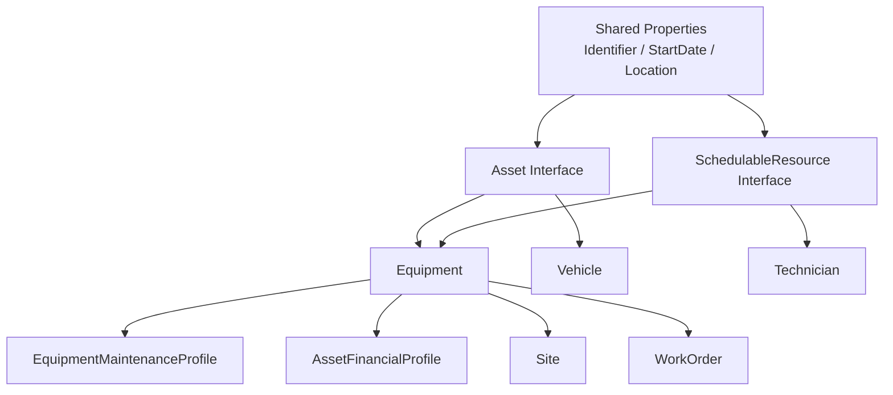

# 第八课：怎样设计一个稳定的企业 Ontology？

小型本体只要能支持一个工作流就可以开始产生价值。

企业 Ontology 的困难在于：

```text
数据源不断变化
新团队不断加入
同一个概念被重复建模
应用已经依赖现有 API
权限边界越来越复杂
每个团队都想把自己的字段加到核心对象
```

这一课回答：

> 怎样让 Ontology 能够增长、复用和演进，而不是变成另一座难以维护的数据迷宫？

> 本章 YAML 均为教学伪代码，只表达设计意图，不代表 Palantir Interface、Value Type 或治理资源的正式 Schema。

## 1. 稳定不等于一开始设计完美

不存在一次设计完成、永远不用变化的企业本体。

稳定指的是：

```text
核心概念清楚
身份和含义不随源系统轻易变化
新用例可以扩展
已有应用不会被随意破坏
重复概念能够被发现和治理
权限边界明确
每次变更都有负责人和审查过程
```

Palantir 官方建议优先遵循：

```text
对现实建模，而不是对系统建模
避免重复
核心开放扩展、谨慎修改
使用组合而不是深层继承
```

[Ontology 设计最佳实践](https://www.palantir.com/docs/foundry/ontology/ontology-best-practices)

## 2. 先确定核心概念和扩展概念

以 `Equipment` 为例。

真正核心的属性可能只有：

```yaml
EquipmentCore:
  equipmentId: string
  displayName: string
  equipmentType: string
  lifecycleStatus: string
```

不同团队还需要：

```text
维护团队
  latestRiskLevel
  lastMaintenanceAt
  maintenanceStrategy

财务团队
  acquisitionCost
  depreciationMethod
  bookValue

能源团队
  ratedPower
  currentEfficiency
  energyConsumption

安全团队
  hazardClass
  inspectionStatus
```

如果所有内容都不断加入 `Equipment`，最终会得到一个巨大的“上帝对象”：

```text
属性很多
大部分用户只使用一小部分
安全策略难以理解
每次改动影响大量应用
多个团队争夺同一个核心类型
```

更稳健的方向是：

```text
保留小而稳定的核心 Equipment
    +
通过 linked extension objects 承载专门领域数据
    +
通过 Interface 复用能力
    +
通过 Shared Property 统一共同属性
```

## 3. Shared Property：统一共同属性

假设多个 Object Type 都有“开始日期”：

```text
Employee.startDate
Contractor.startDate
Equipment.startDate
Contract.startDate
```

如果每个都是独立 Property：

```text
名称可能不同
类型可能不同
描述可能不同
格式和元数据需要分别维护
```

Shared Property 允许多个 Object Type 使用同一个属性定义：

```yaml
sharedProperty:
  apiName: StartDate
  displayName: 开始日期
  type: date
  description: 该实体在当前业务语境下开始生效的日期
```

然后由多个类型使用：

```text
Employee 使用 StartDate
Contractor 使用 StartDate
Contract 使用 StartDate
```

Shared Property 统一的是：

```text
属性含义
数据类型
显示和格式化元数据
集中管理方式
```

它不意味着不同对象共享同一份数据值。[Shared Property 官方概览](https://www.palantir.com/docs/foundry/object-link-types/shared-property-overview)

### 什么时候使用 Shared Property？

适合：

```text
多个类型确实共享同一个业务概念
需要跨类型统一搜索或应用
需要集中维护属性元数据
```

不适合：

```text
只是碰巧名字相同但含义不同
一个“status”在每个领域拥有完全不同状态机
为了减少 Property 数量而强行共享
```

例如：

```text
Order.status 与 Equipment.status
虽然都叫 status，但含义、取值和生命周期完全不同，
通常不应因为同名就做成一个 Shared Property。
```

## 4. Value Type：给值增加统一业务约束

普通 `string` 可以存很多东西：

```text
邮箱
设备编号
国家代码
货币代码
电话号码
工单优先级
```

但这些值不是任意字符串。

Value Type 用来给数据值增加业务意义、格式和约束。

例如：

```yaml
valueType:
  name: EquipmentIdentifier
  baseType: string
  constraints:
    pattern: "^[A-Z]+-[0-9]+$"
  examples:
    - PUMP-101
    - FAN-201
```

或者：

```yaml
valueType:
  name: RiskProbability
  baseType: decimal
  constraints:
    minimum: 0
    maximum: 1
```

最直白的区别：

```text
Property
  描述对象的某个特征

Value Type
  描述这个值本身是什么、允许什么格式
```

Value Type 适合统一：

```text
ID 格式
代码集合
单位和范围
邮箱、URL、货币等语义
跨类型重复使用的值约束
```

Palantir 将 Value Type 定义为带有元数据和约束的字段类型语义包装器，用来集中表达领域含义和复用数据校验；它受所在 Space 的范围限制，并非所有 Ontology 环境都可用。[Value Types 官方概览](https://www.palantir.com/docs/foundry/object-link-types/value-types-overview)

## 5. Interface：统一能力，而不是制造巨型父类

假设系统有：

```text
Equipment
Technician
ConferenceRoom
Vehicle
```

它们完全不是同一种实体，但都可能被安排到时间表中。

可以定义：

```yaml
interface:
  name: SchedulableResource
  properties:
    - CalendarId
    - AvailabilityStatus
  actionConstraints:
    - ReserveResource
  linkConstraints:
    - ScheduledInCalendar
```

然后：

```text
Equipment implements SchedulableResource
Technician implements SchedulableResource
ConferenceRoom implements SchedulableResource
Vehicle implements SchedulableResource
```

应用如果围绕 `SchedulableResource` 构建，就不必分别写四套逻辑。

### Interface 和 Object Type 的区别

```text
Object Type
  具体
  有支持数据源
  可以产生 Object 实例

Interface
  抽象
  通过 Properties、Link constraints 和 Action constraints 描述共同契约
  不能独立产生实例
```

官方文档将 Interface 定义为提供多态性的 Ontology 类型，能够让应用通过共同 API 与不同实现类型交互。[Interface 官方概览](https://www.palantir.com/docs/foundry/interfaces/interface-overview)

### 两类常见 Interface

```text
能力接口
  SchedulableResource
  Inspectable
  Geolocated

抽象实体接口
  Person
  Facility
  Asset
```

### 为什么优先组合？

一台工业泵可能同时是：

```text
Maintainable
Inspectable
SchedulableResource
Geolocated
```

如果使用深层单继承，可能出现：

```text
InspectableSchedulableGeolocatedMaintainablePump
```

组合多个小接口更清楚，也更容易扩展。

需要注意：Interface 的支持范围可能随平台版本和应用而变化，实际使用前应检查官方支持矩阵。

## 6. Object Type Group：帮助人发现本体

企业可能有数百个 Object Type。

用户如果面对一张完整列表，会很难知道从哪里开始。

Object Type Group 用来按业务领域组织发现：

```text
资产与维护
  Equipment
  Sensor
  Anomaly
  WorkOrder

供应链
  Supplier
  PurchaseOrder
  Shipment

客户运营
  Customer
  Contract
  ServiceCase
```

Group 的主要作用是：

```text
分类
搜索
浏览
帮助用户理解 Ontology 的业务地图
```

它不是继承关系，也不是安全边界。[Object Type Group 官方说明](https://www.palantir.com/docs/foundry/object-link-types/type-groups)

## 7. 一个概念只保留一个权威表示

常见重复：

```text
Customer
CRMCustomer
SalesCustomer
BillingCustomer
Customer360
```

它们可能代表：

```text
同一个现实客户的不同源系统视图
不同业务上下文中的不同概念
或只是不同团队重复创建
```

不能只看名字判断。

需要问：

```text
它们是否使用相同身份？
生命周期是否相同？
业务含义是否相同？
权限边界是否允许合并？
用户是否认为它们是同一个东西？
```

### 如果确实是同一个现实实体

优先方向：

```text
一个 canonical Customer
多个支持数据源或上游整合
清晰记录每个 Property 的来源
```

### 如果是不同上下文中的不同概念

可以保留不同 Object Type，并明确 Link：

```text
CRMAccount ──represents──> LegalCustomer
BillingAccount ──belongs to──> LegalCustomer
```

不要为了“全企业唯一模型”而抹平真实业务差异。

## 8. 区分实体、事件、观察和快照

稳定设计必须分清四类概念。

### 实体 Entity

```text
Equipment
Customer
Technician
```

拥有稳定身份并持续存在。

### 事件 Event

```text
EquipmentFailure
OrderCancellation
PaymentTransaction
```

发生在某个时间，通常不可被当作从未发生。

### 观察 Observation

```text
SensorReading
InspectionResult
RiskAssessment
```

表达某个时间对实体的测量或判断。

### 快照 Snapshot

```text
DailyInventorySnapshot
MonthlyAccountBalance
ShiftProductionSummary
```

表达某一时刻或周期的状态副本。

如果把事件、观察和快照都塞成实体当前属性，就会丢失历史语义。

例如：

```text
Equipment.latestRisk = HIGH
```

便于当前筛选，但无法代替：

```text
RiskAssessment
  assessedAt
  modelVersion
  probability
  explanation
  reviewerDecision
```

常见做法是两者并存：

```text
实体上的 latest 属性支持快速工作流
独立事件或观察对象保留完整历史
```

## 9. Extension Object：避免核心对象无限膨胀

核心：

```yaml
Equipment:
  equipmentId: string
  displayName: string
  lifecycleStatus: string
```

维护扩展：

```yaml
EquipmentMaintenanceProfile:
  maintenanceProfileId: string
  strategy: string
  latestRiskLevel: string
  nextPlannedMaintenanceAt: timestamp
```

Link：

```text
Equipment ──has maintenance profile──> EquipmentMaintenanceProfile
```

财务扩展：

```text
Equipment ──has financial profile──> AssetFinancialProfile
```

这样可以：

```text
隔离团队所有权
缩小核心类型的变更面
应用按需加载扩展
更清楚地配置敏感权限
```

但也不要过度拆分，否则用户需要穿过很多 Link 才能看到基本信息。

判断标准仍然是业务清晰度和工作流价值。

## 10. 命名是 API 设计

Ontology 名称会被：

```text
业务用户看到
开发者在 OSDK 中调用
AI 用来选择对象和工具
应用长期依赖
```

因此应使用人和机器都容易理解的命名。

### 推荐

```text
Equipment.lastInspectionDate
Order.promisedDeliveryAt
Customer.primaryEmail
WorkOrder.assignedTechnician
```

### 避免

```text
eqp_lst_insp_dt
ord_pdt
cust_eml_01
linkedChildPersonObjects
```

同时为资源写清：

```text
一句话定义
包含什么
不包含什么
身份规则
数据来源
负责人
适用工作流
```

## 11. API Name 一旦被依赖就要谨慎修改

Display Name 可以为了用户体验调整。

API Name 被代码、Function、OSDK 和应用引用后，修改可能造成破坏。

因此新类型可以经过：

```text
Experimental
    ↓
验证命名和 Schema
    ↓
Active
    ↓
稳定维护
    ↓
Deprecated
```

不要让未验证的实验模型过早成为全企业公共 API。

## 12. 安全边界会影响模型边界

理论上，一个 `Employee` 可以包含：

```text
姓名
部门
薪资
绩效
健康信息
安全许可
```

但这些信息的访问人群完全不同。

设计时要问：

```text
是否适合用 Property 安全策略保护？
是否应该拆成独立的敏感扩展 Object？
不同数据源是否具有不同组织边界？
哪些应用需要哪些最小信息？
```

语义上属于同一实体，不代表所有数据必须位于同一宽对象中。

## 13. 设计所有权

每个核心资源应有明确责任人：

```yaml
ownership:
  objectType: Equipment
  domainOwner: 资产管理团队
  dataOwner: 企业数据平台主管团队
  securityOwner: 工业安全团队
  changeApprovers:
    - 资产架构负责人
    - Ontology 治理委员会
```

不同角色回答不同问题：

```text
领域负责人
  概念和业务规则是否正确？

数据负责人
  来源、质量和刷新是否可靠？

安全负责人
  谁能看到和操作？

应用负责人
  变更会不会破坏工作流？
```

## 14. 设计建议：Rule of Three 何时抽象复用？

不要第一次看到重复就建立复杂框架。

可以使用简单规则：

```text
第一次：可能只是巧合
第二次：可能形成模式
第三次：认真考虑抽象和复用
```

例如三个团队都实现了：

```text
可调度资源的 availability
查询可用时间的 Function
ReserveResource Action
```

此时可以考虑：

```text
SchedulableResource Interface
共享 AvailabilityStatus
统一预约 Action 或 Function
```

## 15. 版本演进：扩展优于破坏

安全的变化通常包括：

```text
新增非必填 Property
新增 Link
新增 Function 或 Action
新增 Interface 实现
新增扩展 Object Type
```

高风险变化包括：

```text
更换 Primary Key
删除被应用使用的 Property
改变 Property 类型或含义
重命名 Active API Name
合并两个身份规则不同的 Object Type
扩大敏感数据访问范围
```

面对高风险变化，可以：

```text
新增 v2 Property 或 Object Type
保持旧 API 一段迁移期
建立旧到新的映射
更新所有消费者
监控使用情况
最后再 Deprecated
```

## 16. 企业 Ontology 的结构示例



它同时表达：

```text
核心实体
跨类型共同能力
领域扩展
共享属性
真实 Links
```

## 17. 设计检查清单

### 对每个 Object Type

```text
[ ] 代表一个现实实体、事件或观察
[ ] 有稳定身份
[ ] 名称使用业务语言
[ ] 描述包含和排除范围清楚
[ ] 核心属性数量合理
[ ] 生命周期和负责人明确
[ ] 不只是某张源表的复制
```

### 对每个 Property

```text
[ ] 有明确使用者和业务价值
[ ] 类型和含义稳定
[ ] 来源与刷新频率明确
[ ] 敏感级别明确
[ ] 同名 Property 是否真的应该共享
```

### 对每个 Link

```text
[ ] 表达真实业务关系
[ ] 两个方向的名称都自然
[ ] 基数正确
[ ] 如果关系有生命周期，是否应升级为 Object
```

### 对公共资源

```text
[ ] API Name 已经过审查
[ ] Owner 和 Approver 明确
[ ] 有文档和示例
[ ] 已识别下游消费者
[ ] 变更有兼容策略
```

## 18. 一分钟自测

判断最合适的设计：

```text
1. Employee 和 Contractor 都需要相同含义的 startDate
2. Equipment、Room、Technician 都可以被调度
3. 一次故障预测需要保存模型版本、概率和复核结果
4. 财务属性只被财务团队使用且高度敏感
5. 几百个 Object Type 需要方便用户浏览
```

<details>
<summary>完成后查看参考答案</summary>

```text
1. 考虑 Shared Property
2. 考虑 SchedulableResource Interface
3. 建立 FailurePrediction Object Type
4. 考虑独立财务扩展对象和安全边界
5. 使用 Object Type Group
```

</details>

## 19. 本课结论

稳定的企业 Ontology 不是一个最大的统一对象模型。

它应该做到：

```text
核心概念小而清楚
不同领域能够安全扩展
共同含义使用 Shared Property
共同能力使用 Interface
值约束使用 Value Type
大量类型使用 Group 帮助发现
事件、观察、实体和快照不混淆
每个公共资源有所有者和变更流程
优先兼容扩展，谨慎破坏修改
```

最值得记住的一句话是：

> 企业 Ontology 的目标不是让所有数据看起来一样，而是让共享概念保持一致，同时允许真实业务差异被清楚表达。

下一课进入 Ontology 的“逻辑层”：Function、派生属性、聚合、规则、机器学习模型和 Pipeline 应该怎样分工。

## 独立练习：何时不要抽象

比较 `Order.status`、`Equipment.status` 和 `Employee.status`。先尝试把它们做成 Shared Property，再列出由取值、生命周期、权限带来的问题。随后选择一个真正适合共享的 Property，并决定应该使用 Shared Property、Value Type 还是 Interface constraint。
