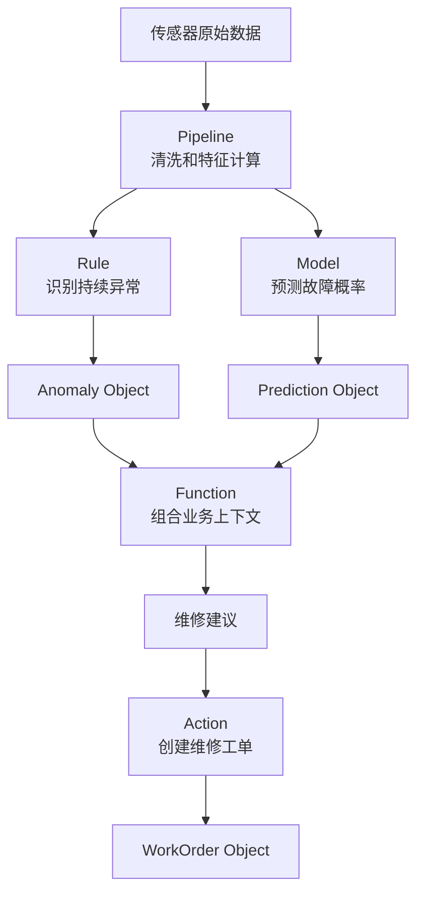

# 第九课：Function、模型和业务逻辑怎样分工？

> 本章 YAML/TypeScript 均为教学伪代码。产品选择还取决于当前 Foundry 环境和能力生命周期；特别注意旧 time-series Rules 已 Sunset。

Ontology 不只是名词和关系。

它还必须表达：

```text
怎样计算
怎样筛选
怎样判断
怎样预测
怎样推荐
怎样验证
```

Foundry 中可以实现逻辑的工具很多：

```text
Pipeline
Automate / 可配置规则
Function
Model
Action Rules
AIP Logic
```

这一课不要求记住每个产品按钮，而是先学会选择：

> 这段逻辑什么时候运行、处理多少数据、是否需要 Object 上下文、是否改变现实？

## 1. 先用一张表区分

| 工具 | 最适合的问题 | 典型例子 |
|---|---|---|
| Pipeline | 批量或流式加工数据 | 每小时计算全部设备特征 |
| Automate / 可配置规则 | 按可配置条件持续识别事件 | 振动连续十分钟超阈值 |
| Function | 应用中的快速计算、查询和编排 | 为当前设备推荐维修方案 |
| Model | 预测、分类、优化或模拟 | 预测未来七天故障概率 |
| Action Rules | 把用户参数转为受控编辑 | 创建工单并更新 Links |
| AIP Logic / Agent | 需要语言理解和多步骤工具调用 | 总结证据并准备建议 |

最重要的区别：

```text
读和算       Function / Model / Pipeline / Automation
改变业务世界 Action
```

## 2. Pipeline：对大量数据进行持续加工

适合 Pipeline 的问题：

```text
每天处理几千万条交易
把多个系统数据标准化并 Join
对所有设备计算最近 24 小时统计特征
按固定计划产生最新客户评分
处理持续到达的事件流
生成新的 Dataset 或 Ontology 输出
```

设备案例：

```text
sensor_readings
    ↓ 每小时聚合
equipment_hourly_features
    vibration_mean
    vibration_max
    temperature_slope
    current_variance
```

Pipeline 特征：

```text
面向大量记录
强调可重复构建
有数据血缘
通常产生持久输出
可批处理或流式执行
```

不适合把用户点击按钮后的低延迟响应全部塞进 Pipeline。

## 3. Automation 和规则：让业务条件可配置

有些判断不需要复杂代码或 ML：

```text
温度超过 100°C
订单金额超过审批额度
库存低于安全库存
合同在 30 天内到期
振动在 10 分钟内持续异常
```

规则的优势是：

```text
条件清楚
容易解释
业务人员可以参与维护
适合告警、分类和时间区间识别
```

例如：

```yaml
alertingAutomation:
  name: HighBearingTemperature
  input: Equipment temperature time series
  condition: temperature > 100 for 10 minutes
  output:
    anomalyType: HIGH_TEMPERATURE
    severity: HIGH
```

对于新的时间序列告警需求，当前推荐使用 time-series alerting automations：在 Quiver 中定义时间序列搜索，再由 Automate 以批处理或流式方式持续评估，并把结果写为 Alert Objects。[Time series alerting](https://www.palantir.com/docs/foundry/time-series/alerting-overview)

旧的 Foundry time-series Rules 已进入 **Sunset**。遗留项目可能仍能看到它，但新课程和新设计不再把它作为推荐方案。[Sunset 与迁移建议](https://www.palantir.com/docs/foundry/foundry-rules/timeseries-concepts)

### 规则和模型的区别

```text
规则
  人明确写出条件
  易解释
  行为确定

模型
  从数据中学习或编码复杂数学逻辑
  输出概率、预测、优化结果
  需要评估和版本管理
```

不要为了显得先进而用 ML 替代清楚可靠的规则。

## 4. Function：应用中的业务计算单元

Function 接收输入、执行服务器端逻辑并返回输出。

它可以：

```text
读取 Object Property
遍历 Links
搜索 Object Set
计算派生值
返回图表聚合
调用模型
调用外部系统
为 Function-backed Action 生成 Ontology edits
```

Palantir Functions 原生支持 Ontology 对象、Link 和编辑，支持 TypeScript 与 Python。[Functions 官方概览](https://www.palantir.com/docs/foundry/functions/overview)

### 简单 Function

```typescript
function remainingHours(order: WorkOrder): number {
  return hoursBetween(now(), order.plannedStartAt);
}
```

### 读取 Links

```typescript
function openWorkOrders(equipment: Equipment): ObjectSet<WorkOrder> {
  return equipment.workOrders
    .filter(order => order.status !== "COMPLETED");
}
```

### 组合业务上下文

```typescript
function recommendMaintenanceResponse(
  equipment: Equipment,
  prediction: FailurePrediction
): Recommendation {
  // 读取设备关键性
  // 查找当前工单
  // 查询备用设备
  // 调用故障模型
  // 返回业务建议和解释
}
```

以上代码只是概念示例，不代表某一具体 Functions API 版本的完整语法。

## 5. Function 的常见输出

### 一个值

```text
riskScore: 0.82
remainingHours: 14
recommendation: "48 小时内维修"
```

### Object 或 Object Set

```text
所有未完成高优先级工单
最适合当前任务的技术人员
与客户相关的全部合同
```

### 聚合

```text
每个工厂的高风险设备数量
每种故障模式的平均维修时间
每个区域的订单延误率
```

### Ontology Edits

复杂 Action 可以调用 Function 生成：

```text
创建或修改多个 Objects
创建或删除多个 Links
同时处理相关状态变化
```

## 6. 派生 Property：存还是实时算？

假设：

```text
Equipment.latestRiskLevel
```

有两种方式。

### 方式一：预先计算并存储

```text
Pipeline / 模型批量计算
    ↓
写入 Dataset 或 Ontology Property
```

适合：

```text
需要频繁筛选和排序
计算昂贵
允许按分钟或小时刷新
需要保存当时结果
```

### 方式二：应用打开时实时计算

```text
Workshop 调用 Function
    ↓
即时返回结果
```

适合：

```text
结果依赖当前用户输入
计算较轻
需要最新状态
不需要把结果作为长期事实保存
```

### 常见组合

```text
存储 latestRiskLevel 供全局筛选
实时计算 recommendation 供当前决策
保存 FailurePrediction Object 供历史审计
```

## 7. 模型：编码对未来或未知状态的判断

Foundry 中的 Model 可以代表：

```text
机器学习模型
预测模型
优化模型
物理模型
统计模型
复杂业务规则模型
```

模型资源通常包含：

```text
模型 Artifact
加载和推理 Adapter
版本
权限
依赖
部署
评估
API
```

Foundry 模型可以用于 Pipeline 中的批量推理，也可以部署为实时推理服务，并绑定到 Ontology。[Foundry 模型概念](https://www.palantir.com/docs/foundry/model-integration/models)

## 8. 批量推理和实时推理

### 批量推理

```text
每天凌晨
    ↓
对所有 100,000 台设备运行模型
    ↓
更新 latestRiskLevel
```

适合：

```text
大量对象
不要求每次点击实时计算
结果需要全局搜索和排序
```

### 实时推理

```text
工程师打开 PUMP-101
    ↓
Function 调用在线模型
    ↓
根据最新输入返回风险
```

适合：

```text
单个或少量对象
需要使用刚输入的场景参数
用户愿意等待短暂推理时间
```

### 混合方式

```text
批量模型筛选出高风险对象
实时模型为选中的对象生成更精细建议
```

## 9. 把模型包装成 Function

模型 API 可能只理解：

```json
{
  "vib_rms": 6.2,
  "temp_slope": 0.41,
  "run_hours": 10234
}
```

业务应用理解的是：

```text
Equipment PUMP-101
```

可以用 Function 连接两者：

```text
输入 Equipment
    ↓
读取设备和 Links
    ↓
构造模型输入
    ↓
调用模型部署
    ↓
把原始输出翻译为业务结果
    ↓
返回 Recommendation
```

Palantir 支持为在线模型部署生成 Function 包装，并在其外增加业务逻辑、Ontology 上下文或多模型编排。[Functions on Models](https://www.palantir.com/docs/foundry/functions/functions-on-models)

## 10. 模型输出应该是 Property 还是 Object？

### 使用 Property

适合只关心最新值：

```text
Equipment.latestRiskLevel
Equipment.predictedFailureDate
```

优点：

```text
容易筛选、排序和显示
模型简单
```

缺点：

```text
历史和上下文容易丢失
```

### 使用独立 Prediction Object

适合需要：

```text
多次预测历史
模型版本
评估时间
解释
人工复核
实际结果
```

常见最佳组合：

```text
Equipment.latestRiskLevel
  支持快速运营

FailurePrediction Objects
  保留完整预测历史和反馈
```

## 11. 模型评估不只看技术指标

技术指标：

```text
Accuracy
Precision
Recall
F1
MAE
RMSE
```

业务指标：

```text
减少多少非计划停机？
提前多少小时发现故障？
误报造成多少无意义维修？
用户采纳建议的比例是多少？
从预测到 Action 花了多久？
```

模型进入 Ontology 后，预测、用户决定和最终结果可以保持关联，因此技术效果和业务效果能被共同评估。[Ontology 中的模型](https://www.palantir.com/docs/foundry/ontology/models)

## 12. Action Rules：逻辑何时真正改变对象？

Function 返回“建议维修”时，现实世界还没有改变。

用户执行 `CreateMaintenanceWorkOrder` 后，Action Rules 才会：

```text
创建 WorkOrder
建立 WorkOrder → Equipment Link
更新 Prediction 状态
发送通知
写回 CMMS
```

Action Rule 可以创建、修改、删除 Object 和 Link，也可以调用 Ontology Edit Function 实现复杂编辑。[Action Rules 官方说明](https://www.palantir.com/docs/foundry/action-types/rules)

必须保持边界：

```text
推荐 Function
  “我建议创建高优先级工单”

Action
  “授权用户确认并真正创建工单”
```

## 13. AIP Logic 和 Agent 适合什么？

Function 适合可编码、服务端、低延迟的业务逻辑。它通常比 Agent 更可预测，但并不天然保证确定性：Function 也可能调用模型或外部系统。

LLM 工作流适合：

```text
阅读维修手册和非结构化报告
总结异常证据
从自然语言提取故障现象
生成工单说明草稿
根据工具结果规划多个步骤
回答需要多源上下文的问题
```

但 LLM 不应绕过 Ontology Action 直接任意修改系统。

安全结构应该是：

```text
Agent 读取被授权的 Objects
    ↓
调用被批准的 Functions 和搜索工具
    ↓
提出建议或准备参数
    ↓
调用有权限、规则和审计的 Action
```

## 14. 如何选择工具：六个问题

### 问题一：处理一个对象还是全部数据？

```text
全部或大量数据 → Pipeline / Automation / 批量模型
一个或少量对象 → Function / 实时模型
```

### 问题二：何时运行？

```text
按计划或数据到达 → Pipeline / Automation
用户交互时       → Function
用户确认决定时   → Action
```

### 问题三：是否需要持久输出？

```text
需要长期保存和全局查询 → Dataset / Property / Prediction Object
只供当前页面显示       → Function 返回值
```

### 问题四：逻辑是否明确可写？

```text
明确阈值或条件 → Rule
确定性业务计算 → Function
从数据学习模式 → Model
理解自然语言   → LLM / AIP
```

### 问题五：是否改变现实？

```text
不改变 → Function / Model / Pipeline
改变   → Action
```

### 问题六：是否需要人工确认？

```text
低风险自动化 → 规则或自动流程可触发受控 Action
高风险决定   → 先建议，再由授权人员提交 Action
```

## 15. 一个完整逻辑栈

设备维护可以分成：



每层只负责自己擅长的问题。

## 16. 常见反模式

### 所有逻辑都放 Pipeline

结果：用户交互慢、参数难以动态变化、业务 Action 无法表达。

### 所有逻辑都放 Function

结果：每次页面加载重复扫描大量数据，缺乏持久输出和批量血缘。

### 所有问题都用机器学习

结果：简单阈值变得难解释，维护成本增加。

### 模型直接自动修改高风险业务

结果：预测和授权决定没有清楚边界，安全与审计风险很高。

### 只保存最新预测分数

结果：无法比较模型版本，也无法分析误报和用户反馈。

### 把 Function 当 Action

结果：计算和修改的责任混乱，无法统一管理权限和副作用。

## 17. 一分钟自测

选择工具：

```text
1. 每晚清洗所有设备数据并计算特征
2. 振动连续十分钟超过阈值时识别区间
3. 用户打开设备时计算候选维修时间
4. 预测未来七天轴承故障概率
5. 用户确认并创建维修工单
6. 阅读维修手册并生成故障说明草稿
```

<details>
<summary>完成后查看参考答案</summary>

```text
1. Pipeline
2. Time-series alerting automation
3. Function
4. Model
5. Action
6. AIP Logic / Agent，可结合检索与 Function
```

</details>

## 18. 本课结论

把逻辑放在正确的位置：

```text
Pipeline 负责大规模持续加工
Automation / Rule 负责清楚可配置的条件；时间序列新需求优先使用 alerting automation
Model 负责预测、分类和优化
Function 负责低延迟业务计算与编排
Action 负责经过授权的现实改变
AIP 负责语言理解和多步骤智能工作流
```

最值得记住的一句话是：

> 模型告诉你可能发生什么，Function 告诉你结合当前业务应该怎样理解，Action 才真正代表组织决定做什么。

下一课专门深入 Action：参数、规则、提交条件、事务、副作用、写回、日志、批量操作、撤销和自动化边界。

## 独立练习：解释为什么不用另一个工具

为“库存低于安全线后生成补货建议”分别设计 Pipeline、alerting automation、Function、Model 和 Action 的职责。每一项都写一句“为什么不用另一个工具代替”，并标出哪些输出应持久化。
