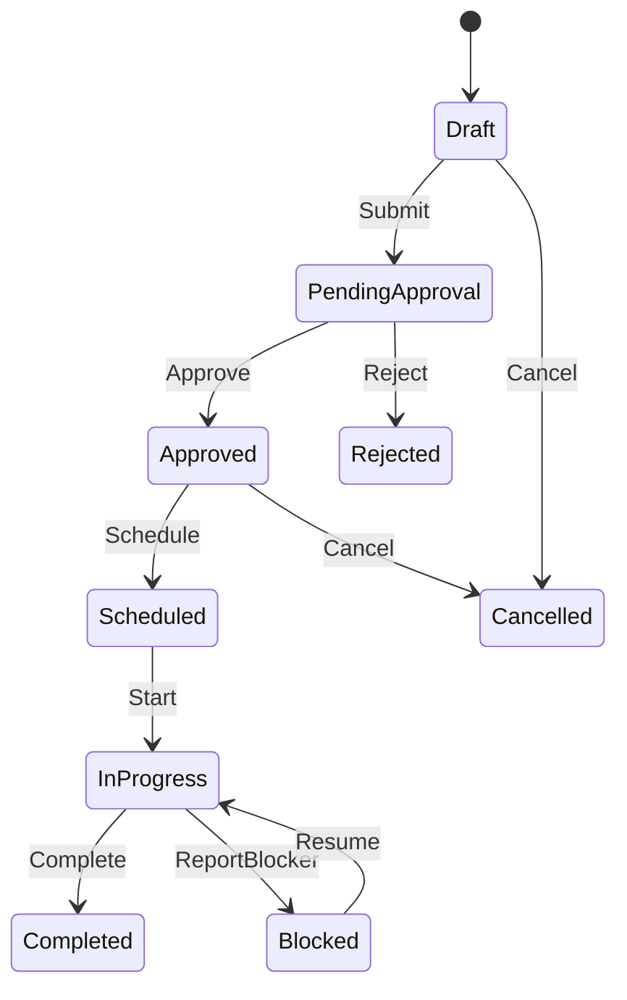
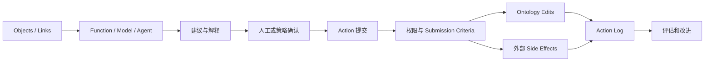

# 第十课：Action 怎样形成真正的决策闭环？

> 本章 YAML 是教学伪代码，不是 Action Type 的正式导入 Schema。凡是“应当”“必须”的可靠性建议，除非紧邻官方链接，均表示课程的工程设计建议，而不是 Foundry 自动提供的保证。

到目前为止，我们已经能：

```text
读取 Object
沿 Link 理解关系
用 Function 计算
用 Model 预测
```

但企业真正产生价值的时刻通常是：

```text
批准订单
指派人员
创建工单
调整库存
取消航班
关闭告警
批准退款
```

这些都是 Action。

先记住：

> Action 不是“修改字段”的按钮，而是组织中一个有名称、有参数、有规则、有权限、有结果的业务决定。

## 1. 从字段修改到业务意图

数据库视角：

```sql
UPDATE work_order
SET status = 'APPROVED', technician_id = 'T-17'
WHERE work_order_id = 'WO-1001';
```

业务视角：

```text
维修主管批准工单 WO-1001，
安排具有轴承维修资格的技术人员 T-17，
计划明天 02:00 开始，
并通知设备负责人和技术人员。
```

Action 应表达第二种含义。

## 2. Action Type 和 Action 实例

```text
ApproveWorkOrder
  Action Type：定义“批准工单”怎样执行

主管在 2026-08-11 10:30 批准 WO-1001
  一次 Action 提交实例
```

类似：

```text
Order 是 Object Type
O-1001 是 Object
```

Action Type 是可重复使用的业务操作模板。

## 3. 一个 Action 的组成

```yaml
actionType:
  name: ApproveAndScheduleWorkOrder
  displayName: 批准并安排维修

  parameters:
    workOrder: WorkOrder
    technician: Technician
    plannedStartAt: timestamp
    comment: string

  submissionCriteria:
    - 工单状态是待批准
    - 操作者拥有维修主管权限
    - 技术人员具有所需资格

  rules:
    - 更新工单状态
    - 更新计划开始时间
    - 建立工单与技术人员 Link

  sideEffects:
    - 通知技术人员
    - 写回 CMMS
```

可以概括为：

```text
Action = 名称 + 参数 + 提交条件 + 规则 + 副作用 + 权限 + 日志
```

## 4. Parameter：用户决定需要提供什么？

Parameter 是一次 Action 的输入。

常见类型：

```text
Object Reference
  选择一个 WorkOrder、Equipment 或 Technician

Object Set / Object List
  选择一批告警或订单

字符串
  备注、原因

数值
  数量、金额、优先级

日期和时间
  计划开始时间

枚举
  批准 / 拒绝 / 退回

附件
  照片、报告、证明文件
```

好的 Parameter 使用业务语言：

```text
✓ 新负责人
✓ 改派原因
✓ 计划完成时间

✗ technician_fk
✗ status_cd
✗ update_value_2
```

只让用户填写真正需要决定的内容。

能由当前 Object、用户身份或 Function 自动推导的值，不必重复要求手工输入。

## 5. 默认值和候选范围

为了减少错误，可以提供：

```text
默认值
  默认使用建议的维修时间

过滤候选 Object
  只显示有资格且当班的 Technician

参数依赖
  选择工厂后，只显示该工厂的设备

隐藏参数
  当前用户、创建时间、来源应用自动填写
```

例如：

```text
findQualifiedTechnicians(workOrder)
    ↓
Technician 参数下拉框只显示合法候选人
```

界面过滤提高体验，但最终安全和业务验证仍必须在提交端执行，不能只依赖前端隐藏选项。

## 6. Submission Criteria：现在允许提交吗？

提交条件回答：

> 当前用户在当前业务状态下是否可以执行这项决定？

例子：

```text
工单必须是 PENDING_APPROVAL
操作者必须是维修主管
金额超过 100 万需要高级审批人
新骑手必须处于 AVAILABLE
订单不能已经取消
预测必须仍然有效
```

条件失败时，应该给用户可理解的信息：

```text
✓ 无法批准：工单已被另一位主管处理
✓ 无法指派：技术人员在计划时间不可用

✗ Validation failed: rule_17 = false
```

## 7. Rules：提交后具体改变什么？

Action Rules 可以：

```text
创建 Object
修改 Object
删除 Object
创建 Link
删除 Link
调用 Ontology Edit Function
触发其他效果
```

官方文档将 Rules 描述为把 Action Parameters 转换为 Ontology edits 或其他效果的逻辑。[Action Rules](https://www.palantir.com/docs/foundry/action-types/rules)

### 创建 Object

```text
CreateMaintenanceWorkOrder
  创建 WorkOrder WO-1001
```

### 修改 Object

```text
ApproveWorkOrder
  status = APPROVED
  approvedAt = now
```

### 创建 Link

```text
AssignTechnician
  WorkOrder ──assignedTo──> Technician
```

### 复杂 Function-backed Action

一个 Action 可能需要更新：

```text
主工单
所有子任务
相关设备状态
备件预留
人员排班
多个 Links
```

这时可以用 Function 生成完整 Ontology Edits。

## 8. 为什么强调单一业务事务？

假设“更换骑手”需要：

```text
删除旧 Link
创建新 Link
旧骑手变为空闲
新骑手变为忙碌
订单记录改派时间
```

如果只完成前三步就失败，业务世界会不一致。

Action 的目标是把相关改变作为一个业务操作协调提交，而不是让用户逐字段手工编辑。

Palantir 将 Action 描述为基于用户定义逻辑，对一个或多个对象属性进行更改的单一事务。[Action 官方概览](https://www.palantir.com/docs/foundry/action-types/overview)

这里的“单一事务”不要扩大解释到外部世界：它描述由 Action 协调的 Ontology edits，并不保证通知、Webhook、ERP 写回与这些 edits 处于同一个跨系统 ACID 事务。

## 9. Side Effect：Ontology 之外还发生什么？

常见副作用：

```text
发送 Foundry 通知
调用 Webhook
写回 ERP、CRM、CMMS
发送邮件或消息
启动外部流程
记录审计事件
```

必须区分：

```text
Ontology Edit
  改变 Ontology 中的 Object、Property 或 Link

Side Effect
  与外部系统或人员产生额外交互
```

Webhook 有两种重要时序：writeback webhook 在对象修改前运行，失败时不会应用 Ontology edits；但仍可能出现外部请求成功、随后 Ontology edits 失败。side-effect webhook 在对象修改后运行，可能在用户已经看到成功提示后才执行，多个 side effects 也没有顺序保证。[Webhook 官方执行语义](https://www.palantir.com/docs/foundry/action-types/webhooks)

### 外部系统失败怎么办？

这是生产设计中的关键问题：

```text
是否重试？
是否有幂等键？
是否记录外部请求 ID？
Ontology 已更新但外部系统失败时怎样补偿？
用户在哪里看到同步状态？
谁负责人工处理失败队列？
```

不要把“调用 Webhook”当成可靠写回设计的全部。

## 10. 幂等性：重复点击不能重复创建现实结果

用户可能双击提交，网络也可能重试。

如果每次都创建新工单：

```text
WO-1001
WO-1002
WO-1003
```

就会产生重复业务对象。

可以设计：

```text
稳定请求 ID
唯一业务键
提交前检查现有工单
外部 API 幂等键
Action 状态与重试记录
```

例如：

```text
同一 FailurePrediction 只能存在一个未关闭维修工单
```

## 11. 并发：对象可能已经被别人修改

两个主管同时打开同一工单：

```text
主管 A 看到 PENDING
主管 B 也看到 PENDING
主管 A 批准
主管 B 随后拒绝
```

应用设计应在提交时重新检查最新状态，而不是相信页面几分钟前加载的状态。

可使用：

```text
状态前置条件
版本或更新时间检查
明确状态机
冲突提示
必要时重新加载
```

这是需要主动设计的并发防护，不是平台对所有读取对象自动提供的完整乐观锁。OSv2 只会对直接参与 edit generation 的有限对象版本执行检查，Action 期间读取的其他对象不保证没有变化。[OSv2 entity version control](https://www.palantir.com/docs/foundry/object-edits/how-edits-applied)

## 12. 状态机：Action 是状态转换

WorkOrder 生命周期：



每个箭头都可以对应一个业务 Action。

不要创建一个万能 `UpdateWorkOrderStatus`，让用户随便选择任何状态。

更好的 Action：

```text
SubmitWorkOrder
ApproveWorkOrder
RejectWorkOrder
ScheduleWorkOrder
StartWorkOrder
CompleteWorkOrder
ReportBlocker
CancelWorkOrder
```

这些名称表达原因、权限和允许的状态转换。

## 13. Action Log：把决定留下来

Action Log 默认记录 Action RID、Action Type RID/版本、时间、用户以及被编辑对象的主键。参数值、摘要和额外业务上下文需要按需求配置，不会自动捕获所有页面状态。[Action Log 官方说明](https://www.palantir.com/docs/foundry/action-types/action-log)

可以把字段分成：

```text
Action RID
Action Type 和版本
提交时间
提交用户
编辑的 Objects
参数值（可选）
提交时的相关上下文（可选）
```

一次批量关闭十个告警，可以产生一个 Action Log Object，并关联所有被编辑告警。

这使组织能够分析：

```text
谁批准了什么？
从发现风险到采取 Action 花了多久？
哪些建议经常被拒绝？
哪个 Action 版本出现异常？
AI 和人工决策结果有何差异？
```

## 14. 普通属性历史、编辑历史和 Action Log

三者关注点不同：

```text
当前 Property
  对象现在是什么状态

编辑历史
  对象的值怎样变化

Action Log
  哪个业务决定导致了一组变化，以及当时的参数和上下文
```

只保存最终 `status = APPROVED`，无法解释为什么批准、谁批准以及同时修改了什么。

## 15. 批量 Action

业务人员可能需要：

```text
关闭 500 个已解决告警
给 200 个订单分配同一处理策略
批准一批低风险申请
```

批量 Action 需要额外考虑：

```text
每个 Object 都满足条件吗？
部分失败是否允许？
一次事务还是分批提交？
用户能否预览影响范围？
怎样防止误选全部对象？
权限是否对每个 Object 重新检查？
如何记录批量决定？
```

高影响批量操作应提供：

```text
对象数量确认
筛选摘要
影响预览
明确审批
执行进度和失败报告
```

## 16. 撤销和补偿

不是所有 Action 都能简单 Undo。

### 容易撤销

```text
修改 Ontology 中尚未同步外部系统的备注
```

### 需要补偿 Action

```text
已经向供应商发出采购订单
已经触发付款
已经发送客户通知
已经执行物理设备停机
```

这时不是删除历史，而是执行新的业务决定：

```text
CancelPurchaseOrder
ReversePayment
ReopenWorkOrder
ResumeEquipment
```

原则：

> 对真实世界已经产生影响的 Action，通常需要补偿流程，而不是假装它没有发生。

Foundry 对 OSv2 对象 edits 提供受限制的 Action revert，但它只能在满足条件时撤销对象实例编辑，不能撤销通知和 Webhook 等副作用。因此产品层 Undo 与业务补偿不是同一件事。[Undo or revert Actions](https://www.palantir.com/docs/foundry/action-types/action-reverts)

## 17. Action 权限

需要区分：

```text
谁能看到 Action Type
谁能编辑 Action 定义
谁能在特定参数和对象上提交 Action
```

能查看一个 WorkOrder，不一定能批准它。

能批准普通工单，不一定能批准：

```text
高金额工单
其他工厂工单
涉及安全停机的工单
自己创建的工单
```

Action 提交还依赖被编辑 Object、Link、安全策略和提交条件。[Action 权限](https://www.palantir.com/docs/foundry/action-types/permissions/)

## 18. 人工、规则和 Agent 谁来提交？

### 人工提交

适合：

```text
高风险
影响不可逆
需要责任人判断
法规要求人工审批
```

### 自动规则提交

适合：

```text
条件明确
影响低
已充分测试
具有监控和回滚机制
```

### AI Agent 提交

适合逐步演进：

```text
第一阶段：AI 只总结和建议
第二阶段：AI 准备 Action 参数，由人确认
第三阶段：AI 在窄范围内自动执行低风险 Action
第四阶段：根据评估扩大自动化范围
```

无论谁提交，应该复用同一个 Action 定义、权限、验证和审计，而不是为 AI 建一条绕过治理的通道。

## 19. 从建议到执行的安全结构



## 20. Action 设计模板

```yaml
actionType:
  name:
  businessIntent:
  owner:

  actor:
  trigger:

  parameters:
    - name:
      type:
      required:
      default:
      allowedValues:

  submissionCriteria:
    - currentState:
    - actorPermission:
    - businessInvariant:

  ontologyEdits:
    createObjects: []
    modifyObjects: []
    deleteObjects: []
    createLinks: []
    deleteLinks: []

  sideEffects:
    notifications: []
    webhooks: []
    externalWriteback: []

  reliability:
    idempotencyKey:
    retryPolicy:
    compensationAction:

  audit:
    logParameters:
    captureContext:

  successMetric:
```

## 21. 一分钟自测

判断哪一个是更好的 Action 名称：

```text
1. Update status / Approve refund
2. Set rider_id / Reassign rider
3. Insert work order / Create maintenance work order
4. Change amount / Adjust invoice after dispute
```

<details>
<summary>完成后查看参考答案</summary>

参考答案都是右侧。

因为右侧表达：

```text
用户为什么做
业务发生了什么
应该使用哪些规则和权限
```

</details>

## 22. 本课结论

成熟 Action 应同时处理：

```text
业务意图
参数
默认值和候选范围
提交条件
对象与 Link 编辑
外部副作用
事务和并发
幂等与重试
权限
Action Log
撤销或补偿
自动化边界
```

最值得记住的一句话是：

> Object 描述企业现在是什么样，Action 描述企业经过授权后允许怎样改变，而 Action Log 让组织能够从这些改变中学习。

下一课讲 Ontology 建好以后如何真正被使用：Object Explorer、Object View、Insight、Workshop、Vertex、API、OSDK 和 AI Agent 分别承担什么角色。

## 独立练习：设计一个会失败的 Action

设计 `ApproveRefund`：包括参数、提交条件、edits、writeback webhook、side effect、幂等键和 Action Log。分别推演“外部请求失败”“外部成功但 Ontology edit 失败”“对象被并发修改”三条路径，并为每条路径写出用户可见状态和补偿动作。
