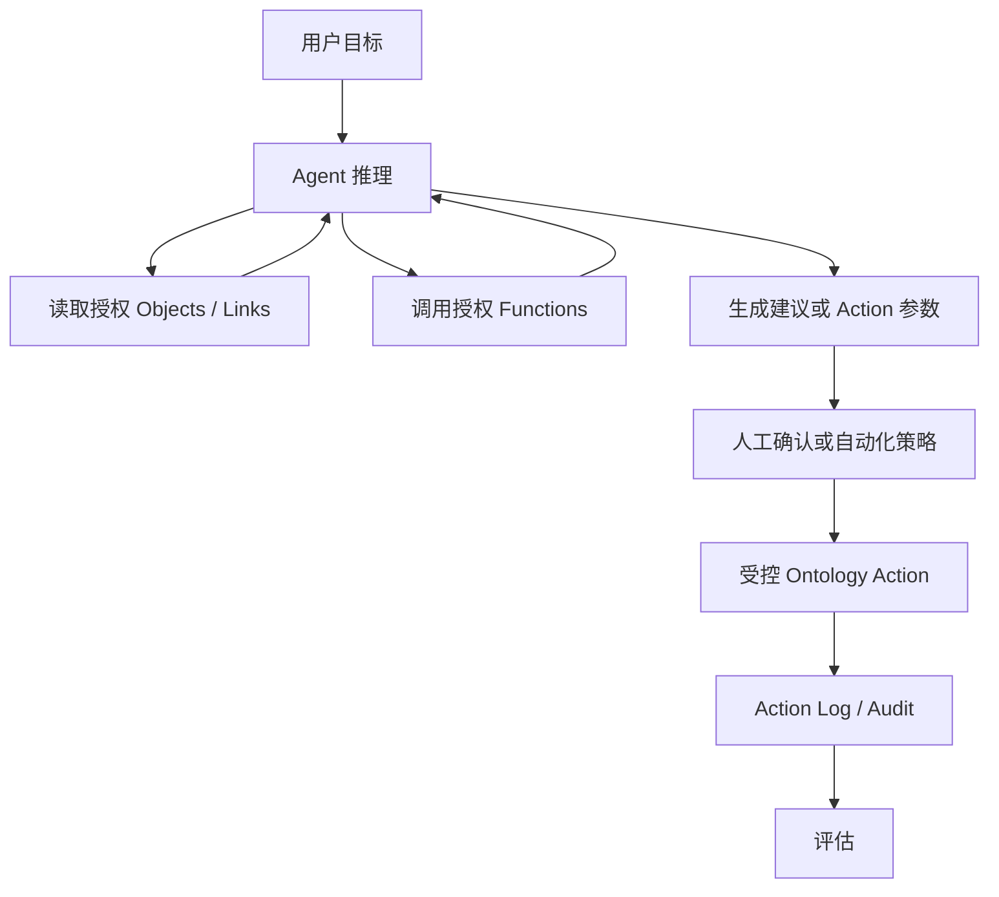

# 第十一课：Ontology 怎样支持应用、API 和 AI？

一个 Ontology 即使设计得很好，如果没人使用，也只是模型。

它真正产生价值的方式是：

```text
业务人员搜索和理解 Object
分析师探索 Object Set 和 Links
应用把信息组织成工作流
开发者通过 OSDK 构建定制产品
AI 读取业务上下文并调用受控 Action
```

先记住：

> Ontology 是共享业务后端；Object Explorer、Workshop、OSDK 和 AI 是它的不同使用方式。

## 1. 同一个 Object 可以出现在哪里？

`Equipment PUMP-101` 可以同时出现在：

```text
Object Explorer 的搜索结果
Equipment Object View
维护工程师的 Workshop 应用
Insight 的高风险设备分析
Vertex 的工厂系统图
地图上的设备位置
TypeScript 自定义应用
Python 分析脚本
AI Agent 的工具调用结果
```

它们不需要分别定义“设备是什么”。

都复用：

```text
Equipment Object Type
Properties
Links
Functions
Actions
Security
```

## 2. Object Explorer：本体的搜索入口

Object Explorer 适合：

```text
第一次了解 Ontology 中有什么
跨类型搜索具体 Object
浏览 Object Type 和类型组
查看属性和 Links
保存探索或对象列表
从对象进入 Object View
```

例如搜索：

```text
PUMP-101
上海一厂
高风险设备
WO-2026-0811
```

Object Explorer 首页能够搜索对象、类型、保存的探索和模块，也能用图查看类型组中的 Links。[Object Explorer 入门](https://www.palantir.com/docs/foundry/object-explorer/getting-started)

最简单理解：

> Object Explorer 像企业业务世界的搜索引擎和目录入口。

## 3. Object View：一个 Object 的统一业务页面

Object View 是围绕单个 Object 组织的信息中心。

PUMP-101 的 Object View 可以包括：

```text
基本信息
当前运行状态
实时温度和振动
最新风险预测
相关异常
未完成工单
历史维修
操作手册
CreateWorkOrder Action
RequestShutdown Action
```

### Standard Object View

Foundry 可以根据 Object Type 配置自动提供标准视图：

```text
Properties
Links
时间序列
媒体和地理属性
```

适合快速查看和验证模型。

### Configured Object View

使用 Workshop 配置更符合工作流的页面：

```text
按角色组织标签页
突出关键指标
嵌入图表和模型建议
展示相关 Object Set
加入 Actions
```

Object View 可以有完整页面和嵌入其他应用的面板形式。[Object View 官方概览](https://www.palantir.com/docs/foundry/object-views/overview)

最简单理解：

> Object Explorer 帮你找到对象，Object View 帮你完整理解和操作一个对象。

## 4. Insight：沿对象和关系进行分析

Insight 适合分析师通过点选方式：

```text
筛选 Object Set
沿 Link 转到相关对象
分组和聚合
构建分析路径
制作图表和地图
保存和共享分析
从结果执行 Action
```

示例问题：

```text
筛选所有 HIGH 风险 Equipment
    ↓
沿 Site Link 分组
    ↓
计算每个工厂的高风险设备数
    ↓
沿 WorkOrder Link 检查是否已有工单
    ↓
得到“高风险但尚未创建工单”的设备
```

Insight 把筛选、Link 遍历和聚合组织成可检查的分析路径。[Insight 官方概览](https://www.palantir.com/docs/foundry/insight/overview)

## 5. Workshop：构建操作型业务应用

Workshop 是在 Ontology 上构建应用的主要方式之一。

维护应用可以设计为：

```text
左侧：高风险设备列表
中间：选中设备的趋势和异常
右侧：模型解释和推荐方案
底部：历史工单
操作区：复核风险、创建工单、请求停机
```

Workshop 主要使用：

```text
Object 和 Object Set Variables
Properties 和 Links
筛选器
表格、图表、地图
Functions
Actions
场景和模型结果
```

### Workshop 的价值

传统应用开发需要自己处理：

```text
数据库查询
API
权限过滤
表单验证
写入逻辑
对象关系
```

Ontology-aware Workshop 应用可以直接使用已有业务资源：

```text
查询 Equipment Object Set
调用 recommendMaintenanceResponse Function
提交 CreateMaintenanceWorkOrder Action
继承相关权限和业务规则
```

## 6. 分析应用与操作应用的区别

### 分析应用

回答：

```text
发生了什么？
为什么发生？
哪些对象值得关注？
趋势如何？
```

### 操作应用

还要回答：

```text
接下来做什么？
谁来做？
是否满足条件？
怎样执行？
结果怎样写回？
```

Palantir Ontology 的重点是让分析自然进入 Action，而不止停留在图表。

## 7. Vertex 和 Scenarios：理解系统与假设变化

有些问题不是查询当前状态，而是模拟：

```text
如果关闭 PUMP-101，生产能力会下降多少？
如果把工单推迟两天，风险怎样变化？
如果增加一条生产线，人员和库存是否足够？
```

Vertex 和 Scenarios 可以围绕对象图、模型和假设覆盖探索系统变化。

区分：

```text
Action
  改变真实 Ontology 或外部系统

Scenario
  在假设空间中比较可能结果，不直接提交真实改变
```

理想流程：

```text
先模拟多个方案
    ↓
比较结果
    ↓
选择方案
    ↓
通过 Action 提交真实决定
```

## 8. Map：地理空间对象工作流

如果 Object 有位置：

```text
设备
车辆
仓库
订单
事故
巡检区域
```

地图可以：

```text
显示 Object
按时间和状态筛选
查看轨迹和事件
选择地图区域中的 Object Set
从地图执行 Action
```

地图中的点不是孤立坐标，而是 `Equipment` 或 `Vehicle` Object，因此可以打开 Object View、沿 Links 查看上下文并执行同一套 Actions。

## 9. OSDK：让开发者使用本体生成的业务 API

如果 Workshop 不能满足定制 UI、移动端或外部产品需求，可以使用 Ontology SDK，简称 OSDK。

OSDK 可以从 Ontology 生成面向业务类型的 SDK。

开发者看到的不是通用表格 API：

```text
GET /table/rows?table=equipment
```

而是类似：

```typescript
client.Equipment
  .where({ latestRiskLevel: "HIGH" })
  .fetchPage();

client.actions.CreateMaintenanceWorkOrder.apply({
  equipment,
  priority: "HIGH",
  reason: "预测轴承故障"
});
```

这只是概念性示例，具体语法取决于生成的 SDK 和版本。

官方开发工具链说明 OSDK 可为 TypeScript、Python 和 Java 生成 SDK，用于访问 Object Type、提交 Action、调用 Function 和 AIP Logic。[Palantir Developer Toolchain](https://www.palantir.com/docs/foundry/dev-toolchain/overview)

### OSDK 的价值

```text
业务类型安全
自动生成 Object、Property、Link 接口
复用 Action 和 Function
遵循 Ontology 权限
减少自建胶水 API
本体变化可通过开发工具发现影响
```

## 10. REST API、Platform SDK 和 OSDK 的区别

### OSDK

适合：

```text
围绕当前 Ontology 构建应用
读取 Object 和 Links
提交 Actions
调用 Functions
```

### Platform REST API / Platform SDK

适合：

```text
管理 Dataset、文件系统、项目和平台资源
执行更通用的平台集成
```

### 自定义 Endpoint

适合：

```text
需要特定 URL、请求结构和响应契约
要为外部消费者封装更稳定的业务 API
```

Palantir API Reference 同时列出 REST APIs、Ontology SDK 和平台 SDK 等开发接口。[API Reference](https://www.palantir.com/docs/foundry/api-reference)

## 11. 为什么应用不应该绕过 Action 直接写数据库？

如果 Workshop 使用 Action，而定制应用直接更新数据库：

```text
两套验证逻辑
两套权限行为
两套审计记录
不同副作用
业务结果可能不一致
```

理想结构：

```text
Workshop
移动应用
外部 Web 应用
AI Agent
      ↓
同一个 Ontology Action
      ↓
同一套规则、权限、写回和日志
```

这就是 Ontology 作为“运营总线”的含义之一。

## 12. AI 为什么需要 Ontology？

直接让 LLM 面对原始数据库，常见问题是：

```text
不知道哪张表可信
不了解字段含义
不知道怎样 Join
无法理解业务身份
容易选择错误写入接口
权限和允许动作不清楚
```

Ontology 给 AI 提供：

```text
明确的业务对象
有含义的 Properties
可遍历 Links
受管理 Functions
受权限约束的 Actions
统一的 Security
```

于是 AI 可以围绕业务语言工作：

```text
查找上海一厂所有高风险设备
    ↓
查看没有未完成工单的设备
    ↓
总结异常和预测证据
    ↓
推荐合格技术人员
    ↓
准备 CreateMaintenanceWorkOrder 参数
```

## 13. AI 的三种成熟度

### 第一层：回答

```text
用户：为什么 PUMP-101 是高风险？
AI：读取 Equipment、Anomaly 和 Prediction 后总结原因。
```

AI 只读，不改变业务。

### 第二层：建议

```text
AI 推荐创建高优先级检查工单，
并填写建议原因和时间，等待工程师确认。
```

AI 准备 Action，人工提交。

### 第三层：有限自动执行

```text
对低风险、明确规则、可逆的任务，
AI 在被授权范围内自动提交 Action。
```

需要：

```text
窄范围工具
严格权限
提交条件
日志和评估
失败处理
人工升级路径
```

## 14. Agent 如何使用 Ontology？

一个 Agent 通常包含：

```text
LLM
系统提示和任务逻辑
读取 Ontology 的工具
调用 Functions 的工具
执行 Actions 的工具
评估和可观测性
```

安全工作流：



Palantir Agents 可通过 OSDK 和 MCP 工具读取、写入 Ontology，并在发布时绑定 Ontology 和作用域权限；该能力目前可能处于 Beta，实际可用性需要检查具体环境。[Agents 官方概览](https://www.palantir.com/docs/foundry/agents/overview)

## 15. Ontology MCP 和 Palantir MCP

Model Context Protocol，简称 MCP，可以把受控工具暴露给 AI。

简单区分：

```text
Ontology MCP
  让外部 Agent 通过 OMCP 应用使用选定的 Object Types、Action Types 和 Query Functions

Palantir MCP
  让开发型 Agent 使用更广泛的平台开发工具；可以修改 Ontology Schema/Types，但不能用它直接写 Ontology Data
```

Ontology MCP（OMCP）用于在受控范围内读写 Ontology Data；Palantir MCP 面向平台开发和资源管理。两者的能力边界与权限模型不同，不能只依据名称互换使用。[Palantir MCP 官方概览](https://www.palantir.com/docs/foundry/palantir-mcp/overview)

不是把整个 Foundry 无限制交给 LLM。

正确做法是选择最小必要范围：

```text
Agent 可以读取哪些 Object Types？
可以访问哪些 Properties？
可以遍历哪些 Links？
可以调用哪些 Functions？
可以提交哪些 Actions？
是否只能作用于某个工厂或区域？
```

## 16. AI 仍然需要评估

需要测试：

```text
是否选择正确 Object？
是否遗漏重要 Link？
Function 参数是否正确？
是否在不确定时请求人工确认？
是否尝试调用无权限 Action？
建议是否改善业务结果？
```

评估不能只看文字是否流畅。

还要看：

```text
工具选择准确率
Action 参数正确率
违规尝试率
人工接受率
任务完成率
实际业务效果
```

## 17. 一个应用如何逐步构建

以预测性维护为例。

### 第一步：验证 Ontology

```text
在 Object Explorer 搜索设备
打开标准 Object View
检查 Properties 和 Links
```

### 第二步：建立分析

```text
在 Insight 筛选高风险设备
按工厂和故障模式聚合
找出没有工单的设备
```

### 第三步：建立操作应用

```text
Workshop 展示列表、趋势、预测和历史工单
加入 ReviewRisk 和 CreateWorkOrder Actions
```

### 第四步：建立定制体验

```text
使用 OSDK 构建移动巡检应用
复用相同 Object、Function 和 Action
```

### 第五步：加入 AI

```text
AI 总结设备证据
推荐工单内容
人工确认后提交 Action
持续评估建议和结果
```

## 18. 选择工具的简单规则

```text
不知道 Ontology 中有什么
  → Object Explorer

想完整查看一个 Object
  → Object View

想筛选、沿 Link 分析和聚合
  → Insight / Quiver

想构建内部业务操作页面
  → Workshop

想模拟系统变化
  → Vertex / Scenarios

想做地理空间操作
  → Map

想构建定制 Web、移动或外部应用
  → OSDK / API

想让 AI 使用企业数据和操作
  → AIP / Agent + Ontology 工具
```

## 19. 常见反模式

### 每个应用复制一份业务逻辑

应该把稳定计算放到 Function，把业务修改放到 Action。

### Object View 展示所有 Property

应该按工作流突出关键内容，而不是把对象当数据库列清单。

### 定制应用绕过 Ontology

这会产生新的数据和权限孤岛。

### AI 获得过宽工具

应该只暴露完成任务所需的对象、函数和操作。

### 先做漂亮 UI，再补语义和 Action

应用很快会被底层混乱拖累。应先验证 Object、Link 和业务动作。

## 20. 一分钟自测

选择最合适的工具：

```text
1. 搜索某个设备编号
2. 查看设备的完整业务页面
3. 分析各工厂高风险设备分布
4. 构建维修主管审批工作台
5. 开发外部移动巡检 App
6. 让 AI 总结异常并准备工单参数
```

<details>
<summary>完成后查看参考答案</summary>

```text
1. Object Explorer
2. Object View
3. Insight / Quiver
4. Workshop
5. OSDK
6. AIP / Agent，调用 Ontology 读取和 Action 工具
```

</details>

## 21. 本课结论

Ontology 让多种消费方式共享同一个业务世界：

```text
Object Explorer 负责发现
Object View 负责理解单个对象
Insight / Quiver 负责分析
Workshop 负责操作型工作流
Vertex / Scenarios 负责模拟
OSDK / API 负责定制开发
AIP / Agent 负责智能协作
```

最值得记住的一句话是：

> 应用和 AI 不应该各自重新理解企业数据；它们应该共同使用 Ontology 已定义的对象、关系、逻辑、操作和权限。

最后一课把所有内容收束到企业最关键的底座：安全、权限、治理、变更管理，以及一个从原始数据到 AI Action 的完整设计验收。

## 独立练习：给 AI 最小权限

为“维修助手”列出允许读取的 Object Types、Properties、Links、Query Functions 和 Action Types，同时列出明确禁止的能力。再解释为什么使用 OMCP 而不是 Palantir MCP，以及何时必须由人工确认 Action。
