# 第十二课：权限、治理与完整 Ontology 验收

> 本章 YAML 是教学伪代码；治理委员会、分阶段授权等内容属于课程设计建议，不是 Palantir 强制组织结构。关键权限结论以英文官方文档为准。

这是主线课程的最后一课。

前十一课解决了：

```text
Ontology 是什么
怎样从业务决策设计本体
数据怎样进入 Foundry
Dataset 怎样成为 Object 和 Link
Function、Model 和 Action 怎样工作
应用和 AI 怎样使用 Ontology
```

最后必须解决两个问题：

```text
谁能看到和改变这个业务世界？
Ontology 变化时，怎样不破坏已经运行的应用？
```

企业 Ontology 如果没有安全和治理，就不能成为可信的操作层。

## 1. 安全不是最后加的一层

在设计 `Employee` 时就应该知道：

```text
姓名谁能看？
薪资谁能看？
健康信息谁能看？
谁能修改部门？
谁能批准调岗？
AI 能否读取私人电话？
```

在设计 `Equipment` 时就应该知道：

```text
谁能看到设备位置？
谁能看到安全漏洞？
谁能请求停机？
谁能批准停机？
外部承包商只能看到哪些工单？
```

安全会影响：

```text
Object Type 边界
Property 放置位置
数据源选择
Link 可见性
Function 输出
Action 参数和提交条件
应用布局
Agent 工具范围
```

## 2. 先分清 Schema 权限和数据权限

### Ontology Resource 权限

控制谁能查看或修改定义：

```text
Object Type
Property Schema
Link Type
Action Type
Interface
Shared Property
```

例如：

```text
谁能修改 Equipment 的 API Name？
谁能新增 Property？
谁能编辑 CreateWorkOrder Action？
```

### Object 和 Link 数据权限

控制谁能查看具体实例和值：

```text
谁能看到 PUMP-101？
谁能看到它的安全风险？
谁能看到 WO-1001 的维修成本？
谁能看到某位员工的薪资？
```

官方权限文档明确区分 Ontology Resources 与 Objects/Links 两个层次。[Object Permissioning 概览](https://www.palantir.com/docs/foundry/object-permissioning/overview)

能查看 `Employee` Object Type 的 Schema，不代表能看到所有员工的薪资值。

## 3. Resource 级角色

根据具体 Foundry 环境和迁移状态，Ontology Resource 可能使用项目权限或 Ontology Roles。

需要先区分两套语境。当前 Project/Compass 权限中的项目角色由项目配置决定；下面的 Owner、Editor、Viewer 是 legacy Ontology Roles 的典型名称，Discoverer 则更接近资源发现权限，不应把四者当成一套固定 Ontology 角色：

```text
Owner
  管理资源和安全

Editor
  修改定义

Viewer
  查看定义和允许的数据

Discoverer
  只发现名称和基础元数据
```

在新的项目权限模式中，Ontology Resources 保存到 Project，并使用与其他 Foundry Resources 一致的权限系统；已有环境可能仍有 Ontology Roles 或传统数据源衍生权限。[Ontology Resource 权限](https://www.palantir.com/docs/foundry/object-permissioning/ontology-permissions)

因此实际项目开始时要先确认：

```text
当前 Ontology 使用哪一种权限模式？
哪些资源已经迁移？
Project 是什么安全边界？
哪些传统行为仍然存在？
```

不要根据另一家公司或旧教程的界面直接推断自己的环境。

## 4. Object 级安全：谁能看到哪一行？

假设所有用户都能查看 `WorkOrder` 类型，但：

```text
上海工程师只能看到上海工厂工单
北京工程师只能看到北京工厂工单
总部主管可以看到全部
外部承包商只能看到分配给自己的工单
```

这叫 Object 或行级安全。

可以根据对象属性和用户上下文配置策略：

```yaml
objectSecurity:
  WorkOrder:
    allowIf:
      - user.siteId == object.siteId
      - user.isHeadquartersManager == true
      - object.assignedVendorId == user.vendorId
```

这是教学表达，不是正式配置语法。

## 5. Property 级安全：同一个对象，不同人看到不同字段

所有用户可能都能看到 Technician T-17，但：

```text
普通调度员
  姓名、技能、当班状态

维修主管
  再加工作电话和绩效摘要

HR
  再加薪资、家庭地址和证件信息
```

Property Security 可以保护特定属性。

官方的 Object 和 Property Security Policies 可分别实现行级与列级控制；两者结合可以形成更细粒度的单元格级控制。用户能看到 Object 但不能看到某个 Property 时，该值可能显示为 null。[Object and Property Security Policies](https://www.palantir.com/docs/foundry/object-permissioning/object-security-policies)

### null 不一定表示没有数据

应用开发者必须意识到：

```text
Property 为 null
可能是源数据为空
也可能是用户没有查看权限
```

界面和逻辑不应因为看不到值就错误推断“现实中不存在”。

## 6. Link 安全

用户能看到两个 Object，不一定应该看到它们之间的关系。

例如：

```text
能看到 Employee
能看到 Investigation
但不一定能看到 EmployeeUnderInvestigation Link
```

Link 可能泄露敏感事实。

设计时检查：

```text
两端 Object 的可见性
Link 本身的权限
沿 Link 查询是否暴露间接信息
聚合是否可能推断敏感关系
```

## 7. Action 权限：看得到不代表做得到

一个用户可以看到高风险设备，但未必能：

```text
创建维修工单
批准工单
请求停机
批准停机
关闭异常
```

Action 安全至少包括：

```text
Action Type 是否可见
用户能否提交
用户能否查看被编辑 Objects 和 Links
参数中的 Object 是否在用户权限范围内
Submission Criteria 是否通过
被编辑资源是否允许相应写入
```

不要只在 Workshop 中隐藏按钮。

真正的授权必须在 Action 提交时由后端检查。

## 8. Function 和模型也必须遵循最小权限

Function 如果能读取敏感 Object，调用者可能通过输出间接获得数据。

需要检查：

```text
Function 以谁的身份运行？
读取哪些 Object 和 Property？
返回值是否包含敏感信息？
聚合是否泄露小群体数据？
外部 API 会收到什么？
日志中会记录什么？
```

模型同样需要：

```text
训练数据权限
模型 Artifact 权限
部署访问权限
输入和输出数据安全
模型解释中的敏感特征
```

## 9. AI Agent 的权限模型

不要给 Agent 一个超级管理员 Token。

应该定义 Agent 的任务边界：

```yaml
agentScope:
  purpose: 帮助维护工程师处理设备异常

  canRead:
    - Equipment 基础状态
    - Sensor 趋势
    - Anomaly
    - FailurePrediction
    - WorkOrder 非敏感信息

  canCallFunctions:
    - recommendMaintenanceResponse
    - findQualifiedTechnicians

  canPrepareActions:
    - CreateMaintenanceWorkOrder

  cannotApplyWithoutHumanApproval:
    - RequestEmergencyShutdown
    - ApproveWorkOrder

  forbidden:
    - HR 私人信息
    - 修改模型权限
    - 创建任意平台资源
```

成熟过程：

```text
从只读开始
    ↓
允许生成建议
    ↓
允许准备 Action 参数
    ↓
允许执行低风险、可逆 Action
    ↓
持续评估后再扩大范围
```

## 10. Restricted View 与安全策略

在一些环境和用例中，Restricted View 可以在 Dataset 层限制用户能看到哪些行，并作为 Object Type 的支持数据源。

例如：

```text
销售人员只能看到自己分支机构的客户
```

官方文档目前对大多数 Ontology 用例更推荐 Object Security Policies，但实际选择取决于环境能力、既有架构和迁移状态。[Object Security Policies 官方说明](https://www.palantir.com/docs/foundry/object-permissioning/object-security-policies) [Restricted Views 背景](https://www.palantir.com/docs/foundry/security/restricted-views)

学习重点不是死记哪一个按钮，而是理解：

```text
安全策略在哪里定义？
它保护 Schema 还是数据？
控制整类 Object、单个 Object 还是 Property？
是否同样作用于应用、API 和 AI？
```

## 11. 最小权限原则

对人、应用和 Agent 都使用同一原则：

> 只授予完成当前工作所需的最小数据和操作范围。

例子：

```text
技术人员只需要查看分配给自己的工单
不需要查看所有工厂的维修成本

客服 Agent 需要查询订单和物流
不需要调用退款批准 Action

模型评估服务需要预测和真实结果
不一定需要员工姓名和联系电话
```

## 12. 治理：谁决定 Ontology 应该怎样变化？

Ontology 是共享业务 API。

新增或修改资源可能影响：

```text
Pipeline
Object Index
Functions
Actions
Workshop 应用
OSDK 应用
AI 工具
安全策略
外部集成
```

因此需要治理，而不是任何人都直接修改生产主版本。

## 13. Ontology 治理委员会

不需要建立庞大官僚机构，但应有可信责任组。

最小成员：

```text
领域负责人
数据平台主管
Ontology 架构负责人
安全负责人
关键应用负责人
```

职责：

```text
批准核心 Object 和身份规则
发现并解决重复类型
审查破坏性变化
明确资源 Owner
审查敏感属性和 Actions
维护命名与文档标准
决定 Deprecated 和迁移计划
```

治理团队、评审机制和职责划分属于本课程基于平台权限模型提出的组织设计建议，并不是 Foundry 强制要求。遗留环境可参考 legacy Ontology Roles 页面，但新项目应优先按 Project/Compass 权限设计，并确认当前环境的迁移状态。[当前 Ontology Resource 权限](https://www.palantir.com/docs/foundry/object-permissioning/ontology-permissions)

## 14. 资源必须有 Owner

```yaml
ontologyResource:
  name: Equipment
  domainOwner: 资产管理团队
  technicalOwner: Foundry 平台团队
  securityOwner: 工业安全团队
  downstreamOwners:
    - 预测维护应用团队
    - 移动巡检团队
  supportChannel: 资产本体支持组
```

没有 Owner 的共享资源会出现：

```text
没人敢修改
也没人阻止错误修改
数据问题无人负责
应用破坏后互相推诿
```

## 15. 文档最少要写什么？

每个核心 Object Type：

```text
一句话定义
包含什么
不包含什么
主键和身份规则
生命周期
Properties 的业务含义
Links 的含义和基数
来源和刷新频率
安全分类
Owner
主要消费者
```

每个 Action Type：

```text
业务意图
谁可以执行
参数
提交条件
修改哪些资源
副作用
失败和补偿方式
日志与成功指标
```

这些文档也会改善 AI 对工具的正确选择。

## 16. 变更先在分支和 Proposal 中审查

Ontology Proposal 类似代码的 Pull Request：

```text
从 Main 创建 Branch
    ↓
在隔离版本中修改
    ↓
预览和测试影响
    ↓
邀请 Owner 审查
    ↓
批准或拒绝变更
    ↓
合并到 Main
```

官方的 Ontology Proposal 允许在分支上修改，并在进入 Main 前进行审查和批准。[Ontology Proposals](https://www.palantir.com/docs/foundry/ontologies/ontologies-proposals)

需要审查：

```text
语义是否正确
是否重复已有概念
API 是否兼容
索引是否成功
数据质量是否足够
安全是否扩大
Actions 是否仍然正确
应用是否正常
OSDK 是否需要重新生成或升级
```

## 17. 保存变更不只是点击 Save

Ontology Manager 中未保存的修改处于工作状态。

保存前要查看：

```text
所有编辑
错误
警告
并发更新
合并冲突
潜在破坏性影响
```

官方文档指出，Property 或 Object Type 的变化可能破坏依赖应用；并发编辑也可能需要合并和冲突处理。[保存 Ontology 变更](https://www.palantir.com/docs/foundry/ontology-manager/save-changes)

## 18. 哪些变化最危险？

```text
更换 Primary Key
删除 Property
修改 Property 数据类型
改变已有 Property 的业务含义
重命名 Active API Name
删除或改变 Link 基数
修改 Action 参数和行为
扩大安全范围
替换支持数据源但没有保持身份
```

### 更换 Primary Key 为什么特别危险？

如果：

```text
旧主键：PUMP-101
新主键：SH01-P101
```

系统可能把同一设备理解为旧 Object 消失、新 Object 出现。

影响：

```text
Links 断开
Action 编辑历史无法匹配
保存的 Object Set 失效
应用 URL 和引用变化
外部集成标识失效
```

身份设计应该在早期认真验证。

## 19. 兼容迁移策略

不要直接删除旧属性。

更安全的过程：

```text
1. 新增新 Property 或 v2 Object Type
2. 从旧数据填充新结构
3. 双写或保持同步
4. 更新 Functions、Actions 和应用
5. 监控旧资源的使用
6. 通知消费者迁移
7. 标记旧资源 Deprecated
8. 确认无人使用后再移除
```

Ontology 应像生产代码和公共 API 一样进行版本与依赖管理。

## 20. 数据质量也是治理

如果支持数据源存在：

```text
重复主键
空主键
类型错误
无效外键
状态代码未知
刷新延迟
异常数量突变
```

Ontology 可能索引失败，或更危险地向用户展示错误业务世界。

需要监控：

```text
完整性
唯一性
有效性
一致性
及时性
Link 覆盖率
索引健康
```

示例：

```yaml
qualityChecks:
  - equipmentId 不为空且唯一
  - status 属于允许状态
  - siteId 必须匹配现有 Site
  - 数据更新时间不超过 30 分钟
  - 高风险设备必须具有模型版本
```

## 21. Action 和 AI 也需要质量指标

Action 指标：

```text
提交成功率
外部写回失败率
平均执行时间
重复提交率
补偿 Action 数量
从触发到决定的时间
```

AI 指标：

```text
工具选择准确率
Action 参数正确率
无权限调用率
人工接受率
错误自动化率
业务结果改善
```

Ontology 的质量不是只看 Schema 是否漂亮，而是看整个决策系统是否可靠。

## 22. 最终综合案例

现在把 PUMP-101 从源系统走到 AI Action。

```mermaid
flowchart TD
    Sources["EAM / IoT / CMMS / HR"] --> Connection["Data Connection"]
    Connection --> Raw["Raw Datasets"]
    Raw --> Pipeline["Pipeline 清洗、Join、质量检查"]
    Pipeline --> Curated["Curated Datasets / Time Series"]

    Curated --> Objects["Equipment / Sensor / WorkOrder / Technician"]
    Curated --> Links["安装于 / 发生异常 / 指派给"]

    Objects --> Alerting["Time-series alerting automation 识别异常"]
    Objects --> Model["Model 预测故障"]
    Alerting --> Function["Function 组合业务建议"]
    Model --> Function

    Function --> App["Object View / Workshop / OSDK App"]
    App --> Agent["AI 总结和准备参数"]
    Agent --> Approval["人工确认或自动化策略"]
    Approval --> Action["受控 Action"]

    Action --> Edits["Object / Property / Link Edits"]
    Action --> External["写回 CMMS / 通知"]
    Action --> Log["Action Log"]

    Log --> Evaluation["业务与模型评估"]
    Evaluation --> Model

    Security["Security"] --> Objects
    Security --> Function
    Security --> App
    Security --> Agent
    Security --> Action

    Governance["Governance / Proposals / Owners"] --> Objects
    Governance --> Function
    Governance --> Action
```



这张图就是 12 课的完整主线。

## 23. 一套最终验收问题

### 业务价值

```text
[ ] 支持的是哪个具体决策？
[ ] 谁做决定？
[ ] 触发条件是什么？
[ ] 成功指标是什么？
```

### Object

```text
[ ] 代表现实实体、事件或观察吗？
[ ] 主键唯一且稳定吗？
[ ] 生命周期明确吗？
[ ] 没有机械复制源表吗？
```

### Property 和 Link

```text
[ ] 每个 Property 有清楚业务价值吗？
[ ] 来源、刷新和敏感级别明确吗？
[ ] Link 表达真实关系吗？
[ ] 有生命周期的关系是否应成为 Object？
```

### 数据层

```text
[ ] Data Connection 可靠吗？
[ ] Raw 和 Curated 数据职责清楚吗？
[ ] Pipeline 有血缘和质量检查吗？
[ ] 索引新鲜度可监控吗？
```

### Logic

```text
[ ] Pipeline、Rule、Function 和 Model 分工正确吗？
[ ] 模型输出被翻译成业务概念了吗？
[ ] 有解释、版本和评估吗？
```

### Action

```text
[ ] 名称表达业务意图吗？
[ ] 参数最小且清楚吗？
[ ] 提交条件和权限完整吗？
[ ] 幂等、并发、失败和补偿考虑了吗？
[ ] Action Log 能捕获决定吗？
```

### 应用和 AI

```text
[ ] 用户能自然发现和理解 Object 吗？
[ ] 应用复用 Functions 和 Actions 吗？
[ ] OSDK 应用没有绕过 Ontology 吗？
[ ] Agent 只拥有最小必要工具吗？
[ ] 有人工确认和评估策略吗？
```

### 安全和治理

```text
[ ] Resource、Object、Property、Link、Action 权限都考虑了吗？
[ ] 每个核心资源有 Owner 吗？
[ ] 变更经过 Branch 和 Proposal 审查吗？
[ ] 破坏性变更有迁移计划吗？
[ ] 安全与数据质量持续监控吗？
```

## 24. 你现在应该能回答什么？

完成 12 课后，应该能够直白回答：

### Foundry 是什么？

```text
Foundry 是连接、加工、治理企业数据，
并将数据投入分析、模型和运营工作流的平台。
```

### Ontology 是什么？

```text
Ontology 是 Foundry 中面向现实业务的操作层，
把数据和模型组织成 Objects、Properties、Links、Functions、Actions 和 Security。
```

### 它和数据库有什么不同？

```text
数据库主要保存记录；
Ontology 用统一业务语言解释记录，并连接逻辑、权限和操作。
```

### 它和知识图谱有什么不同？

```text
知识图谱偏向连接和推理事实；
Palantir Ontology 还把业务 Function、Action、Security 和写回作为核心。
```

### 它为什么适合 AI？

```text
AI 不需要猜测表和字段，
而是在受控权限下使用明确的业务对象、关系、函数和操作。
```

### 最终价值是什么？

```text
让数据、分析、模型、人和 AI
围绕同一个业务世界做出可执行、可审计、可学习的决定。
```

## 25. 12 课核心课程总复习

```text
01  用外卖案例理解 Ontology
02  动手推演最小本体
03  区分 ER、知识图谱、DDD 和 Ontology
04  从业务决策开始设计，而不是复制表
05  设备预测性维护完整闭环
06  理解 Foundry 数据到运营的全景
07  理解 Dataset 怎样成为 Object 和 Link
08  设计可扩展的企业 Ontology
09  区分 Pipeline、Automation、Function 和 Model
10  用 Action 表达并执行业务决定
11  通过应用、OSDK 和 AI 使用 Ontology
12  用安全、治理和变更管理保证长期可信
```

## 26. 最后的核心公式

```text
Foundry
= 数据连接
+ Dataset
+ Pipeline
+ Lineage
+ 模型与开发工具
+ Ontology
+ 应用
+ 安全与治理
```

```text
Ontology
= Objects
+ Properties
+ Links
+ Functions / Models
+ Actions
+ Security
```

```text
决策闭环
= 可信数据
+ 业务上下文
+ 计算或预测
+ 人或 AI 的判断
+ 受控 Action
+ 外部执行
+ 结果反馈
+ 持续学习
```

## 27. 本课与主线课程结论

如果只记住一个观点，请记住：

> Palantir Ontology 不是为了给数据换一组更漂亮的名称，而是为了建立一个人、软件和 AI 都能共同理解、查询、改变并持续学习的业务世界。

概念主线到这里已经完整，但实践不是“以后再做”的额外阶段：前面每章的独立练习应已经逐步形成一份可检查的设计。现在把这些成果合并为最终交付：一组样例数据、一张 Object/Link 图、一份主键与来源说明、两个 Functions、一个含前置条件的 Action，以及一份权限和失败补偿说明。能够向别人解释并找出模型中的错误，才算真正完成课程。

## 最终实践验收：不看讲义完成

为一个不同于外卖和设备维护的领域，在 90 分钟内交付最小 Ontology。找另一位读者只根据你的说明回答三个业务问题并模拟一次 Action；如果他需要猜字段、无法判断权限，或不能解释失败后的状态，就记录问题并迭代模型。这个验收没有唯一答案，重点是模型能否支持真实决定。

## 接下来：进入案例篇

核心概念完成后，用两个更接近企业运营的案例检验理解：

```text
13  ERP 进销存：采购、库存、销售、履约与 ERP 写回
14  Supply & Demand Planning：约束、Scenario、计划发布与 Plan-vs-Actual
```

案例篇不是增加新术语，而是练习怎样把前 12 课的方法迁移到新的业务领域。
