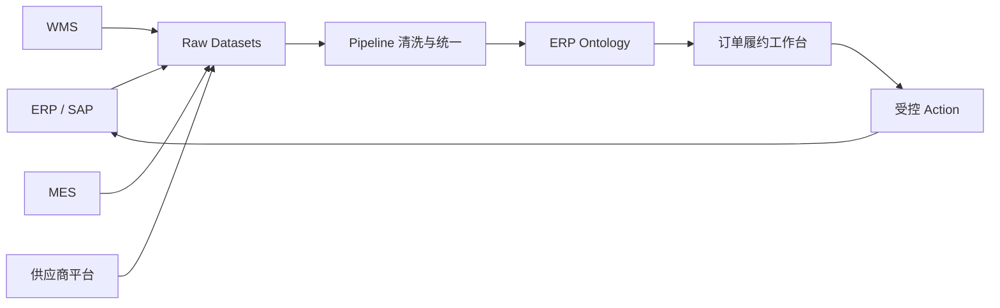
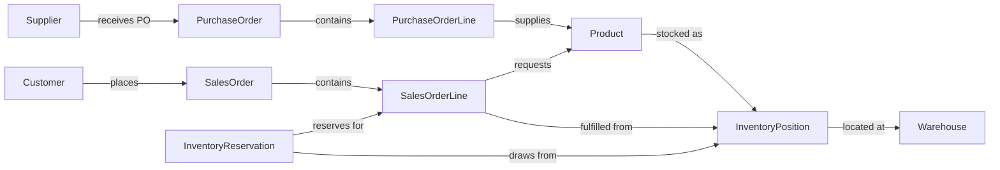
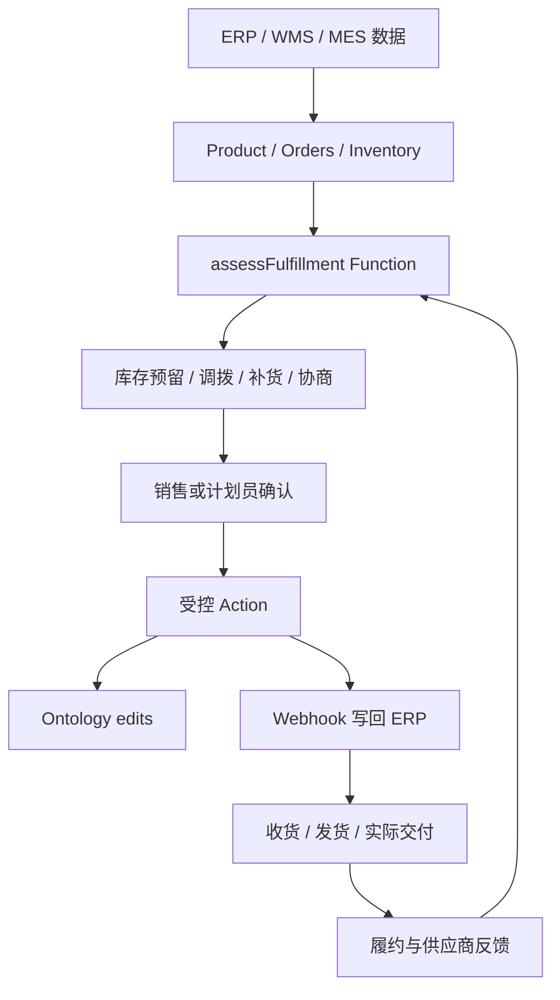

# 案例篇 13：用 ERP 进销存理解 Ontology

> 本章 YAML 是教学伪代码，不是 SAP、ERP 或 Foundry 的正式配置。案例中的数量和规则用于帮助理解，真实项目必须由业务、财务、仓储和 ERP 团队共同确认。

进销存最容易让人误以为：

> ERP 已经有表、单据和流程了，为什么还需要 Ontology？

答案不是“用 Ontology 替换 ERP”。

最简单的分工是：

```text
ERP
  负责采购订单、销售订单、收货、发货和财务过账等交易记录

Ontology
  把分散系统中的商品、仓库、库存、订单和业务决定连接成统一操作世界
```

这一章围绕一个问题展开：

> 客户订单 SO-2048 能否在周五按时、完整交付？如果不能，应该补货、调拨，还是与客户协商？

---

## 1. 先看业务现场，而不是先看 ERP 表

一家制造与分销企业可能同时使用：

```text
SAP ERP       采购订单、销售订单、物料主数据
WMS           库位、批次、拣货和发货
MES           生产进度和完工数量
供应商平台     确认交期
运输系统       车辆和预计到达时间
Excel         人工调整和临时承诺
```

销售人员看到订单：

```text
销售订单：SO-2048
客户：华东零售
商品：P-100 过滤器
数量：500
要求交付：周五
```

ERP 显示库存 620，看起来足够。

但真实情况可能是：

```text
现有库存             620
质检冻结             100
已承诺给其他客户     180
周三确认到货         200
供应商曾多次延期
```

所以真正的问题不是：

> 库存字段是多少？

而是：

> 到周五之前，真正能够承诺给 SO-2048 的数量是多少？

---

## 2. 数据怎样进入 Foundry？

Foundry 的 Data Connection 用来从外部系统同步数据，也可以通过 Webhook 或 Export 与外部系统交互。[Data Connection 官方概览](https://www.palantir.com/docs/foundry/data-connection/overview)

如果企业使用 SAP ECC 或 S/4HANA，SAP ERP Connector 可以读取 Application Tables、CDS Views、Extractors、Function Modules 等，并支持通过 BAPI Webhook 写回。具体可用能力取决于 SAP 环境、Connector 安装、网络和权限配置。[SAP ERP Connector](https://www.palantir.com/docs/foundry/available-connectors/sap-erp)

教学案例把数据路径简化为：



注意：不要在接入时就悄悄改变业务含义。

```text
Raw 层保留源系统事实
Pipeline 层统一编码、单位、状态和主数据
Ontology 层表达业务对象、关系和允许的决定
```

---

## 3. 先确定最小业务对象

要回答 SO-2048 能否交付，至少需要这些 Object Types：

| Object Type | 最简单的含义 | 例子 |
|---|---|---|
| Product | 企业销售或采购的商品/物料 | P-100 过滤器 |
| Customer | 购买商品的客户 | 华东零售 |
| Supplier | 提供商品或原料的供应商 | S-08 精密器材 |
| Warehouse | 存放库存的地点 | WH-SH 上海仓 |
| InventoryPosition | 某商品在某仓库的当前库存位置 | P-100@WH-SH |
| InventoryReservation | 一次数量占用决定 | RSV-SO2048-10 |
| SalesOrder | 客户订单头 | SO-2048 |
| SalesOrderLine | 订单中的具体商品需求 | SO-2048-10 |
| PurchaseOrder | 对供应商的采购订单 | PO-9007 |
| PurchaseOrderLine | 采购订单中的具体商品供给 | PO-9007-20 |
| StockMovement | 一次入库、出库或调拨事实 | SM-7712 |

为什么需要 Order 和 OrderLine 两层？

```text
SalesOrder
  表达客户、币种、整体状态和合同条件

SalesOrderLine
  表达每一种商品的数量、交期、仓库和履约状态
```

如果一个订单有十种商品，只建一个巨大 `SalesOrder`，就很难表达：

```text
哪些行已满足？
哪些行短缺？
哪些行需要拆单？
哪些行来自不同仓库？
```

---

## 4. 主键必须表达稳定身份

教学伪代码：

```yaml
objectTypes:
  Product:
    primaryKey: productId

  SalesOrder:
    primaryKey: salesOrderId

  SalesOrderLine:
    primaryKey: salesOrderLineId

  InventoryPosition:
    primaryKey: inventoryPositionId
```

`InventoryPosition` 的身份需要特别小心。

一种简单设计：

```text
inventoryPositionId = warehouseId + productId
WH-SH|P-100
```

如果业务还按批次、库存状态或所有权区分，则身份粒度可能变成：

```text
warehouseId + productId + batchId + stockStatus + ownerId
```

这里没有万能答案。关键问题是：

> 哪些库存值可以安全地合并成同一个业务位置？

---

## 5. 用 Link 把进、销、存连接起来



有了这些 Links，用户不必手工 Join 多个系统，就可以沿业务关系回答：

```text
哪个客户需要 P-100？
哪些仓库拥有 P-100？
哪些采购订单会在周五之前到达？
库存已经承诺给哪些订单？
供应商延期会影响哪些客户？
```

---

## 6. “库存”不是一个数字

常见库存概念至少包括：

```text
On Hand          物理上已在仓库
Blocked          冻结或质检中，不能使用
Reserved         已分配给订单
Available        当前可用
Inbound          已确认但尚未到货
Safety Stock     不希望被普通订单消耗的安全库存
```

一个教学公式：

```text
当前可用量
= On Hand - Blocked - Reserved
```

面向未来交期时，还需要 Available-to-Promise 的思想：

```text
周五可承诺量
= 当前可用量
 + 周五前可信的入库
 - 周五前其他已确认需求
 - 安全库存
```

这只是概念公式，不是所有企业通用的 ATP 算法。真实规则还可能考虑：

```text
订单优先级
客户等级
保质期和批次
替代物料
最小包装量
仓库截单时间
运输时效
供应商交付可靠性
```

---

## 7. Function 负责计算履约建议

可以设计：

```text
Function: assessFulfillment

输入：
  SalesOrderLine
  requiredDate

读取：
  当前库存
  已有 Reservations
  确认入库
  仓库和运输时间
  客户与订单优先级

返回：
  fulfillableQuantity
  shortageQuantity
  recommendedWarehouse
  expectedShipDate
  confidence
  reasons[]
```

SO-2048-10 的结果可能是：

```yaml
fulfillableQuantity: 500
recommendedWarehouse: WH-SH
expectedShipDate: 2026-08-14
confidence: MEDIUM
reasons:
  - 当前可用库存 340
  - PO-9007 在周三确认到货 200
  - 供应商近三个月准时率 78%
```

Function 给出建议，但还没有真正占用库存或修改 ERP。

---

## 8. Action 才代表业务决定

### ReserveInventory

```yaml
actionType: ReserveInventory
parameters:
  salesOrderLine: SalesOrderLine
  inventoryPosition: InventoryPosition
  quantity: integer

submissionCriteria:
  - quantity > 0
  - salesOrderLine.status == OPEN
  - latestAvailableQuantity >= quantity

edits:
  - 创建 InventoryReservation
  - 连接 Reservation 与订单行、库存位置
  - 更新订单行 reservedQuantity
```

### CreatePurchaseRequisition

当库存不足时，业务人员可能决定请求采购：

```text
输入：商品、数量、期望到货日、供应商建议、原因
检查：是否已有未关闭补货、审批额度、最小订购量
结果：创建补货请求并进入审批
```

### TransferInventory

另一个仓库有货时，可以创建调拨决定：

```text
WH-BJ → WH-SH
商品 P-100
数量 160
要求到达 周四
```

不要把三个选择都隐藏在一个 `UpdateInventory` Action 中。Action 名称应该表达业务意图：

```text
ReserveInventory
RequestReplenishment
TransferInventory
NegotiateDeliveryDate
ReleaseShipment
```

---

## 9. 写回 ERP 不是一句“调用接口”

可以通过 Webhook 把批准后的采购、调拨或发货决定写回 ERP。

但必须明确：

```text
哪个系统是每类事实的 Source of Truth？
Foundry 生成的是建议、请求还是正式单据？
外部请求成功但 Ontology edits 失败怎么办？
Ontology edits 成功但 side effect 失败怎么办？
怎样防止重试创建重复单据？
外部单据号怎样回填？
```

SAP ERP Connector 支持通过 BAPI Webhook 写回，但具体 BAPI、权限和运行方式必须按企业 SAP 环境配置。[SAP ERP Webhooks](https://www.palantir.com/docs/foundry/available-connectors/sap-erp#webhooks)

一个可靠的状态设计可能是：

```text
DRAFT
PENDING_APPROVAL
APPROVED
SYNCING_TO_ERP
SYNCED
SYNC_FAILED
CANCELLED
```

---

## 10. 并发：同一份库存不能承诺两次

销售 A 和销售 B 同时看到可用库存 160：

```text
销售 A 为订单 X 预留 120
销售 B 为订单 Y 预留 100
```

如果都相信几分钟前的页面数据，就会超卖。

因此 `ReserveInventory` 需要：

```text
提交时重新计算可用量
使用稳定请求 ID 防止重复提交
明确订单优先级冲突规则
失败时告诉用户最新可用量
记录谁做了什么决定
```

并发保护是需要主动设计的业务规则，不应假设所有读取都自动获得完整事务隔离。

---

## 11. 一张工作台应该让用户看见什么？

订单履约工作台可以围绕 `SalesOrder` 展示：

```text
订单基本信息和要求交期
每个订单行的需求、可用和短缺
推荐仓库和可信入库
受影响的其他订单
补货、调拨、延期三种方案
风险原因和数据更新时间
可执行 Actions
外部 ERP 同步状态
```

Workshop 可以基于 Ontology Objects、Object Sets、Functions 和 Actions 组织操作型应用，而不要求每个页面重新理解底层表。[Workshop 官方概览](https://www.palantir.com/docs/foundry/workshop/overview)

---

## 12. 结果怎样形成反馈？

进销存闭环不应该停在“已创建单据”。

还应记录：

```text
承诺交期是否兑现？
供应商是否按确认日期到货？
库存预留是否后来取消？
调拨是否按时完成？
是否发生缺货或超卖？
实际库存与系统库存差异多少？
用户采纳了哪种建议？
```

这些结果可以改进：

```text
供应商可靠性评分
安全库存
履约置信度
采购提前期
仓库调拨策略
客户承诺规则
```

---

## 13. 完整决策闭环



最值得记住的一句话：

> ERP 记录交易发生了什么；Ontology 把跨系统事实连接起来，帮助人和 AI 理解当前局面并执行下一步决定。

---

## 独立练习：设计一次缺货处理

给定：

```text
订单需求            800
当前可用            420
三天内确认入库      200
另一个仓库可调拨    260
安全库存            100
客户要求五天后到货
```

请独立完成：

1. 选择需要的 Objects 和 Links。
2. 写出你的 ATP 计算口径。
3. 设计至少三种履约方案。
4. 选择一个 Action，并写出参数与提交条件。
5. 推演外部 ERP 写回失败和并发预留两种异常。
6. 说明最后应记录哪些结果用于改进下一次决定。

下一章把进销存的当前事实向未来延伸：怎样用 Supply & Demand Planning 比较约束、Scenario 和可执行计划。
