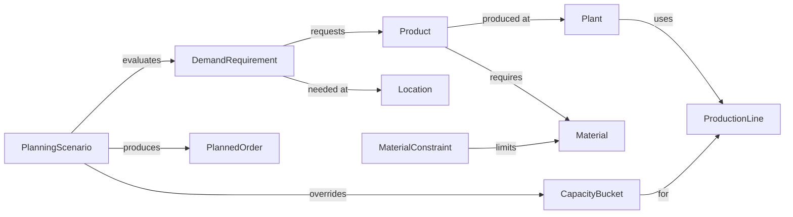
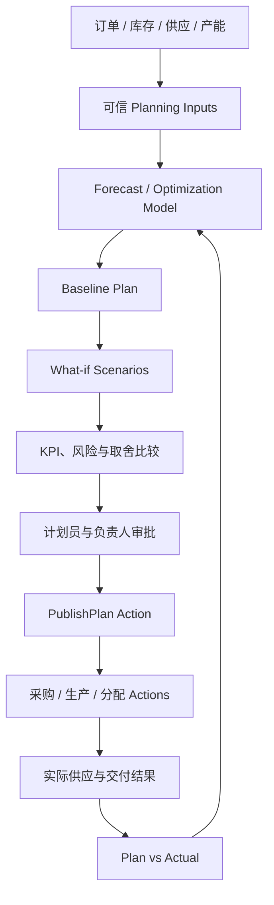

# 案例篇 14：用 Supply & Demand Planning 理解 Ontology

> 本章把 Planning 理解为供应、需求和产能计划，而不是某个固定 Palantir 产品名称。YAML 是教学伪代码；真实计划模型、约束和目标必须由计划、生产、采购、销售和财务团队共同定义。

ERP 进销存回答的是：

> 现在有什么订单、库存和单据？

Planning 更关心：

> 未来可能发生什么？有哪些可行方案？组织最终承诺执行哪一版计划？

最重要的区别：

```text
现实状态       已经发生或当前有效的事实
预测           对未来需求、供应或风险的估计
Scenario       如果改变某些条件，会发生什么
Published Plan 组织批准并准备执行的计划
Actual Result  最后真正发生的结果
```

不能把这五种东西混在一起。

---

## 1. 一个 Planning 问题

某企业未来四周需要交付三种产品：

| Product | Week 1 | Week 2 | Week 3 | Week 4 |
|---|---:|---:|---:|---:|
| P-100 | 800 | 1,200 | 1,000 | 900 |
| P-200 | 500 | 700 | 900 | 1,100 |
| P-300 | 300 | 350 | 450 | 500 |

但供应侧存在限制：

```text
P-100 与 P-200 共用生产线 LINE-A
LINE-A 每周只有 1,500 小时
关键原料 M-77 第二周可能延迟
P-300 只能由两名有认证的技术人员生产
某个重要客户必须优先保障
加班可以增加产能，但成本更高
```

计划员需要比较：

```text
方案 A：增加加班
方案 B：加急关键原料
方案 C：推迟低优先级订单
方案 D：把部分生产转移到另一工厂
```

Planning 不是生成一个数字，而是：

> 在约束、目标和不确定性之间比较可执行方案，并把批准方案转为受控行动。

---

## 2. Planning 为什么需要 Ontology？

传统计划数据常散落在：

```text
ERP              订单、库存、采购、生产订单
MES              实际产能和生产进度
APS / 优化系统    计划结果
CRM              商机和客户优先级
Excel             人工覆盖和会议决议
外部数据          天气、物流、市场信号
```

Ontology 可以统一表达：

```text
需求来自谁、为了什么产品、在哪个时间和地点发生
供应来自库存、采购还是生产
哪些资源、物料和规则构成约束
哪个 Scenario 使用了哪些假设
谁批准了哪一版计划
计划最终转化成哪些采购、生产或分配决定
实际结果与计划偏差多少
```

---

## 3. 先确定计划粒度

计划失败常常不是算法问题，而是粒度没有说清楚。

必须回答：

```text
时间粒度：天、周还是月？
产品粒度：产品族、SKU 还是批次？
地点粒度：区域、工厂、仓库还是生产线？
客户粒度：渠道、客户组还是具体客户？
计划范围：四周、十三周还是一年？
```

例如：

```text
P-100 | PLANT-SH | 2026-W34
```

表示某个产品、工厂和周的计划 Bucket。

如果需求按月、产能按天、库存按仓库，却没有统一转换规则，任何“最优计划”都可能只是数字拼接。

---

## 4. 最小 Planning Ontology

| Object Type | 含义 |
|---|---|
| Product | 被计划的商品或物料 |
| Location | 工厂、仓库或市场区域 |
| DemandRequirement | 某时间 Bucket 的需求 |
| SupplyCommitment | 已有库存、确认采购或生产供给 |
| CapacityBucket | 某资源在某时间段的可用产能 |
| MaterialConstraint | 原料短缺或限制 |
| PlanVersion | 一组有版本的计划结果 |
| PlanningScenario | 一组 What-if 假设和模拟结果 |
| PlannedOrder | 计划建议的采购或生产订单 |
| AllocationDecision | 把有限供给分配给需求的决定 |

教学伪代码：

```yaml
PlanningScenario:
  primaryKey: scenarioId
  properties:
    name: string
    basePlanVersion: string
    status: DRAFT | EVALUATED | APPROVED | REJECTED
    createdBy: userId
    createdAt: timestamp
    assumptionsSummary: string

PlanVersion:
  primaryKey: planVersionId
  properties:
    horizonStart: date
    horizonEnd: date
    status: DRAFT | PUBLISHED | SUPERSEDED
    publishedAt: timestamp
```

`Scenario` 和 `PlanVersion` 必须拥有稳定身份，否则无法回答：

```text
这张图使用哪版需求预测？
谁修改了产能假设？
为什么最终选择方案 B？
当前执行计划是哪一版？
实际结果应该与哪版计划比较？
```

---

## 5. 用 Link 表达约束传播



Links 让影响能够沿业务网络传播：

```text
M-77 延迟
→ 哪些 Products 受影响？
→ 哪些 Plants 无法生产？
→ 哪些 DemandRequirements 不能满足？
→ 哪些 Customers 和销售订单会延期？
```

这比在一张结果表里只看到“缺口 300”更接近真实决策。

---

## 6. 区分硬约束、软约束和目标

### 硬约束

违反后方案不可执行：

```text
产量不能超过物理产能
不能使用不存在的物料
认证人员不足时不能安排特殊工序
库存不能在没有替代或延期规则时变成负数
```

### 软约束

可以违反，但必须付出代价或获得批准：

```text
加班上限
优选供应商比例
安全库存
客户期望交期
换线次数
```

### 优化目标

用来比较可行方案：

```text
最大化按时足量交付
最小化库存
最小化加班和加急成本
最小化计划波动
优先保护战略客户
降低供应风险
```

目标之间会冲突。

```text
库存最低 ≠ 服务水平最高
产能利用率最高 ≠ 交付最稳定
成本最低 ≠ 风险最低
```

所以 Planning 结果必须显示取舍，而不是只给一个看似精确的答案。

---

## 7. Pipeline、Model、Function、Scenario 和 Action 怎样分工？

| 能力 | 在 Planning 中的职责 |
|---|---|
| Pipeline | 清洗需求、供应、BOM、库存和产能数据 |
| Model | 预测需求、交期、风险或求解计划 |
| Function | 计算当前 Scenario 的 KPI、解释缺口和推荐方案 |
| Scenario | 保存一组假设，在现实 Ontology 之外模拟变化 |
| Action | 批准计划、发布计划或把建议转成执行决定 |
| Automate | 按时间或条件触发重算、提醒或受控工作流 |

不要让 Model 直接悄悄改变正式计划。

安全结构应该是：

```text
模型产生方案
→ Function 解释结果
→ 用户比较 Scenarios
→ Action 批准并发布
→ 执行系统接收受控决定
```

---

## 8. Scenario：先模拟，不改变现实

Palantir 的 Scenario 可以理解为在 Ontology 基础状态上应用一组 Actions 和 Models 形成的分叉，用来模拟不同条件；Scenario 保存的是相对于基础状态的变化。[Workshop Scenarios 核心概念](https://www.palantir.com/docs/foundry/workshop/scenarios-concepts)

例如基础计划：

```text
LINE-A 每周产能：1,500 小时
M-77 第二周供应：900 件
战略客户优先级：高
```

三个 Scenarios：

```text
Scenario A：增加 300 小时加班
Scenario B：加急 250 件 M-77
Scenario C：把 200 件 P-200 转移到 PLANT-BJ
```

每个 Scenario 输出：

| KPI | Baseline | A 加班 | B 加急 | C 转厂 |
|---|---:|---:|---:|---:|
| 按时足量交付率 | 88% | 95% | 96% | 94% |
| 额外成本 | 0 | 80,000 | 60,000 | 45,000 |
| 平均库存 | 1,240 | 1,210 | 1,260 | 1,180 |
| 高风险订单 | 12 | 5 | 4 | 6 |

Vertex 用于基于系统图探索、模拟和量化不同条件与 Actions 的影响。[Vertex 官方概览](https://www.palantir.com/docs/foundry/vertex/overview)

需要注意生命周期：Vertex 旧的直接 Model selection 流程已进入 Sunset；当前官方建议把 Model 配置为 Function，再导入 Function-backed Action 供 Scenario 使用。[Vertex Scenarios Getting Started](https://www.palantir.com/docs/foundry/vertex/scenarios-getting-started)

---

## 9. Scenario 不是正式计划

Scenario A 看起来最好，也不能自动认为组织已经决定加班。

还需要回答：

```text
谁有权批准？
额外成本由谁承担？
工厂是否确认人员可用？
供应商是否真正接受加急？
受影响客户是否已经沟通？
方案使用的数据是否仍然最新？
```

可以设计：

```yaml
actionType: ApprovePlanningScenario
parameters:
  scenario: PlanningScenario
  decision: APPROVE | REJECT | REQUEST_CHANGES
  comment: string

submissionCriteria:
  - scenario.status == EVALUATED
  - scenario.inputDataFreshness == VALID
  - currentUser has planning approval permission

edits:
  - 更新 Scenario 状态
  - 记录审批人、时间和原因
  - 创建候选 PlanVersion
```

---

## 10. 发布计划是一个受控 Action

`PublishPlan` 可能：

```text
把候选 PlanVersion 标记为 PUBLISHED
把上一版标记为 SUPERSEDED
创建 PlannedOrders
建立计划与需求、产能、物料约束的 Links
通知采购、生产和销售团队
触发下游重算或集成
```

但“发布计划”不一定等于“立即创建正式 ERP 单据”。

组织可以分阶段：

```text
Published Plan
→ PlannedOrder
→ 人工或自动审批
→ ReleaseProductionOrder / CreatePurchaseRequisition
→ ERP 正式单据
```

这样可以区分：

```text
计划建议
组织承诺
执行指令
交易系统记录
```

---

## 11. Automate 负责何时重新计划

计划不应该每收到一行数据就无条件全部重算。

可以定义触发条件：

```text
每天凌晨执行例行计划
高优先级订单数量变化超过阈值
关键供应商确认日期延迟
某生产线停机超过两小时
计划员手动请求重算
```

Automate 可以持续或按计划检查时间、Object data 和 Object Sets，并执行 Action、Function、AIP Logic 或通知。[Automate 官方概览](https://www.palantir.com/docs/foundry/automate)

重新计划也要记录：

```text
触发原因
使用的数据版本
模型或求解器版本
开始和完成时间
失败原因
生成的 Scenario 或 PlanVersion
```

---

## 12. 计划员工作台应该展示什么？

```text
当前 Published Plan 和数据新鲜度
需求、供应、库存和产能概览
最重要的 Shortages 与 Constraints
受影响的客户、产品和地点
Baseline 与多个 Scenarios 的 KPI 对比
每个方案的假设、风险和成本
人工 Override 及其原因
Approve、Publish、Release 等 Actions
重算和外部同步状态
```

重点不是把所有数字塞进一个大表。

页面应该帮助计划员回答：

```text
发生了什么变化？
为什么出现缺口？
有哪些可执行方案？
每个方案牺牲什么？
谁需要批准？
决定怎样进入执行？
```

---

## 13. 用实际结果评价计划

计划质量不能只看求解器是否成功。

应该比较：

```text
Forecast 与 Actual Demand
Published Plan 与 Actual Production
Promised Date 与 Actual Delivery
Planned Material Arrival 与 Actual Receipt
Planned Capacity 与 Actual Capacity
Scenario KPI 与真实业务结果
```

常见指标：

```text
Forecast Accuracy
On-Time In-Full
Plan Adherence
Schedule Stability
Inventory Turns
Expedite Cost
Capacity Utilization
Shortage Recovery Time
Override Rate
```

还要记录人工 Override：

```text
谁改了什么？
为什么修改？
当时掌握了哪些模型没有看到的信息？
结果证明这次 Override 是否合理？
```

这些反馈可以帮助改进数据、约束、模型和审批规则。

---

## 14. 完整 Planning 决策闭环



最值得记住的一句话：

> Planning 不是把预测写进 ERP，而是在真实业务上下文中比较未来方案，再把经过批准的计划转成可执行、可审计的决定。

---

## 独立练习：设计四周供应计划

给定：

```text
未来四周需求：每周 1,000
当前库存：600
正常产能：每周 800
加班产能：每周最多 250，成本较高
关键原料第二周短缺 300
战略客户需求：第二周 500，必须优先
```

请完成：

1. 定义时间、产品和地点粒度。
2. 选择最小 Object Types 与 Links。
3. 区分硬约束、软约束和优化目标。
4. 设计 Baseline 和至少三个 Scenarios。
5. 为每个 Scenario 选择四个 KPI。
6. 设计 `ApprovePlanningScenario` 与 `PublishPlan`。
7. 说明什么时候只重算、什么时候需要人工审批。
8. 写出五个实际结果字段，用于一个月后的 Plan-vs-Actual 复盘。

完成这两个案例后，回到第 12 课的最终验收：如果你能在一个新领域中独立区分现实状态、预测、Scenario、计划和 Action，就已经真正掌握了 Ontology 的迁移方法。
